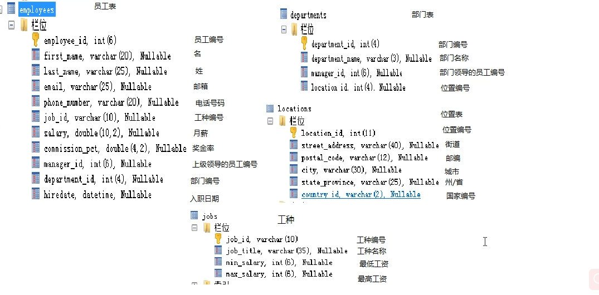
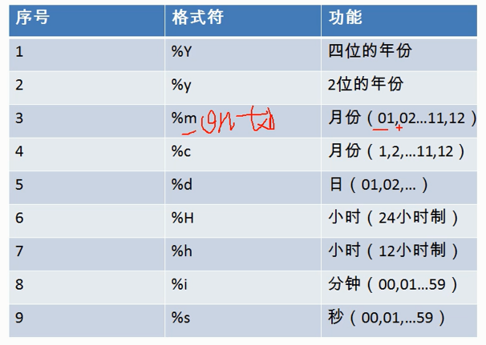
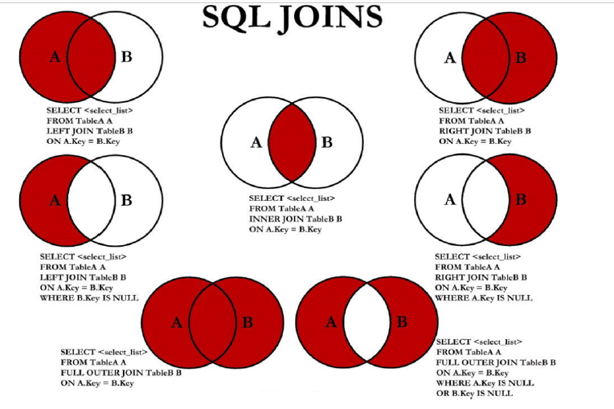
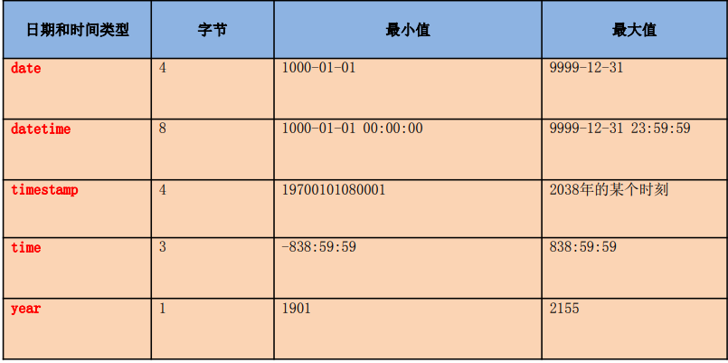

# MySQL 基础

[TOC]


#### 一. 数据库概述

##### 1\. 持久化

持久化/性（persistence ）：把数据保存到可掉电式存储设备中以供之后使用。

##### 2\. DB,DBMS,SQL (相关概念)

- **数据库**（DataBase DB），根据字面意思可以理解为存储数据的仓库，它保存了一系列有组织的数据。

- **数据库管理系统**  (Database Management System DBMS)，又称为数据库软件或数据库产品。是一种操纵和管理数据库的大型软件，用于建立、使用、维护数据库，对数据库进行统一管理和控制。用户通过数据库管理系统访问表中的数据。

- **结构化查询语言** (Structure Query Language SQL)，用于和数据库通信的语言，不是某个数据库特有的，而是几乎所有的主流数据库软件通用的语言。

我们可以借助于 SQL 通过 DBMS 来对数据库进行一系列的操作。例如：创建、删除。

常见的 DBMS 有：NoSQL、Oracle、MySQL、DB2、SQLServer

##### 3\.  为什么要使用数据库？

既然数据库是存储数据的容器，为什么要使用它，而不是使用我们在编程中所使用的集合、数组、文件等其它的容器？

使用数组、集合等存储数据，是将数据保存再内存当中，重新启动程序之后/断电之后数据会被销毁，存储的数据会丢失。而使用文件等虽然可以永久存储但是不方便查询和管理。

##### 4\. 使用 DB 来存储数据有哪些好处呢？

① 实现数据持久化

② 可以实现结构化查询，方便管理;

##### 5\. 数据库存储数据的特点

① 将数据放到表中，再将表放到数据库中

② 一个数据库中可以有多个表，每个表都有一个唯一的表名，用来标识自己；表名具有唯一性 (互异性)

③ 表由一列或多列组成，列也称之为 ”字段“。列相当于 Java 中的属性

④ 表中的数据是按行存储的，每一行相当于 Java 中的一个对象。

#### 二. SQL 语言概述

##### 1\. 什么是 SQL 

结构化查询语言（Structure Query Language SQL）：专门用来与数据库通信的语言。

##### 2\. SQL 的优点：

① 不是某个特定数据库供应商专有的语言，几乎所有 DBMS 都支持 SQL 
② 简单易学 
③ 虽然简单，但实际上是一种强有力的语言，灵活使用其语言元素，可以进行非常复杂和高级的数据库操作。

##### 3\. SQL 语言的分类：

①  DQL (Data Query Language)：数据查询语言。主要 select 语句
②  DML（Data Manipulation Language):数据操纵（操作）语言，用于添加、删除、修改数据库记录 
③ DDL（Data Definition Language):数据定义语言，用于库和表的创建、修改、删除、复制…  `CREATE ALTER DROP RENAME TRUNCATE 清空`
④ TCL（Transaction Control Language):事务控制语言。
⑤  DCL (Data Control language): 数据控制语言，用于定义用户的访问权限和安全级别。

Tips:` DROP` 删的是结构，而 `DELETE`删的是数据

##### 4\. SQL 语言分类二： 

1\. DML 用于查询与修改，主要包括如下 SQL 语句

- INSERT：添加数据到数据库中 
- UPDATE：修改数据库中的数据 
- DELETE：删除数据库中的数据 
- SELECT：选择（查询）数据 

> SELECT是 SQL 语言的基础，最为重要。

2\. DDL 用于定义数据表，比如创建、修改或删除数据表，创建、删除数据表，包括如下 SQL 语句：

- CREATE TABLE：创建数据库表 
- ALTER TABLE：更改表结构、添加、删除、修改列长度 
- DROP TABLE：删除表 
- CREATE INDEX：在表上建立索引 
- DROP INDEX：删除索引

3\. DCL 用来控制数据库的访问，包括如下SQL语句：

- GRANT：授予访问权限 
- REVOKE：撤销访问权限 
- COMMIT：提交事务处理 
- ROLLBACK：事务处理回退 
- SAVEPOINT：设置保存点 
- LOCK：对数据库的特定部分进行锁定

#### 三. 初识 MySQL

##### 1\. MySQL 软件的介绍

① 1995 MySQL 数据库是 MySQL AB 公司发布并支持的。总部位于瑞典广泛的应用在 Internet 中小型网站开发中

② 08 年被 SUN 公司收购

③ 09 年 SUN 公司被 Oracle 公司收购

④ 2016 年， MySQL 8.0版本退出

特点：

- 开源的、关系型数据库

- 支持千万级别数据量存储。

优点：

- 成本低: 开源，免费
- 性能高: 执行效率高、移植性好
- 简单: 容易安装和使用、体积小


DBMS 分为两类：

- 基于共享文件系统的 DBMS (Access)
- 基于客户机——服务器（C/S）的 DBMS (MySQL、Oracle、SqlServer)

版本

- 社区版 (免费)
- 企业版 (收费)

下载地址：<https://dev.mysql.com/downloads/mysql/>

##### 2\. MySQL 的安装

具体安装（略）

- typical 典型安装 会安装 MySQL 自带的客户端
- custom 自定义安装
- complete 完全安装 需要更多磁盘空间

配置 MySQL

注意：MySQL 5.*默认编码为 latin, 安装之后要修改。

##### 3\. 启动和停止 MySQL 服务

- 方式一：通过计算机管理方式 

  右击此电脑—管理—服务—找到问我们为数据库起的名字—启动或停止MySQL服务

- 方式二：通过命令行方式(**需要使用管理员登陆** cmd)

  启动：`net start mysql服务名 `

  停止：`net stop mysql服务名`

4. MySQL 服务端的登陆和退出

方式一：通过 MySQL 自带的客户端 Command Line Client 登录

启动后，直接输入密码即可

退出：exit/quit/ Ctrl + Z + Enter

注：此种方式仅限于 root 用户

方式二：通过命令行进入：完整命令：`msyql [-h 主机名称 -P 端口号] -u 用户名称 -p` 

注意：

1. 如果显式的输入密码，-p 与密码之间不能有空格。

2. 数据库在本机且端口号为默认端口（3306） ，则主机名称和端口号可以省略。例如：`mysql -u 用户名称 -p`
3. 上面命令是隐式输入密码。

tips: 登录需要保证 MySQL 服务是启动状态的。

##### 5\. MySQL 的配置文件

配置文件：my.ini

MySQL 由于版本的不同，my.ini 存放的位置也就不同。一般存在数据库数据所在的目录。

通过查看快捷方式的属性从而知道 my.ini 的存放位置


```ini
[mysql] //客户端的配置

[mysqld] //服务器端配置
port //服务器端口号，可以根据需要对其进行修改
basedir //MySQL 软件的安装目录 
datadir //文件目录，把数据库中的文件存储在这个目录下
default-storage-engine //数据库的存储引擎，可以这里进行修改
```

##### 6\. 语法规范

语法规范：

- SQL 可以写在一行或者多行。为了提高可读性，各子句分行写，必要时使用缩进 

  ```sql
  SELECT
  *
  FROM
  stuinfo;
  ```

- 每条命令以 `; `或 `\g` 或 ` \G` 结束 。推荐使用 `;` 结尾

  在命令行中 MySQL 使用 \G 可以对内容进行一定程度是格式化

- 关键字不能被缩写也不能分行 

- 关于标点符号 
  - 必须保证所有的()、单引号、双引号是成对结束的 
  - 必须使用英文状态下的半角输入方式 
  - 字符串型和日时间类型的数据可以使用单引号`' '`表示 
  - 列的别名，尽量使用双引号`" "`，而且不建议省略 as

语法规范：

- MySQL 在 Windows 环境下是大小写不敏感的 
- MySQL 在 Linux 环境下是大小写敏感的 
  - 数据库名、表名、表的别名、变量名是严格区分大小写的 
  - 关键字、函数名、字段(或字段名)、列的别名(字段的别名) 是忽略大小写的。 

- 推荐采用统一的书写规范： 
  - 数据库名、表名、表别名、字段名、字段别名等都小写 
  - SQL 关键字、函数名、绑定变量等都大写

##### 7. 命名规则：

① 数据库、表名不得超过30个字符，变量名限制为29个 
② 只能包含 A–Z, a–z, 0–9, _共63个字符
③ 数据库名、表名、字段名等对象名中间不要包含空格
④ 同一个MySQL软件中，数据库不能同名；同一个库中，表不能重名；同一个表中，字段不能重名
⑤ 必须保证你的字段没有保留字、数据库系统或常用方法冲突。如果坚持使用，请在SQL语句中使用`（着重号）`引起来
⑥ 保持字段名和类型的一致性，在命名字段并为其指定数据类型的时候一定要保证一致性。假如数据类型在一个表里是整数，那在另一个表里可就别变成字符型了

##### 8\. 注释

- 单行注释：`# 注释文字` #后面可以没有空格
- 单行注释：`-- 注释` --后面必须有空格
- 多行注释：`/*注释的内容*/`

##### 9\. 常用的 SQL 命令

- `show databases;` 显示当前所有的数据库名称

- `create database database_name;` 新建数据库

- `use 数据库名称;` 打开指定的数据库

- `show tables;` 显示当前数据库中的所有表，(在使用该命令之前，要先指定数据库[使用上一条指令])

  `show tables from 库名;` 显示指定数据库中的所有表

- `select database();` 显示当前所在的数据库名称

- 创建表：

  ```sql
  create table 表名(
  字段 列类型 [约束],
  ……
  字段 列类型 [约束]
  );
  # 意声明不同列之间用要用 "," 隔开。
  ```

- `desc 表名;`或 `DESCRIBE 表名;`查看表结构

- `drop table 表名;` 删除指定的表

- `drop database 数据库名;` 删除指定的库

- 查看当前数据库中，指定表中的数据： `select * from 表名`

- 查询特定的列: `select 字段1,字段2, … from 表名`

- 对查询的数据进行过滤：使用 where 子句

  ```sql
  select 字段1,字段2, … 
  from 表名
  where 筛选条件;
  ```

- 运算符：`between … and …` 和 `LIKE`

- 向指定的表中添加数据：`insert into 表名（属性[多个属性中间需要用 , 隔开]） values(属性值)`

- 修改表中添加的数据：`update 表名 set 属性='属性值' where 属性=属性值` 

  例如：`update stuinfo set name='lilei' where id=1;`

- 查看 MySQL 的服务版本：

  - 一种：在 MySQL 命令行中查看：`select version();`
  - 第二种：在 windows 命令行种查看：`mysql --version` 或 `mysql -V`
  
- 查看目前所在的数据库：`SELECT DATABASE();`

- 查看编码：`SHOW VARIABLES LIKE 'character_%';`

- 查看比较规则：`SHOW VARIABLES LIKE 'collation_%';`

- 显示表结构: `describe 表名 或 desc 表名；`

- 查看表的创建信息：`SHOW CREATE TABLE 表名;`

  查看数据库的创建信息：`SHOW CREATE DATABASE 数据库名;`

- 修改表和数据库的字符集

  语法：`ALTER 数据库名或表名 charset 字符集`

  修改表中某一属性的字符集：`ALTER TABLE 表名 modify 属性名 属性类型 约束 CHARSET 字符集; `

#####  10\. MySQL 中自带的数据库

- information_schema: 主要保存 MySQL 数据库服务器的系统信息
- performance_schema：监控 MySQL 的各类性能指标
- sys：主要作用是以一种更容易被理解的方式展示 MySQL 数据库服务器的各类性能指标，帮助系统管理员和开发人员监控 MySQL 的技术性能。
- mysql：保存了 MySQL 数据库服务器运行时需要的系统信息

##### 11\. 解决在 MySQL 5.x 版本中插入中文出现乱码的问题：

第一步： 

① 查看编码: `SHOW VARIABLES LIKE 'character_%';`

主要看：character_set_database/server

② 查看比较规则: `SHOW VARIABLES LIKE 'collation_%';`

主要看: collation_database/server

> 由于 MySQL 的母公司位于荷兰，因此这两个总是默认为 latin

第二步：修改 MySQL 目录下的my.ini

```ini
[mysql]
…
default-character-set=utf8
[mysqld]
character-set-server=utf8
collation-server=utf8_general_ci
```

第三步：重启服务

第四步：查看编码

重复第一步

Tips: 在 MySQL 中直接设置字符格式：`SET 属性=字符集`；例如：`SET character_set_connection=gbk;`

##### 11\. 图形化工具连接 MySQL 可能出现的问题：

有些图形界面工具，特别是旧版本的图形界面工具，在连接 MySQL8 时出现“Authentication plugin 'caching_sha2_password'=cannot be loaded”错误。

出现这个原因是 MySQL8 之前的版本中加密规则是mysql_native_password，而在 MySQL8 之后，加密规则
是 caching_sha2_password。

解决问题方法有两种，第一种是升级图形界面工具版本，第二种是把 MySQL8
用户登录密码加密规则还原成 mysql_native_password。

第二种解决方案如下，用命令行登录MySQL数据库之后，执行如下命令修改用户密码加密规则并更新用
户密码，这里修改用户名为“root@localhost”的用户密码规则为“mysql_native_password”，密码值为
“abc123”，如下图所示。

```sql
# 使用mysql数据库
USE mysql;
# 修改'root'@'localhost'用户的密码规则和密码
ALTER USER 'root'@'localhost' IDENTIFIED WITH mysql_native_password BY 'abc123';# 这里的 abc123 是密码
# 刷新权限
FLUSH PRIVILEGES;
```

##### 12\. 在 MySQL 中重置 root 密码

第一步：用管理员身份登录系统

第二步：停止 MySQL 服务：`net stop mysql服务名`

第三步：在单行中创建一个包含密码分配语句的文本文件。 这里保存为保存为 mysql-init.txt

`ALTER USER 'root'@'localhost' IDENTIFIED BY 'MyNewPass';` # 这里的 MyNewPass 是更新后的密码

第四步：启动MySQL服务器，将init_file系统变量设置为文件名称(注意选项值中的反斜杠加倍):

服务器在启动时执行init_file系统变量命名的文件的内容，更改'root'@'localhost'帐户密码。

为了让服务器输出显示在控制台窗口而不是日志文件中，在mysqld命令中添加 `--console` 选项。

**如果您使用MySQL安装向导安装MySQL，您可能需要指定——defaults-file选项**。例如:

```
mysqld --console --defaults-file="C:\\ProgramData\\MySQL\\MySQL Server 8.0\\my.ini" --init-file="C:\\mysql-init.txt"
```

服务器成功启动后，删除C:\mysql-init.txt。

现在，您应该能够以 root 用户使用新密码连接到MySQL服务器。停止 MySQL 服务器并正常重启。如果将服务器作为服务运行，则从Windows Services窗口启动它。如果您手动启动服务器，请使用您通常使用的任何命令。

参考：<https://dev.mysql.com/doc/refman/8.0/en/resetting-permissions.html>

12\. 以后遇到问题的资料参考：

[MySQL 官网](<https://dev.mysql.com/doc/refman/8.0/en/>)

[旧金山大学论坛](https://www.cs.usfca.edu/~galles/visualization/about.html)

[数据库排行版](https://db-engines.com/en/ranking_trend)

参考书：《MySQL是怎样运行的》

13\. 我们可以用多个属性组成约束：

例如：`PRIMARY KEY(属性1，属性2)`； 在创建表时，与最后一个属性名与逗号隔开

#### 三. DQL（Data Query Language） 数据查询语言

##### **1. 导入现有的数据表、表的数据**

方式一：通过命令行方式导入：`SOURCE 文件的全路径名`（图形化工具中这样导入会报错，windows 注意使用双斜杠）

方式二：由具体的图形化工具导入数据

SQLYOG：工具-执行 SQL 脚本



##### 2\. 基础查询

**语法：**`SELECT 查询列表 FROM 表名;`

**特点：**

1. 通过 SELECT 语句查询完成的结果，是一个虚拟的表格，不真实存在
2. 要查询的列表可以是 **常量值，表达式、字段、函数**

**查询表中的单个字段**

语法：`SELECT 字段名 FROM 表名`

**查询表中的多个字段**

语法：`SELECT 字段名1，字段名1…字段名n FROM 表名`

*字段名称之间用逗号隔开，对字段名称的顺序没有要求*。

**查询表中的所有字段**

1.  方法一：`SELECT 该表中所有的字段，中间用逗号隔开(可以根据自己的需要更改顺序) FROM 表名`
2.  方法二：`SELECT * FROM 表名`  * 代表表中的所有字段

Tips: 一般情况下，除非需要使用表中所有的字段数据，最好不要使用通配符‘*’。使用通配符虽然可以节省输入查询语句的时间，但是获取不需要的列数据通常会降低查询和所使用的应用程序的效率。通配符的优势是，当不知道所需要的列的名称时，可以通过它获取它们。 **在生产环境下，不推荐你直接使用 SELECT * 进行查询。**

**查询常量值**

```sql
SELECT 100;
SELECT 'john';
```

**查询表达式**

```sql
SELECT 100%98;
```

**查询函数**

```sql
 SELECT VERSION();
```

注意：

1. 使用使用之前要先使用 `USE 库名` 语句，打开数据库(选择要使用的数据库)。

2. 如果某个字段是关键字，则需要加着重号。格式：

   ```sql
   `字段名`
   ```

> SQLyog 的使用：
>
> 执行：选中需要执行的命令然后执行，快捷键 F9。
>
> 格式化：选中需要格式化的命令然后格式化，快捷键  F12

##### 3\.起别名

由于查询常量值，表达式、函数，字段名为 sql 语句中的常量值、表达式或参数，为了我们便于识别和理解，因此需要给我们的字段起别名。

好处：便于理解、识别

*方式一*：使用 AS (alias)

```sql
`SELECT 100%98 AS 别名;`
SELECT last_name AS 姓,first_name AS 名 FROM employees;
```

*方式二*：使用空格

```sql
SELECT last_name 姓,first_name 名 FROM employees;
```

别名推荐使用**双引号**引起来，以便在别名中**包含空格或特殊的字符并区分大小写**.

**字符串**

- 日期和字符只能在单引号或双引号中出现
- 字符串可以是 SELECT 列表中的一个**字符,数字,日期**。

##### 4\. MySQL 常用操作与函数

**去重**

语法：`distinct 字段名` 

可以对 distinct 后面的字段进行去重

```sql
USE myemployees;
SELECT DISTINCT 
department_id
FROM 
employees;
```

**concat() 函数**

格式：`concat(需要连接的内容，用逗号隔开);`

**IFNULL() 函数**

格式：`IFNULL(exper1,exper2);`

功能：判断 exper1 是否为 null，如果为 null 返回指定 exper2 的值，否则返回原本 exper1 的值。

**ISNULL() 函数**

格式：`ISNULL(arg1)`

功能：判断 arg 是否为 null，如果为 null 则返回 1，否则返回 0

##### **5. 条件(筛选)查询**

将不满足条件的行过滤掉.

语法：

```sql
SELECT 
	查询列表 # ① 
FROM 
	表名 # ②
WHERE 
	筛选条件;  # ③
```

执行顺序：②③①

Tips: **字符串中的字母，MySQL 不区分大小写，但是 ORACLE 区分大小写。**

###### **1\. 空值参与运算：**

① 空值：null

② 空值不等同于 0, '', 'null'

③ 所有运算符或列值遇到 null 值，运算的结果都为null

运算符分类：

###### **2\. 算术运算符**

算术运算符主要用于数学运算，其可以连接运算符前后的两个数值或表达式，对数值或表达式进行加（+）、减（-）、乘（*）、除（/）和取模（%）运算。

| 运算符   | 名称       |
| -------- | ---------- |
| +        | 加法       |
| -        | 减法       |
| *        | 乘法       |
| / 或 DIV | 出发       |
| % 或 MOD | 取模(求余) |

 **+ 号作用**

MySQL 中的 + 号：

仅仅只有一个功能：做加法运算

- `SELECT 1000+90;` 两个操作数都为数值型，则做加法运算。

- `SELECT '123'+90;`其中一个操作数为字符型，试图将字符型转换为数值型
  - 如果转换成功，则继续做加法运算。
  - 如果转换失败，则将字符型值转换为 0
- `SELECT null+10;`只要一个操作数值为 null，则值一定为 null

注：在 SQL 不区分字符和字符串，全是字符型数据，因此使用单引号或双引号都可以。

加/减法:

① 一个整数类型的值对整数进行加法和减法操作，结果还是一个整数；

② 一个整数类型的值对浮点数进行加法和减法操作，结果是一个浮点数；

③ 加法和减法的优先级相同，进行先加后减操作与进行先减后加操作的结果是一样的；

④ 在Java中，`+`的左右两边如果有字符串，那么表示字符串的拼接。但是在MySQL中+只表示数值相加。如果遇到非数值类型，先尝试转成数值，如果转失败，就按 0 计算。（补充：MySQL中字符串拼接要使用字符串函数 CONCAT()实现）

⑤ `Null`与任何值参与运算的结果仍然是 null

乘/除法：

① 一个数乘以整数1和除以整数1后仍得原数；
② 一个数乘以浮点数1和除以浮点数1后变成浮点数，数值与原数相等；
③ **一个数除以整数后，不管是否能除尽，结果都为一个浮点数；**
④ 一个数除以另一个数，除不尽时，结果为一个浮点数，并保留到小数点后4位；
⑤ 乘法和除法的优先级相同，进行先乘后除操作与先除后乘操作，得出的结果相同。
⑥在数学运算中，0不能用作除数，**在MySQL中，一个数除以0为NULL。**

按条件表达式筛选*

###### **3\. 比较运算符**

比较运算符用来对表达式左边的操作数和右边的操作数进行比较，比较的结果为真则返回1，比较的结果为假则返回 0，其他情况则返回 NULL。

\>, <, =,!= 或 <>(不等于，推荐使用 <>), >=, <=,<=> (安全等于)

1\. 等号运算符

- 等号运算符 `=`判断等号两边的值、字符串或表达式是否相等，如果相等则返回1，不相等则返回 0。

- 在使用等号运算符时，遵循如下规则：

  - 如果等号两边的值、字符串或表达式都为字符串，则MySQL 会按照字符串进行比较，其比较的是字符串中每个字符的编码是否相等。

  - 如果等号两边的值都是整数，则 MySQL 会按照整数来比较两个值的大小。

  - 如果等号两边的值一个是整数，另一个是字符串，则MySQL会将字符串转化为数字进行比较，如果转换不成功，则按 0 处理。

  - 如果等号两边的值、字符串或表达式中有一个为NULL，则比较结果为NULL。

对比：SQL中赋值符号使用 :=

2\. 安全等于运算符

安全等于运算符`<=>`与等于运算符 `=`的作用是相似的， 唯一的区别是`<=>`可以用来对 NULL 进行判断。在两个操作数均为 NULL 时，其返回值为 1，而不为 NULL；当一个操作数为 NULL 时，其返回值为 0，而不为 NULL。

3\.不等于运算符 

不等于运算符`<>和!=` 用于判断两边的数字、字符串或者表达式的值是否不相等，如果不相等则返回 1，相等则返回 0。不等于运算符不能判断 NULL值。如果两边的值有任意一个为 NULL，或两边都为 NULL，则结果为 NULL。

###### **4\. 逻辑运算符**

逻辑运算符主要用来判断表达式的真假，在MySQL中，逻辑运算符的返回结果为1、0或者NULL。
MySQL中支持4种逻辑运算符如下：

```sql
&& AND 与
|| OR 或
! NOT 非
XOR 异或
```

1．逻辑非运算符 

逻辑非（NOT或!）运算符表示当给定的值为 0 时返回1；当给定的值为非0值时返回0；
当给定的值为NULL时，返回NULL。

2\. 逻辑或运算符 

逻辑或（OR或||）运算符是当给定的值都不为NULL，并且任何一个值为非0值时，则返
回1，否则返回0；当一个值为NULL，并且另一个值为非0值时，返回1，否则返回NULL；当两个值都为
NULL时，返回NULL。

注意：
OR可以和AND一起使用，但是在使用时要注意两者的优先级，由于AND的优先级高于OR，因此先
对AND两边的操作数进行操作，再与OR中的操作数结合。

3\. 逻辑异或运算符 

逻辑异或（XOR）运算符是当给定的值中任意一个值为NULL时，则返回NULL；如果两个非NULL的值都是0或者都不等于0时，则返回0；如果一个值为0，另一个值不为0时，则返回 1

###### **5. 其他符号查询**

| 运算符            | 名称                       |
| ----------------- | -------------------------- |
| ISNULL 或 IS NULL | 为空运算符                 |
| IS NOT NULL       | 不为空运算符               |
| GREATEST          | 最大值运算符               |
| LEAST             | 最小值                     |
| BETWEEN …AND…     | 判断一个值是否在两个值之间 |
| IN                | 属于                       |
| NOT IN            | 不属于                     |
| LIKE              | 模糊匹配                   |
| REGEXP或 RLIKE    | 正则表达式                 |

1\.  is [not] null

- 空运算符（IS NULL或者ISNULL）判断一个值是否为NULL，如果为NULL则返回 1，否则返回 0

- 非空运算符（IS NOT NULL）判断一个值是否不为NULL，如果不为NULL则返回1，否则返
  回0。

- = 或 <> 不能用于判断 null 值
- is null 或 is not null 可以判断 null 值

```sql
#案例1：查询没有奖金的员工名和奖金率
SELECT
	last_name,
	commission_pct
FROM
	employees
WHERE
	commission_pct IS NULL;
# 错误 =、<> 不能判断 null 值
SELECT
	last_name,
	commission_pct
FROM
	employees
WHERE
	commission_pct <> NULL;

#案例1：查询有奖金的员工名和奖金率
SELECT
	last_name,
	commission_pct
FROM
	employees
WHERE
	commission_pct IS NOT NULL;

#----------以下为 错误的
SELECT
	last_name,
	commission_pct
FROM
	employees

WHERE 
	salary IS 12000;# 将 IS 替换为 = 就可以了
```

安全等于 <=>: 

功能：判断是否等于

```sql
#案例1：查询没有奖金的员工名和奖金率
SELECT
	last_name,
	commission_pct
FROM
	employees
WHERE
	commission_pct <=>NULL;
	
	
#案例2：查询工资为12000的员工信息
SELECT
	last_name,
	salary
FROM
	employees

WHERE 
	salary <=> 12000;
```

IS NULL 和 <=> 的对比：

- IS NULL:仅仅可以判断 NULL 值，可读性较高，建议使用
- <=>    :既可以判断NULL值，又可以判断普通的数值，可读性较低

Tips: where 子句中不能使用组函数

2\. 最小值运算

语法格式为：LEAST(值1，值2，...，值n)。其中，“值n”表示参数列表中有n个值。在有两个或多个参数的情况下，返回最小值。假如任意一个自变量为NULL，则GREATEST()的返回值为 NULL

- 当参数是整数或者浮点数时，LEAST将返回其中最小的值
- 当参数为字符串时，返回字母表中顺序最靠前的字符
- 当比较值列表中有NULL时，不能判断大小，返回值为NULL

3\. 最大值运算：

语法格式：`GREATEST(值1，值2，...，值n)`

其中，n表示参数列表中有n个值。当有两个或多个参数时，返回值为最大值。假如任意一个自变量为NULL，则GREATEST()的返回值为NULL。

规则：

- 当参数中是整数或者浮点数时，GREATEST将返回其中最大的值；
- 当参数为字符串时，返回字母表中顺序最靠后的字符；
- 当比较值列表中有NULL时，不能判断大小，返回值为NULL。

4\. LIKE：模糊查询

LIKE运算符主要用来匹配字符串，通常用于模糊匹配，如果满足条件则返回1，否则返回 0。如果给定的值或者匹配条件为NULL，则返回结果为NULL。

特点:

一般和通配符搭配使用,用于判断(匹配)字符型数据。MySQL 5.5 版本之后 之后也可以判断数值型数据。

- % 任意多个字符 （也包含 0 个字符）
- _ 任意单个字符
- 转义字符默认为 \，也可以通过 ESCAPE 来指定转义字符

```sql
SELECT 
	last_name
FROM
	employees
WHERE
	last_name LIKE ‘_$_%’ ESCAPE ’$‘;
# 这里的 $ 就是转义字符,通过 ESCAPE 指定
```

例子1：查询员工名中包含字符 a 的员工信息

`SELECT * FROM employees WHRERE last_name LIKE '%a%' `;

Tips：这里的 a 不区分大小写

5\. BETWEEN AND

语法格式：`SELECT D FROM TABLE WHERE C BETWEEN A AND B;`

此时，当 C 大于或等于 A，并且 C小于或等于B ，结果为 1，否则结果为 0。

```SQL
  # 查询员工编号在  100 到 120 之间
  # 之前的写法
  WHERE
  	employee_id >= 100 AND employee_id <= 120;
  # 使用 BETWEEN AND
  HWERE 
  	employee_id BETWEEN 100 AND 120;
```

注意：   

- 使用 between and 可以提高语句的简洁度
- 范围包含两个临界值
- 两个临界值，不可以调换顺序
- 不可以使用别名

> 扩展语法：
>
> NOT BETWEEN 临界值1 AND 临界值2。
>
> 不在 临界值1 和临界值2 之间。

6\. IN

含义：IN 运算符用于判断给定的值是否是 IN 列表中的一个值，如果是则返回1，否则返回0。如果给定的值为 NULL，或者 IN 列表中存在 NULL，则结果为NULL。
特点：
	① 使用 in 提高语句简洁度
	② in 列表的值类型必须一致或兼容
	③ in 列表中不支持通配符

```SQL
	
#案例：查询员工的工种编号是 IT_PROG、AD_VP、AD_PRES中的一个员工名和工种编号

SELECT
	last_name,
	job_id
FROM
	employees
WHERE
	job_id = 'IT_PROT' OR job_id = 'AD_VP' OR JOB_ID ='AD_PRES';


#------------------

SELECT
	last_name,
	job_id
FROM
	employees
WHERE
	job_id IN( 'IT_PROT' ,'AD_VP','AD_PRES');


```

**7\. REGEXP 运算符（正则表达式）**

REGEXP运算符用来匹配字符串，语法格式为： `'expr' REGEXP '匹配条件'`。如果expr满足匹配条件，返回1；如果不满足，则返回0。若expr或匹配条件任意一个为NULL，则结果为 NULL

REGEXP 运算符在进行匹配时，常用的有下面几种通配符：

（1）‘^’匹配以该字符后面的字符开头的字符串。
（2）‘$’匹配以该字符前面的字符结尾的字符串。
（3）‘.’匹配任何一个单字符。
（4）“[...]”匹配在方括号内的任何字符。例如，“[abc]”匹配“a”或“b”或“c”。为了命名字符的范围，使用一个‘-’。“[a-z]”匹配任何字母，而“[0-9]”匹配任何数字。
（5）‘*’匹配零个或多个在它前面的字符。例如，“x*”匹配任何数量的‘x’字符，“[0-9]*”匹配任何数量的数字，而“*”匹配任何数量的任何字符。

```
SELECT 'shkstart' REGEXP 'hk'; # 字符串中包含 hk  的字符串。
```

详见《正则表达式.md》

###### 6\. 位运算符

与&  或| 异或^  取反~ 按位右移>>  按位左移

略 详见第04章_运算符.pdf

##### 6. 排序

如果没有使用排序操作，默认情况下查询返回的数据是按添加数据的顺序显示的。

语法格式：

```sql
SELECT 
	查询列表 ①
FROM
	表		②
[WHERE 筛选条件] ③
ORDER BY
	排序列表 [asc|desc]；④
# 执行顺序 ② ③ ① ④
```

- asc （默认)代表升序，可以省略。desc 代表的是降序。ascend descend
- order by 子句可以支持 单个字段、别名、表达式、函数、多个字段
- **order by 子句在查询语句的最后面**，除了 limit 子句

例子：

```sql
#1、按单个字段排序
SELECT * FROM employees ORDER BY salary DESC;

#2、添加筛选条件再排序

#案例：查询部门编号>=90的员工信息，并按员工编号降序

SELECT *
FROM employees
WHERE department_id>=90
ORDER BY employee_id DESC;


#3、按表达式排序
#案例：查询员工信息 按年薪降序


SELECT *,salary*12*(1+IFNULL(commission_pct,0))
FROM employees
ORDER BY salary*12*(1+IFNULL(commission_pct,0)) DESC;


#4、按别名排序
#案例：查询员工信息 按年薪升序

SELECT *,salary*12*(1+IFNULL(commission_pct,0)) 年薪
FROM employees
ORDER BY 年薪 ASC;

#5、按函数排序
#案例：查询员工名，并且按名字的长度降序

SELECT LENGTH(last_name),last_name 
FROM employees
ORDER BY LENGTH(last_name) DESC;

#6、按多个字段排序

#案例：查询员工信息，要求先按工资降序，再按 employee_id 升序
SELECT *
FROM employees
ORDER BY salary DESC,employee_id ASC;
#1. 可以使用不在SELECT列表中的列排序。
#2. 在对多列进行排序的时候，首先排序的第一列必须有相同的列值，才会对第二列进行排序。如果第
一列数据中所有值都是唯一的，将不再对第二列进行排序。

```

根据 SQL 的执行顺序可以得知列的别名，只可以在 ORDER BY 中使用，不可以在 WHERE 自居中使用。

**with rollup 计算总和**

数量值计算总和，其他无法计算总和的计算结果为 null,

```sql
#统计每一种note的库存量，并合计总量
SELECT IFNULL(note,'合计总库存量') AS note,SUM(num) FROM books GROUP BY note WITH ROLLUP;
# 统计每一种note的数量，并合计总量
# 在这个例子中使用 IFNULL 函数，将表中的null 值显示为合计总数
SELECT IFNULL(note,'合计总数') AS note,COUNT(*) FROM books GROUP BY note WITH ROLLUP;

```

##### 7. 常见函数

###### 1\. 不同 DBMS 函数的差异

DBMS 之间的函数差异性很大；在 MySQL 中的使用的函数在其他的 DBMS 可能无法使用。

从函数定义的角度出发，我们可以将函数分成**内置函数和自定义函数**。

- 内置函数是系统内置的通用函数
- 自定义函数是我们根据自己的需要编写。
  的

###### 2. MySQL 中的内置函数

内置函数从**实现的功能角度**可以分为数值函数、字符串函数、日期和时间函数、流程控制函数、加密与解密函数、获取MySQL信息函数、聚合函数等。可以将这些内置函数分为两类：

- 单行函数：接受单行数据(参数返回一个结果。例如：abs求绝对值
- 多行函数：接受多行数据返回一个结果。 例如：max 求最大值

> 分组函数作用于一组数据，并对一组数据返回一个值

**分类：**

1. 单行函数

如 concat、length、ifnull 等。功能：做处理

2. 分组(多行)函数

功能：做统计使用，又称为统计函数、聚合函数、组函数

##### 8\. 单行函数

###### 1\. 字符函数：

- length:获取字节个数(utf-8一个汉字代表3个字节,gbk为2个字节)
- concat 
- substr 
- instr 
- trim
- upper
- lower
- lpad
- rpad
- replace

```sql
#一、字符函数

#1.length 获取参数值的字节个数
SELECT LENGTH('john');
SELECT LENGTH('张三丰hahaha');

SHOW VARIABLES LIKE '%char%';# 查看字符集

#2.concat 拼接字符串

SELECT CONCAT(last_name,'_',first_name) 姓名 FROM employees;

#3.upper、lower
SELECT UPPER('john');
SELECT LOWER('joHn');
#示例：将姓变大写，名变小写，然后拼接
SELECT CONCAT(UPPER(last_name),LOWER(first_name))  姓名 FROM employees;

#4.substr、substring
注意：索引从1开始
#截取从指定索引处后面所有字符（包含索引位置的字符）
SELECT SUBSTR('李莫愁爱上了陆展元',7)  out_put;

#截取从指定索引处指定字符长度的字符
SELECT SUBSTR('李莫愁爱上了陆展元',1,3) out_put;


#案例：姓名中首字符大写，其他字符小写然后用_拼接，显示出来

SELECT CONCAT(UPPER(SUBSTR(last_name,1,1)),'_',LOWER(SUBSTR(last_name,2)))  out_put
FROM employees;

#5. instr 返回子串第一次出现的索引，如果找不到返回 0

SELECT INSTR('杨不悔爱上了殷六侠','殷八侠') AS out_put;

#6. trim 祛除字符串前后的空格或指定的子串

SELECT LENGTH(TRIM('    张翠山    ')) AS out_put;
#utf-8编码，一个汉字占据3个字节 9

SELECT TRIM('a' FROM 'aaaaaaaaa张aaaaaaaaaaaa翠山aaaaaaaaaaaaaaaaaaaaaaaaaaaaaaaaaaaaa')  AS out_put;

#去除字符串中前后的 a

#7.lpad 如果不够指定的字符长度则用指定的字符实现左填充，如果超过指定长度则从后面截断

SELECT LPAD('殷素素',2,'*') AS out_put;

# 第一个参数 原始字符串
# 第二个参数 要到达的长度
# 第三个参数 填充的的字符

#8.rpad 用指定的字符实现右填充指定长度(使整个字符串字符个数达到 n,如果不够指定的字符长度，则后面截断到达指定的长度)

SELECT RPAD('殷素素',12,'ab') AS out_put;

# 格式: SELECT RPAD(原字符串,n,填充字符串)使整个字符串字符个数达到 n。如果原字符串字符个数超过 n，则不填充。

#9.replace 替换

SELECT REPLACE('周芷若周芷若周芷若周芷若张无忌爱上了周芷若','周芷若','赵敏') AS out_put;
# 第一个参数 原始字符串
# 第二个参数 被替换的字符
# 第三个参数 要替换的字符

```

###### 2\. 数学函数：

- round
- ceil
- floor
- truncate
- mod
- rand : 获取随机数，0 &leq; x < 1

```sql
#round 四舍五入
SELECT ROUND(-1.55);# 对于负数就是先将绝对值四舍五入，然后再添加负号
SELECT ROUND(1.567,2);# 保留小数点后两位小数


#ceil 向上取整,返回 >= 该参数的最小整数

SELECT CEIL(-1.02);# -1

#floor 向下取整，返回<=该参数的最大整数
SELECT FLOOR(-9.99);# -

#truncate 截断

SELECT TRUNCATE(1.69999,1);# 小数点后保留 1 位，其余的截断

# mod取余
/*
结果的正负取决于被除数
mod(a,b) ：  a-a/b*b

mod(-10,-3): -10-(-10)/(-3)*（-3）=-1
*/
SELECT MOD(10,-3);
SELECT 10%3;
```

###### 3\.日期函数：

- now
- curdate
- curtime
- year
- month
- monthname : 以英文形式返回月
- day
- hour
- minute
- second
- str_to_date
- date_formate
- datediff 返回两个日期相差的天数



```sql
#now 返回当前系统日期+时间
SELECT NOW();

#curdate 返回当前系统日期，不包含时间
SELECT CURDATE();

#curtime 返回当前时间，不包含日期
SELECT CURTIME();


#可以获取指定的部分，年、月、日、小时、分钟、秒
SELECT YEAR(NOW()) 年;
SELECT YEAR('1998-1-1') 年;

SELECT  YEAR(hiredate) 年 FROM employees;

SELECT MONTH(NOW()) 月; # 月份对应的数字
SELECT MONTHNAME(NOW()) 月;# 月份对应的英文


#str_to_date 将字符通过指定的格式转换成日期

SELECT STR_TO_DATE('1998-3-2','%Y-%c-%d') AS out_put;

#查询入职日期为1992-4-3的员工信息
SELECT * FROM employees WHERE hiredate = '1992-4-3';

SELECT * FROM employees WHERE hiredate = STR_TO_DATE('4-3 1992','%c-%d %Y');


#date_format 将日期转换成字符

SELECT DATE_FORMAT(NOW(),'%y年%m月%d日') AS out_put;

#查询有奖金的员工名和入职日期(xx月/xx日 xx年)
SELECT last_name,DATE_FORMAT(hiredate,'%m月/%d日 %y年') 入职日期
FROM employees
WHERE commission_pct IS NOT NULL;
```

###### 4\.其他函数：

略（详见课件笔记）

**数据库信息函数**

- version() 当前数据库服务器的版本
- database() 当前打开的数据库
- user() 当前用户
- charset(value) 返回字符串 value 使用的字符集
- collation(value) 返回字符串 value 使用的加密规则

**加密函数**

- password('字符') 返回该字符的密码形式（该函数在 MySQL 8.0.0 时被移除）
- md5('字符') 返回该字符的 md5 的加密形式
- sha('字符') 返回该字符的 md5 的加密形式，比 md5 更加安全
- `encode(value,password_seed)` 把 password_seed 作为秘钥对 value 进行加密(MySQL8.0直中被废弃)
- `decode(value,password_seed)` 把 password_seed 作为秘钥对 value 进行解密(MySQL8.0直中被废弃)

##### 7\. 流程控制函数

*if 函数： if else 的效果*

格式：`SELECT IF(exper1,exper2,exper3) [from 表名];` 如果 exper1 表达式的值为 ture,则返回 exper2 的值，否则返回 exper3 的值。

```sql
SELECT IF(10<5,'大','小');

SELECT last_name,commission_pct,IF(commission_pct IS NULL,'没奖金，呵呵','有奖金，嘻嘻') 备注
FROM employees;
```

**case 函数** 

*使用一*：switch-case 的效果

mysql 中

```sql
case 要判断的字段或表达式
when 常量1 then 要显示的值1或语句1;
when 常量2 then 要显示的值2或语句2;
...
else 要显示的值n或语句n;
end

# 放在 SELECT 后面当作表达式使用。在存储过程或函数中单独当作语句使用
```

例子：

```sql
/*案例：查询员工的工资，要求
部门号=30，显示的工资为1.1倍
部门号=40，显示的工资为1.2倍
部门号=50，显示的工资为1.3倍
其他部门，显示的工资为原工资
*/

SELECT salary 原始工资,department_id,
CASE department_id
WHEN 30 THEN salary*1.1
WHEN 40 THEN salary*1.2
WHEN 50 THEN salary*1.3
ELSE salary
END AS 新工资
FROM employees;
```

*case 函数使用2：*

类似于 多重if

语法格式：

```sql
case 
when 条件1 then 要显示的值1或语句1
when 条件2 then 要显示的值2或语句2
...
else 要显示的值n或语句n
end
```

例子：

```sql
SELECT salary,
CASE 
WHEN salary>20000 THEN 'A'
WHEN salary>15000 THEN 'B'
WHEN salary>10000 THEN 'C'
ELSE 'D'
END AS 工资级别
FROM employees;
```

##### 9\. 多行 (聚合) 函数

- **功能：**用作统计使用，又称为聚合函数或统计函数或组函数、多行函数

- **分类：**
  sum 求和、avg 平均值、max 最大值 、min 最小值 、count 计算个数

  标准差：各数据偏离平均数的距离的平均数，它是离均差平方和平均后的方根。**标准差是方差的算术平方根**

  方差：各个数据与平均数只差的平方的平均数
  $$
  x是平均数，x_1,x_2,x_3… 是各个数据\\
  方差s=(x_1-x)^2+(x_2-x)^2+(x_3-x)^3+…\\
  标准差=\sqrt[]{s}
  $$
  
- 特点：
  - sum、avg 一般用于处理数值型
    max、min、count 可以处理任何类型
  - **以上分组函数都忽略 null 值**
  - 公式：`AVG=SUM/COUNT`
  - 可以和 distinct 搭配实现去重的运算
  - count 函数的单独介绍，一般使用 count(*) 用作统计行(个)数
    - count(字段) 统计该字段**非空值**的个数
    - count(*) 统计结果集的行数
    - count(1) 统计结果集的行数
  - 和分组函数一同查询的字段，必须是 group by 后的字段
  - **MySQL 中聚合函数不可以嵌套使用**

> 效率上：
>
> MyISAM 存储引擎，COUNT(*) 效率最高。（三者效率相同。——康师傅）
>
> InnoDB 存储引擎，COUNT(1) 和 COUNT(*) 效率 > COUNT(字段)

```sql
#1、简单 的使用
SELECT SUM(salary) FROM employees;
SELECT AVG(salary) FROM employees;
SELECT MIN(salary) FROM employees;
SELECT MAX(salary) FROM employees;
SELECT COUNT(salary) FROM employees;


SELECT SUM(salary) 和,AVG(salary) 平均,MAX(salary) 最高,MIN(salary) 最低,COUNT(salary) 个数
FROM employees;

SELECT SUM(salary) 和,ROUND(AVG(salary),2) 平均,MAX(salary) 最高,MIN(salary) 最低,COUNT(salary) 个数
FROM employees;

#2、参数支持哪些类型
# 虽然不报错，但是不建议使用
SELECT SUM(last_name) ,AVG(last_name) FROM employees;
SELECT SUM(hiredate) ,AVG(hiredate) FROM employees;

#支持
SELECT MAX(last_name),MIN(last_name) FROM employees;
SELECT MAX(hiredate),MIN(hiredate) FROM employees;

#计算非空值的个数
SELECT COUNT(commission_pct) FROM employees;# 35
SELECT COUNT(last_name) FROM employees; # 107
# conut 函数会忽略 null 值

#3、是否忽略null

SELECT SUM(commission_pct) ,AVG(commission_pct),SUM(commission_pct)/35,SUM(commission_pct)/107 FROM employees;

SELECT MAX(commission_pct) ,MIN(commission_pct) FROM employees;

SELECT COUNT(commission_pct) FROM employees;
SELECT commission_pct FROM employees;


#4、和distinct搭配
# 下面的例子，salary 去重之后求和
SELECT SUM(DISTINCT salary),SUM(salary) FROM employees;

SELECT COUNT(DISTINCT salary),COUNT(salary) FROM employees;


#5、count函数的详细介绍

SELECT COUNT(salary) FROM employees;

# 下面两行都是统计行数的，只不过方式不同，但是结果一致
SELECT COUNT(*) FROM employees;# 一行中只要有一个字段值不为 null，则 count+1
SELECT COUNT(1) FROM employees;# 相当于又加了一列 1，然后统 1 的个数。因此这里的 1 可以换为其它任意常量值。

效率：
MYISAM存储引擎下  ，COUNT(*)的效率高
INNODB存储引擎下，COUNT(*)和COUNT(1)的效率差不多，比COUNT(字段)要高一些


#6、和分组函数一同查询的字段有限制

SELECT AVG(salary),employee_id  FROM employees;

# 因为 分组函数获得的是一个值，而 employee_id 是多个值，表格不规则，因此不能一同使用。

```

> 计算两个日期间相隔的天数：
>
> DATEDIFF(date1,date2)
>
> day = date1-date2。因此 date1 日期较新

##### 10. 分组查询

GROUP BY 语句

功能：使用 GROUP By 子句可以将表中的数据分为若干组

语法：

```sql
SELECT column,group_founction(column)
FROM table
[WHERE condition]
GROUP BY group_by_expression
ORDER BY column;

select 查询列表，【分组函数】# 5
from 表			# 1
【where 筛选条件】 # 2
group by 分组的字段 # 3
having 分组后筛选 # 4
【order by 排序的字段】; # 6

# 查询列表，必须是组函数和 group by 后出现的字段。例如下面第一个例子的 job_id 和分组函数 Avg(salary)
```

Tips： WHERE 语句一定放在 FROM 后面，而排序语句一般放在最后

如果过滤条件中使用了聚合函数，则必须使用 HAVING 来替代 WHERE 否则报错

特点：

1\. **和组（聚合）函数一同查询的字段必须是 group by 后出现的字段**
2\. 筛选分为两类：分组前筛选和分组后筛选

|            | 数据源              | 位置        | 关键字 |
| ---------- | ------------------- | ----------- | ------ |
| 分组前筛选 | 原始表              | group by 前 | where  |
| 分组后筛选 | group by 后的结果集 | group by 后 | having |

问题1：分组函数做筛选条件的能不能放在 where 后面
答：不能，因为在原始表中没有数据，分组之后，才能得到分组函数的数据源 (也就是 Group By 后的结果集)

问题2：where——group by——having 用哪个刷选？

一般来讲，能用分组前筛选的，尽量使用分组前筛选，提高效率

3\. GROUP BY 子句支持单个字段也、多个字段（多个字段之间用逗号隔开，没有顺序要求），表达式和函数

4.可以搭配着排序使用,(排序放在整个分组查询的最后)

```sql
#1. 简单的分组

#案例1：查询每个工种的员工平均工资

SELECT AVG(salary),job_id
FROM employees
GROUP BY job_id;

#案例2：查询每个位置的部门个数

SELECT COUNT(*),location_id
FROM departments
GROUP BY location_id;


#2、可以实现分组前的筛选

#案例1：查询邮箱中包含a字符的 每个部门的最高工资

SELECT MAX(salary),department_id
FROM employees
WHERE email LIKE '%a%'
GROUP BY department_id;


#案例2：查询有奖金的每个领导手下员工的最高工资

SELECT MAX(salary),manager_id
FROM employees
WHERE commission_pct IS NOT NULL
GROUP BY manager_id;

#3、分组后筛选

#案例：查询哪个部门的员工个数>5

#①查询每个部门的员工个数
SELECT COUNT(*),department_id
FROM employees
GROUP BY department_id;

#② 筛选刚才①结果

SELECT COUNT(*),department_id
FROM employees 
GROUP BY department_id
HAVING COUNT(*) > 2;


#案例2：每个工种有奖金的员工的最高工资>12000的工种编号和最高工资

SELECT job_id,MAX(salary)
FROM employees
WHERE commission_pct IS NOT NULL
GROUP BY job_id
HAVING MAX(salary)>12000;


#案例3：领导编号>102的每个领导手下的最低工资大于5000的领导编号和最低工资

manager_id>102

SELECT manager_id,MIN(salary)
FROM employees
GROUP BY manager_id
HAVING MIN(salary)>5000;


#4.添加排序

#案例：每个工种有奖金的员工的最高工资>6000的工种编号和最高工资,按最高工资升序

SELECT job_id,MAX(salary) m
FROM employees
WHERE commission_pct IS NOT NULL
GROUP BY job_id
HAVING m>6000
ORDER BY MAX(salary);

#: 按员工姓名的长度分组，查询每一组的员工个数，筛选员工个数大于 5 的有那些
SELECT 
  COUNT(*),
  LENGTH(last_name) len_name 
FROM
  employees 
GROUP BY len_name
HAVING COUNT(*) > 5;

#5.按多个字段分组

#案例：查询每个部门每个工种的最低工资,并按最低工资降序

SELECT MIN(salary),job_id,department_id
FROM employees
GROUP BY department_id,job_id
ORDER BY MIN(salary) DESC;

# where 子句不支持别名，oracle group by 和 having 子句不支持别名
```

WARNING: **SELECT 中出现的非组函数的字段，必须出现在 GROUP BY 子句中，反之 GROUP BY 中出现的字段可以不出现在 SELECT 子句中**

```
# 下面的查询语句是错误的
SELECT department_id, job_id, AVG(salary)
From Employees
GROUP BY department_id;
```

**新特性：** MySQL 中使用 `GROUP BY` 中使用 `WITH ROLLUP` ，会添加一条记录计算所有记录的总和

```sql
# 计算各部门的平均工资
SELECT department_id, AVG(salary) AS 
"avg_sal"
FROM employees
GROUP BY department_id WITH ROLLUP;
# 在这个例子中使用 WITH ROLLUP，会添加一行计算所有部门的平均工资的平均工资。
```

注意： 当使用 `WITH ROLLUP` 时，不能同时使用 `ORDER BY` 子句进行结果排序，`ORDER BY` 和 `WITH ROLLUP` 是互为排斥的。

##### 11. 连接查询（多表查询）

- 含义：又称多表查询或关联查询，当查询的字段来自于多个表时，就会用到连接查询

- 笛卡尔乘积现象：当查询多个表时，没有添加有效的连接条件，导致多个表所有行实现完全连接

  表 1 有 m 行，表 2 有 n 行，结果=m*n行

- 发生原因：没有有效的连接条件
  如何避免：WHERE 子句中添加有效的连接条件
  
- **在两个或多个表中有相同列时，在字段名之前加上表名或表的别名**

- 从 SQL 优化的角度， 建议多表查询时，每个字段都指明其所在的表。

>  阿里巴巴开发规范：
>
> 需要注意的是，如果我们**使用了表的别名，在查询字段中、过滤条件中就只能使用别名进行代替，不能使用原有的表名，否则就会报错。**

分类：

	按年代分类：
	MySQL 中
	sql92标准:仅仅支持内连接；也支持一部分外部连接（用于 Oracle、SQLServer,MySQL 不支持）
	sql99标准【推荐】：支持内连接+外连接（左外和右外）+交叉连接
	
	按功能分类：
		内连接：
			等值连接
			非等值连接
			自连接
		外连接：
			左外连接
			右外连接
			全外连接 (mysql 不支持)
		交叉连接

- 在 SQL92 中采用（+）代表从表所在的位置。即左或右外连接中，(+) 表示哪个是从表。
- Oracle 对 SQL92 支持较好，而 MySQL 则不支持 SQL92 的外连接。
- 而且在 SQL92 中，只有左外连接和右外连接，没有满（或全）外连接。

```sql
#左外连接
SELECT last_name,department_name
FROM employees ,departments
WHERE employees.department_id = departments.department_id(+);
#右外连接
SELECT last_name,department_name
FROM employees ,departments
WHERE employees.department_id(+) = departments.department_id;
```

###### 1\. sql92 等值连接

** sql 92标准 **

语法：

```
SELECT 查询列表
FROM 表1 别名，表2 别名……
WHERE 表1.key=表2.key [AND 筛选条件]
GROUP BY 分组字段
HAVING 分组后的筛选
ORDER BY 排序字段
```

特点：

① 一般为表起表名

② 多表的顺序可以调换，没有主从表之分

③ n 表连接，至少需要 n-1 个连接条件

④ 多表等值连接的结果为多表的交集部分

```sql
#一、
/*

① 多表等值连接的结果为多表的交集部分
② n表连接，至少需要n-1个连接条件
③ 多表的顺序没有要求
④ 一般需要为表起别名
⑤ 可以搭配前面介绍的所有子句使用，比如排序、分组、筛选

*/

#案例1：查询女神名和对应的男神名
SELECT NAME,boyName 
FROM boys,beauty
WHERE beauty.boyfriend_id= boys.id;

#案例2：查询员工名和对应的部门名

SELECT last_name,department_name
FROM employees,departments
WHERE employees.`department_id`=departments.`department_id`;

#2、为表起别名
/*
①提高语句的简洁度
②区分多个重名的字段

注意：如果为表起了别名，则查询的字段就不能使用原来的表名去限定

*/
#查询员工名、工种号、工种名

SELECT e.last_name,e.job_id,j.job_title
FROM employees e,jobs j
WHERE e.`job_id`=j.`job_id`;


#3、两个表的顺序是否可以调换

#查询员工名、工种号、工种名

SELECT e.last_name,e.job_id,j.job_title
FROM jobs j,employees e
WHERE e.`job_id`=j.`job_id`;


#4、可以加筛选


#案例：查询有奖金的员工名、部门名

SELECT last_name,department_name,commission_pct

FROM employees e,departments d
WHERE e.`department_id`=d.`department_id`
AND e.`commission_pct` IS NOT NULL;

#案例2：查询城市名中第二个字符为o的部门名和城市名

SELECT department_name,city
FROM departments d,locations l
WHERE d.`location_id` = l.`location_id`
AND city LIKE '_o%';

#5、可以加分组


#案例1：查询每个城市的部门个数

SELECT COUNT(*) 个数,city
FROM departments d,locations l
WHERE d.`location_id`=l.`location_id`
GROUP BY city;


#案例2：查询有奖金的每个部门的部门名和部门的领导编号和该部门的最低工资
SELECT department_name,d.`manager_id`,MIN(salary)
FROM departments d,employees e
WHERE d.`department_id`=e.`department_id`
AND commission_pct IS NOT NULL
GROUP BY department_name,d.`manager_id`;
#6、可以加排序


#案例：查询每个工种的工种名和员工的个数，并且按员工个数降序

SELECT job_title,COUNT(*)
FROM employees e,jobs j
WHERE e.`job_id`=j.`job_id`
GROUP BY job_title
ORDER BY COUNT(*) DESC;

#7、可以实现三表连接？

#案例：查询员工名、部门名和所在的城市

SELECT last_name,department_name,city
FROM employees e,departments d,locations l
WHERE e.`department_id`=d.`deartment_id`
AND d.`location_id`=l.`location_id`
AND city LIKE 's%'
ORDER BY department_name DESC;
```

###### 2\.  sql92 非等值连接


```
SELECT 查询列表
FROM 表1 别名，表2 别名……
WHERE 非等值连接条件
GROUP BY 分组字段
HAVING 分组后的筛选
ORDER BY 排序字段;
```

```sql
#案例1：查询员工的工资和工资级别

SELECT salary,grade_level
FROM employees e,job_grades g
WHERE salary BETWEEN g.`lowest_sal` AND g.`highest_sal`
AND g.`grade_level`='A';

/*
select salary,employee_id from employees;
select * from job_grades;
CREATE TABLE job_grades
(grade_level VARCHAR(3),
 lowest_sal  int,
 highest_sal int);

INSERT INTO job_grades
VALUES ('A', 1000, 2999);

INSERT INTO job_grades
VALUES ('B', 3000, 5999);

INSERT INTO job_grades
VALUES('C', 6000, 9999);

INSERT INTO job_grades
VALUES('D', 10000, 14999);

INSERT INTO job_grades
VALUES('E', 15000, 24999);

INSERT INTO job_grades
VALUES('F', 25000, 40000);

*/
```

自连接

```sql
#案例：查询 员工名和上级的名称

SELECT e.employee_id,e.last_name,m.employee_id,m.last_name
FROM employees e,employees m
WHERE e.`manager_id`=m.`employee_id`;

/*
也就是就将一个表当作两个表使用，这里既可以当员工表，又可以当领导表
*/
```

###### 3\. ***sql99 语法***

语法:

```sql
select 查询列表
from 表1 别名 【连接类型】
join 表2 别名
on 连接条件
where 筛选条件
group by 分组
having 筛选条件
order by 排序列表
//用 on 代替了 where
```

**内连接** inner

语法：

```sql
select 查询列表
from 表1 别名
[inner] join 表2 on 连接条件
where 筛选条件
group by 分组
having 筛选条件
order by 排序列表
limit 子句
```

特点：

1. 可以添加排序、分组、筛选
2. inner 可以省略
3. 筛选条件放在 where 后面，连接条件放在 on 后面提高了分离性，便于阅读 
4. sql99 中的 inner join 连接和 sql92 中的等值连接效果是一样的，都是查询多表的交集部分。
5. 表的顺序可以调换
6. n 表连接至少需要 n-1 个连接条件

###### 4\. 等值连接

```sql
# 查询员工名、部门名
SELECT 
  e.last_name,
  d.department_name 
FROM
  employees e 
  INNER JOIN departments d 
    ON e.`department_id` = d.`department_id` ;

# 查询名字中包含有 e  的员工名和工种名(添加筛选)
SELECT 
  e.`last_name`,
  j.`job_title`
FROM
  employees e 
  INNER JOIN jobs j 
    ON e.`job_id` = j.`job_id` 
WHERE e.`last_name` LIKE '%e%' ;

# 3. 查询部门个数>3的城市名和部门个数，（添加分组+筛选）
SELECT 
  city,
  COUNT(*) 
FROM
  locations l 
  INNER JOIN departments d 
    ON l.`location_id` = d.`location_id` 
GROUP BY l.`location_id` 
HAVING COUNT(*) > 3 ;

# 案例4.查询哪个部门的员工个数>3的部门名和员工个数，并按个数降序（添加排序）
SELECT 
  COUNT(*) 员工个数,
  d.`department_name` 部门名 
FROM
  employees e 
  INNER JOIN departments d 
    ON e.`department_id` = d.`department_id` 
GROUP BY e.`department_id` 
HAVING COUNT(*) > 3 
ORDER BY COUNT(*) DESC;
#
举例：三表连接
# 查询员工名、部门名、工种名，并按部门名降序
select last_name,department_name,job_tittle
from employees e
inner join departments d on e.`department_id` = d.`department_id`
inner join jobs j on e.`job_id`= j.`job_id`
order by department_nme desc;
```

###### 5\. 非等值连接

```sql
#查询员工的工资级别
SELECT 
  `salary`,`grade_level`
FROM
  employees e 
  INNER JOIN job_grades j 
    ON e.`salary` BETWEEN j.`lowest_sal` 
    AND j.`highest_sal` ;

#查询工资级别的个数>20的个数，并且按工资级别降序
SELECT 
  COUNT(*),
  `salary`,
  `grade_level` 
FROM
  employees e 
  INNER JOIN job_grades j 
    ON e.`salary` BETWEEN j.`lowest_sal` 
    AND j.`highest_sal` 
GROUP BY j.`grade_level` 
HAVING COUNT(*) > 20 
ORDER BY salary DESC; 
```

**自连接**

```sql
# 查询员工的名字和上级的名字
SELECT 
  e.`last_name`,
  m.`last_name` 
FROM
  employees e 
  INNER JOIN employees m 
    ON e.`manager_id` = m.`employee_id` ;
    
# 查询员工包含字符 k 的名字和上级的名字
SELECT 
  e.`last_name`,
  m.`last_name` 
FROM
  employees e 
  INNER JOIN employees m 
    ON e.`manager_id` = m.`employee_id` 
    WHERE e.`last_name` LIKE "%k%";
```

**外连接**

> 查询一个表中有，另一个表中没有的记录
>
> 特点：
>
> 1. 外连接的查询结果为主表中的所有行
>
>    如果从表中有它和匹配的，则显示匹配的值
>
>    如果从表中没有和它匹配的，则显示 null
>
>    外连接查询结果 = 内连接结果 +主表中有而从表中没有的
>
> 2. 左外连接：left 左边的是主表
>
>    右外连接：right 右边的是主表
>
>    主要用于查询除了交集部分不匹配的行
>
> 3. 左外和右外交换两个表的顺序，可以实现同样的效果
>
> 4. 全外连接查询结果：内连接+主表中有而从表中没有的+从表中有而主表总没有的

- 左外连接: left [outer]
- 右外连接：right [outer]
- 全外连接：full [outer]

SQL92

- 在 SQL92 中，只有左外连接和右外连接，没有满（或全）外连接。

- Oracle 对 SQL92 支持较好，而 MySQL 则不支持 SQL92 的外连接。
- 在 SQL92 中采用（+）代表从表所在的位置。即左或右外连接中，(+) 表示哪个是从表。

```sql
SELECT last_name,department_name
FROM employees ,departments
WHERE employees.department_id = departments.department_id(+);
#右外连接
SELECT last_name,department_name
FROM employees ,departments
WHERE employees.department_id(+) = departments.department_id;3
```


SQL99

```sql
# 左外连接
# 查询男朋友，不在男神表的的女神名
 SELECT b.name
 FROM beauty b
 LEFT OUTER JOIN boys bo
 ON b.`boyfriend_id` = bo.`id`
 WHERE bo.`id` IS NULL;
 
# 右外连接
# 查询男朋友，不在男神表的的女神名
SELECT b.name
FROM boys bo
RIGHT OUTER JOIN beauty b
ON b.`boyfriend_id` = bo.`id`
WHERE bo.`id` IS NULL;

# 查询没有员工的部门
SELECT d.`department_name`
FROM departments d
LEFT OUTER JOIN employees e ON d.`department_id`=e.`department_id`
WHERE e.`employee_id` IS NULL;
————————————————————————————————————————————————————————————————————
SELECT g.name,b.`*`
FROM boys b
RIGHT JOIN beauty g ON g.`boyfriend_id`=b.`id`
WHERE b.id <=> NULL;
# 查询 beauty.boyfriend_id 在 boys.id 中没有的 beauty.name
```

> 主键非空

**全外连接**(mysql不支持)

①满外连接的结果 = 左右表匹配的数据 + 左表没有匹配到的数据 + 右表没有匹配到的数据。
② SQL99 是支持满外连接的。使用 `FULL JOIN` 或 `FULL OUTER JOIN` 来实现。
③ 需要注意的是，MySQL不支持`FULL JOIN`，但是可以用` LEFT JOIN UNION RIGHT JOIN`代替。  

```sql
USE girls;
 SELECT b.*,bo.*
 FROM beauty b
 FULL OUTER JOIN boys bo
 ON b.`boyfriend_id` = bo.id;
```

交叉连接：cross [join]、

```sql
 SELECT b.*,bo.*
 FROM beauty b
 CROSS JOIN boys bo;
 //结果为笛卡尔乘积
```

sql92 和 sql99 的选择

功能：sql99 支持的较多

可读性：sql99 是实现连接条件和筛选条件分离，可读性较高

##### 12. 子查询

嵌套在其它语句中的 select 语句，称为子查询或内查询。

外部的查询语句（内部嵌套 select 语句）称为主查询或外查询。

> 主查询语句可以是 insert、update、delete、select 等，一般 select 作为外面语句较多。

分类：

按子查询出现的位置：

- select 后面：
  - 仅支持标量子查询
- from 后面
  - 表子查询
- where 或 having 后面
  - *标量子查询* (单行子查询)
  - *列子查询* （多行子查询）
  - 行子查询 
- exists 后面 （相关子查询）
  - 标量子查询
  - 行子查询
  - 列子查询
  - 表子查询

从内查询返回的结果的条目数：

- 单行子查询
- 多行子查询

内查询是否被执行多次：

- 相关子查询
- 不相关子查询

比如：

- 相关子查询的需求：查询工资大于本部门平均工资的员工信息。
- 不相关子查询的需求：查询工资大于本公司平均工资的员工信息。

按结果集的行列数不同：

- 标量子查询（结果集一行一列）
- 列子查询（结果集一列多行）
- 行子查询 (结果集：一行多列)
- 表子查询 （结果集一般为多行多列）

特点：

1. 子查询放在小括号内
2. 子查询一般放在条件的右侧

tips: 子查询的执行优先于主查询执行，主查询的条件用到了子查询的结果。

######  where 或 having 的后面

###### 1\.标量子查询

标量子查询，一般搭配着单行操作符使用 >< >= <= = <>

```sql
#1.标量子查询★

#案例1：谁的工资比 Abel 高?

#①查询Abel的工资
SELECT salary
FROM employees
WHERE last_name = 'Abel'

#②查询员工的信息，满足 salary>①结果
SELECT *
FROM employees
WHERE salary>(

	SELECT salary
	FROM employees
	WHERE last_name = 'Abel'

);

# 在学习子查询之前使用的方法

SELECT e.last_name, e.salary
FROM employees e
INNER JOIN employees a ON e.salary > a.salary
WHERE a.last_name = 'Abel';

#案例2：返回job_id与141号员工相同，salary比143号员工多的员工 姓名，job_id 和工资

#①查询141号员工的job_id
SELECT job_id
FROM employees
WHERE employee_id = 141

#②查询143号员工的salary
SELECT salary
FROM employees
WHERE employee_id = 143

#③查询员工的姓名，job_id 和工资，要求job_id=①并且salary>②

SELECT last_name,job_id,salary
FROM employees
WHERE job_id = (
	SELECT job_id
	FROM employees
	WHERE employee_id = 141
) AND salary>(
	SELECT salary
	FROM employees
	WHERE employee_id = 143

);


#案例3：返回公司工资最少的员工的 last_name,job_id和salary

#①查询公司的 最低工资
SELECT MIN(salary)
FROM employees

#②查询last_name,job_id和salary，要求salary=①
SELECT last_name,job_id,salary
FROM employees
WHERE salary=(
	SELECT MIN(salary)
	FROM employees
);

#案例4：查询最低工资大于50号部门最低工资的部门id和其最低工资

#①查询50号部门的最低工资
SELECT  MIN(salary)
FROM employees
WHERE department_id = 50

#②查询每个部门的最低工资

SELECT MIN(salary),department_id
FROM employees
GROUP BY department_id

#③ 在②基础上筛选，满足min(salary)>①
SELECT MIN(salary),department_id
FROM employees
GROUP BY department_id
HAVING MIN(salary)>(
	SELECT  MIN(salary)
	FROM employees
	WHERE department_id = 50
);

#非法使用标量子查询

SELECT MIN(salary),department_id
FROM employees
GROUP BY department_id
HAVING MIN(salary)>(
	SELECT  salary
	FROM employees
	WHERE department_id = 50
    # 这里面的是列子查询因此会报错
);

题目：查询与141号或174号员工的manager_id和department_id相同的其他员工的employee_id，
manager_id，department_id

#实现方式1：不成对比较

SELECT employee_id, manager_id, department_id
FROM employees
WHERE manager_id IN(
    SELECT manager_id
    FROM employees
    WHERE employee_id IN (174,141))
AND department_id IN(
    SELECT department_id
    FROM employees
    WHERE employee_id IN (174,141))
AND employee_id NOT IN(174,141);

# 实现方式2:成对比较：

SELECT employee_id, manager_id, department_id
FROM employees
WHERE (manager_id, department_id) IN(
    SELECT manager_id, department_id
    FROM employees
    WHERE employee_id IN (141,174))
AND employee_id NOT IN (141,174);
```

子查询的空值问题：

如果子查询为空，则语句不报错，但是没有结果

```
SELECT lat_name, job_Id
FROM employees
WHERE job_id = (
	SELECT job_id
	FROM employees
	WHERE last_name = 'Hass'
)
```


###### 2\. 列子查询

 一般搭配着多行操作符使用 in any/some all

| 操作符      | 含义                         |
| ----------- | ---------------------------- |
| IN/NOT IN   | 等于/不等于列表中的任意一个  |
| ANY \| SOME | 和子查询返回的任意一个值比较 |
| ALL         | 和子查询返回的所有值比较     |

```sql
#案例1：返回location_id是1400或1700的部门中的所有员工姓名

#①查询location_id是1400或1700的部门编号
SELECT DISTINCT department_id
FROM departments
WHERE location_id IN(1400,1700)

#②查询员工姓名，要求部门号是①列表中的某一个

SELECT last_name
FROM employees
WHERE department_id  IN(
	SELECT DISTINCT department_id
	FROM departments
	WHERE location_id IN(1400,1700)
);

#案例2：返回其它工种中比job_id为‘IT_PROG’工种任一工资低的员工的员工号、姓名、job_id 以及salary
-
#①查询job_id为‘IT_PROG’部门任一工资

SELECT DISTINCT salary
FROM employees
WHERE job_id = 'IT_PROG'

#②查询员工工号、姓名、job_id 以及salary，salary<(①)的任意一个
SELECT last_name,employee_id,job_id,salary
FROM employees
WHERE salary<ANY(
	SELECT DISTINCT salary
	FROM employees
	WHERE job_id = 'IT_PROG'

) AND job_id<>'IT_PROG';

#或
SELECT last_name,employee_id,job_id,salary
FROM employees
WHERE salary<(
	SELECT MAX(salary)
	FROM employees
	WHERE job_id = 'IT_PROG'

) AND job_id<>'IT_PROG';

# 查询平均工资最低的部门
# 第一种 子查询之前的方法
SELECT department_id
FROM employees
GROUP BY department_id
ORDER BY AVG(salary)
LIMIT 0,1;

# 第二种 聚合函数不可以嵌套，而查询之后的数据也可以作为一个表，跳出原有的结构

SELECT department_id
FROM employees
GROUP BY department_id
HAVING AVG(salary) = (
SELECT MIN(avg_sal)
	FROM (
        SELECT AVG(salary) avg_sal
        FROM employees
        GROUP BY department_id
    0) dept_avg_sal
)

# 第三种 实现方法

SELECT department_id
FROM employees
GROUP BY department_id
HAVING AVG(salary) <= ALL (
    SELECT AVG(salary) avg_sal
    FROM employees
    GROUP BY department_id
)
```

空值问题：

```sql
SELECT last_name
FROM employees
WHERE employee_id NOT IN (
SELECT manager_id
FROM employees
);
# 结果为 no  rows selected 
```

如果多行子查询的结果为有一个值为 null, 则返回值也为空.

###### 3\. 行子查询

```sql
#查询员工编号最小且工资最高的员工信息
SELECT * 
FROM employees
WHERE (employee_id,salary)=(
	SELECT MIN(employee_id),MAX(salary)
	FROM employees
);

# 以前的做法
SELECT * 
FROM employees
WHERE employee_id =(
	
	SELECT MIN(employee_id)
	FROM employees
	
 )AND salary = (
 
	SELECT MAX(salary)
	FROM employees
	
 );
```

###### 4\. select 后面

仅仅支持标量子查询

```sql
#案例：查询每个部门的员工个数

SELECT d.*,(
	SELECT COUNT(*)
	FROM employees e
	WHERE e.department_id = d.`department_id`
    # 查询部门的个数
 ) 个数
 FROM departments d;
 
 
 #案例2：查询员工号=102的部门名
 
SELECT (
	SELECT department_name
	FROM departments d
	INNER JOIN employees e
	ON d.department_id=e.department_id
	WHERE e.employee_id=102
) 部门名;

```

###### 5\.FROM 后面

```sql
/*
将子查询结果充当一张表，要求必须起别名
*/

#查询每个部门的平均工资及工资等级

#①查询每个部门的平均工资
SELECT AVG(salary),department_id
FROM employees
GROUP BY department_id;


SELECT * FROM job_grades;


#②连接①的结果集和job_grades表，筛选条件平均工资 between lowest_sal and highest_sal

SELECT  ag_dep.*,g.`grade_level`
FROM (
	SELECT AVG(salary) ag,department_id
	FROM employees
	GROUP BY department_id
) ag_dep
INNER JOIN job_grades g
ON ag_dep.ag BETWEEN lowest_sal AND highest_sal;

```

###### 6\. exists 后面 （相关子查询）

语法：`exists(完整的查询语句)`, 这里的功能就是判断查询语句是否有值，有 1 ，没有 0

结果：１ 或 ０，

```sql
#案例1：查询有员工的部门名

#in
SELECT department_name
FROM departments d
WHERE d.`department_id` IN(
	SELECT department_id
	FROM employees
)

#exists

SELECT department_name
FROM departments d
WHERE EXISTS(
	SELECT *
	FROM employees e
	WHERE d.`department_id`=e.`department_id`
);


#案例2：查询没有女朋友的男神信息

#in

SELECT bo.*
FROM boys bo
WHERE bo.id NOT IN(
	SELECT boyfriend_id
	FROM beauty
)

#exists
SELECT bo.*
FROM boys bo
WHERE NOT EXISTS(
	SELECT boyfriend_id
	FROM beauty b
	WHERE bo.`id`=b.`boyfriend_id`

);


#查询有员工的部门
SELECT department_name
FROM departments d
WHERE EXISTS(
	SELECT *
	FROM employees e
	WHERE d.department_id = e.department_id
);
```

###### 7\.  相关子查询

```sql
#回顾：查询员工中工资大于公司平均工资的员工的last_name,salary和其department_id
#6.1 
SELECT last_name,salary,department_id
FROM employees
WHERE salary > (
		SELECT AVG(salary)
		FROM employees
		);
		
#题目：查询员工中工资大于本部门平均工资的员工的last_name,salary和其department_id
#方式1：使用相关子查询
SELECT last_name,salary,department_id
FROM employees e1
WHERE salary > (
		SELECT AVG(salary)
		FROM employees e2
		WHERE department_id = e1.`department_id`
		);

#方式2：在FROM中声明子查询
# 康师傅 sql92
SELECT e.last_name,e.salary,e.department_id
FROM employees e,(
		SELECT department_id,AVG(salary) avg_sal
		FROM employees
		GROUP BY department_id) t_dept_avg_sal
WHERE e.department_id = t_dept_avg_sal.department_id
AND e.salary > t_dept_avg_sal.avg_sal;

# 自己写的 sql99
SELECT e1.last_name, e1.salary, e1.department_id
FROM employees e1
INNER JOIN (
	SELECT department_id,AVG(salary) avg_sal
	FROM employees
	GROUP BY department_id
) e2 ON e1.department_id = e2.department_id
WHERE e1.salary > e2.avg_sal;

#题目：查询员工的id,salary,按照department_name 排序

SELECT employee_id,salary
FROM employees e
ORDER BY (
	 SELECT department_name
	 FROM departments d
	 WHERE e.`department_id` = d.`department_id`
	) ASC;
# 注意要用左外，因为有员工没有部门
SELECT employee_id, salary,department_name
FROM employees e
LEFT OUTER JOIN departments d ON d.department_id = e.department_id
ORDER BY d.department_name ASC;

题目：若employees表中employee_id与job_history表中employee_id相同的数目不小于2，
#输出这些相同id的员工的employee_id,last_name和其job_id

SELECT employee_id, last_name, job_id
FROM employees e
WHERE 2 <= (
	SELECT COUNT(employee_id)
	FROM job_history j
	WHERE e.employee_id = j.employee_id
);

SELECT e.employee_id, e.last_name, e.job_id
FROM employees e
INNER JOIN (
	SELECT COUNT(employee_id) num, employee_id
	FROM job_history
	GROUP BY employee_id
) job ON e.employee_id = job.employee_id
WHERE 2 <= job.num;
```


（略）

相关子查询按照一行一行的顺序执行，主查询的每一行都执行一次子查询。

结论：在SELECT中，除了GROUP BY 和 LIMIT之外，其他位置都可以声明子查询！

**子查询和自连接的选择？**

如果既可使用子查询，又可以使用自连接，优先使用自连接, 因为自连接的效率更高。


###### 8\. 相关更新和相关删除

略

###### 9\. 子查询编写选择

子查询编写技巧（huo 步骤）：① 从里往外 ② 从外往里写

如何选择？

① 如果子查询相对简单，建议从外往里写。一旦子查询结构复杂，建议从里往外写。

② 如果是相关子查询，通常都是从外往里写。

##### 13. 分页查询

分页，就是将数据库中的结果集，一段一段显示出来需要的条件。

应用场景：当要显示的数据，一页显示不全，需要分页提交 sql 请求

`limit offset,size` 

- offset  位置偏移量 要显示条目的起始索引（起始索引从 0 开始）
- size 行(条目)数 要显示的条目个数

举例：

```sql
#显示员工的前 5 条信息
SELECT *
FROM employees
LIMIT 0,5;
SELECT *
FROM employees
LIMIT 5;
# 当从起始索引也完全可以省略
```

特点：

1\. limit 语句放在查询语句的最后 

2\.公式：要显示的页数 page,每页的条目数 size

（page-1)*size,size

> MySQL 8.0 中可以使用 `LIMIT 3 OFFSET 4`，意思是获取从第5条记录开始后面的3条记录，和 `LIMIT 4,3;`返回的结果相同。

3\. 使用 LIMIT 的好处：

约束返回结果的数量可以**减少数据表的网络传输量**，也可以**提升查询效率**。如果我们知道返回结果只有
1 条，就可以使用LIMIT 1 ，告诉 SELECT 语句只需要返回一条记录即可。这样的好处就是 SELECT 不需
要扫描完整的表，只需要检索到一条符合条件的记录即可返回。 

4\. `LIMIT 0，条目数` 等价于 `LIMIT 条目数`

##### 查询语句的执行顺序

```sql
select 查询列表		⑥
from 表            ①
连接类型 join 表2 on 连接条件
…					②
where 筛选条件 		  ③
group by 分组列表     ④
having 分组后的筛选    ⑤
order by 排序字段   ⑦
limit 偏移,条目数;	  ⑧
```

##### 14\. union 联合查询

- union 联合，合并：将多条查询语句的结果集合并成一个结果
- 应用场景，要查询的结果来自于多个表

- 语法：

```sql
查询语句 1
union 
查询语句 2
union
…
```

- 应用场景：查询的结果来自于多个表，且多个表没有直接的连接关系，但查询的信息一致

```sql
#查询部门编号 > 90 邮箱包含 a 的员工信息
# 没有使用 union
SELECT *
FROM employees
WHERE email LIKE '%a%' OR department_id > 90;

# 使用 union
SELECT * FROM employees WHERE email LIKE '%a%' 
union
SELECT * FROM employees WHERE department_id > 90;
```

特点：

1. 要求多条语句的查询**列数是一致**的。
2. 要求多条查询语句的查询的**每一列的类型和顺序最好一致**。
3. union 关键字默认去重，如果使用 union all 可以包含重复项

> 注意：执行UNION ALL语句时所需要的资源比UNION语句少。如果明确知道合并数据后的结果数据不存在重复数据，或者不需要去除重复的数据，则尽量使用UNION ALL语句，以提高数据查询的效
> 率。

##### 14\.七种 SQL JOINS 的实现

(略)

##### 15\. 自然查询

NATURAL JOIN 用来表示自然连接。我们可以把
自然连接理解为 SQL92 中的等值连接。它会帮你**自动查询两张连接表中所有相同的字段，然后进行等值连接。**

SQL92 标准

```sql
SELECT employee_id,last_name,department_name
FROM employees e JOIN departments d
ON e.`department_id` = d.`department_id`
AND e.`manager_id` = d.`manager_id`;
```

在 SQL99 中你可以写成：

```sql
SELECT employee_id,last_name,department_name
FROM employees e NATURAL JOIN departments d;
```

**USING**

QL99还支持使用 USING 指定数据表里的同名字段进行等值连接。但是只能配合 JOIN 一起使用

```sql
SELECT employee_id,last_name,department_name
FROM employees e JOIN departments d
USING (department_id);
# 等价于下面这种写法
SELECT employee_id,last_name,department_name
FROM employees e ,departments d
WHERE e.department_id = d.department_id;
```

USING 指定了具体的相同的字段名称，你需要在 USING
的括号 () 中填入要指定的同名字段。同时使用 JOIN...USING 可以简化 JOIN ON 的等值连接。

##### 16\. 总结

表连接的约束条件可以有三种方式：WHERE, ON, USING

- WHERE：适用于所有关联查询
- ON ：只能和 JOIN 一起使用，只能写关联条件。虽然关联条件可以并到 WHERE 中和其他条件一起写，但分开写可读性更好。（推荐）
- USING：只能和 JOIN 一起使用，而且要求两个关联字段在关联表中名称一致，而且只能表示关联字段值相等。（虽然简洁，但使用场景较少）

WARNING:

我们要**控制连接表的数量**。多表连接就相当于嵌套 for 循环一样，非常消耗资源，会让 SQL 查询性能下
降得很严重，因此不要连接不必要的表。在许多 DBMS 中，也都会有最大连接表的限制。

> 【强制】**超过三个表禁止 join。**需要 join 的字段，数据类型保持绝对一致；多表关联查询时， 保
> 证被关联的字段需要有索引。
>
> 说明：即使双表 join 也要注意表索引、SQL 性能。
>
> 《阿里巴巴开发规范》

### 六、DML (Data Manipulation Language) 数据操作语言的学习

##### 1. 插入语句 insert

语法：`insert into 表名(字段,…) values(值 1,…) `

方式一: 经典插入

举例：

```sql
#① 没有指明添加的字段
# 值的顺序要和表的字段顺序一一对应
INSERT INTO beauty
 VALUES(13,'小缘','女','1999-12-23 00:00:00','12345678910',NULL,8);
#② 指明添加的字段（推荐）
INSERT INTO beauty(`id`,`name`,`sex`,`borndate`,`phone`,`photo`,`boyfriend_id`)
 VALUES(13,'小缘','女','1999-12-23 00:00:00','12345678910',NULL,8);
 

```

1. 插入值的类型要与列的类型一致或兼容

2. 可以为空的字段，可以不用插入值，或用null填充。 不可以为空的字段，必须插入值。

   方式一：null

   ```sql
    INSERT INTO beauty(`id`,`name`,`sex`,`borndate`,`phone`,`photo`,`boyfriend_id`)
    VALUES(13,'小缘','女','1999-12-23 00:00:00','12345678910',NULL,8);
   ```

   方式二：列和值都不写

   ```sql
    INSERT INTO beauty(`id`,`name`,`sex`,`borndate`,`phone`,`boyfriend_id`)
    VALUES(13,'小缘','女','1999-12-23 00:00:00','12345678910',8);
   ```

   tips: 我们可以使用 JDBC 插入数据

3. 字段的顺序可以调换

4. 字段和值的顺序和个数必须保持一致

5. 可以省略字段，默认为所有字段，而且字段的顺序和表中的存储顺序一致。

方式二：

语法

```sql
insert into 表名
set 字段=值,字段=值,…
```

两种插入语句的区别：

- 方式一支持插入多行，每个元组之间用逗号隔开。方式二不支持

  ```sql
  USE girls;
   INSERT INTO beauty(`id`,`name`,`sex`,`borndate`,`phone`,`photo`,`boyfriend_id`)
   VALUES(13,'小缘','女','1999-12-23 00:00:00','12345678910',NULL,8),
   (14,'小缘','女','1999-12-23 00:00:00','12345678910',NULL,8),
   (15,'小缘','女','1999-12-23 00:00:00','12345678910',NULL,8);
  ```

- 方式一支持子查询，方式二不支持

  ```sql
  INSERT INTO 表名(字段,…)
  SELECT 查询语句;
  # 也就是将 select 查询语句的结果集插入到表中
  ```

方式三：将查询结果插入到表中

```sql
INSERT INTO emp1(id,NAME,salary,hire_date)
#查询语句
SELECT employee_id,last_name,salary,hire_date  # 查询的字段一定要与添加到的表的字段一一对应
FROM employees
WHERE department_id IN (70,60);
```

- emp1 表中要*添加数据表中的字段的长度*不能低于 employees 表中*查询的字段的长度*。

- 如果 emp1 表中*要添加数据的字段*的长度低于 employees 表中*查询的字段的长度*的话，就有添加不成功的风险。

##### 2. 修改语句 update

修改单表的记录

语法：

```sql
update 表名 set 字段名=新值，字段名=新值，…
where 筛选条件
# 可以实现批量修改数据的,
```

修改多表的记录

语法:

```sql
#sql92语法

update 表1 别名，表2 别名
set 列=值，…
where 连接条件
and 筛选条件

#sql99语法

update 表1,表名
inner|left|right join 表2 别名
on 连接条件
set 列=值
where 筛选条件
```

#修改数据时，是可能存在不成功的情况的。（可能是由于约束的影响造成的）

举例：

```sql
#修改 张无忌的女朋友的手机号为 114
UPDATE boys bo
INNER JOIN beauty b ON bo.`id` = b.`boyfriend_id`
SET b.`phone` = '114'
WHERE bo.boy_name = '张无忌';
```

##### 3. 删除语句 delete

方式一：delete

单表的删除

```sql
delete from 表 where 筛选条件
#删除表中的某些行
```

多表的删除：

```sql
#sql92
delete 别名
from 表1 别名，表2 别名
where 连接条件
and 筛选条件

#sql99
delete 别名
from 表1 别名
inner|left|right 表2 别名 on 连接条件
where 筛选条件
#别名写谁，就删除那个表中的记录
```

举例：

```sql
#删除张无忌的女朋友的信息
delete b
from beauty b
inner join boys bo on b.`boyfriend_id`=bo.`id`
where bo.boyName='张无忌';
```

在删除数据时，也有可能因为约束的影响，导致删除失败

```sql
DELETE FROM departments
WHERE department_id = 50;
```

小结：

① DML操作默认情况下，执行完以后都会自动提交数据。
② 如果希望执行完以后不自动提交数据，则需要使用 SET autocommit = FALSE.

方式二：truncate

```sql
truncate
truncate table 表名；
#将整个表的数据删除
```

两种方式的区别：★

- delete 可以加 where 条件；truncate 不能加 where 条件
- truncate 的效率比 delete 效率高
- 假如删除的表中有自增长列，如果用 delete 删除后，再插入数据，自增长的值从断点开始；而用 truncate  删除后，再插入数据，自增长列的值从 1 开始
- truncate 删除没有返回值，delete 删除有返回值
- truncate 删除不能回滚，delete 删除可以回滚

##### 4\. MySQL 8.0 新特性: 计算列

1\. 什么叫计算列呢？

简单来说就是某一列的值是通过别的列计算得来的。例如，a 列值为 1、b 列值为 2，c 列
不需要手动插入，定义 `a + b` 的结果为 c 的值，那么 c 就是计算列，是通过别的列计算得来的

在MySQL 8.0中，CREATE TABLE 和 ALTER TABLE 中都支持增加计算列。

```sql
CREATE TABLE test1(
a INT,
b INT,
c INT GENERATED ALWAYS AS (a + b) VIRTUAL  #字段c即为计算列
);
```

### 七、DDL(Data Define Language) 数据定义语言

##### 1. 库和表的管理

###### 库的管理：

创建 create、修改 alter、删除 drop

###### ① 库的创建

- 语法：`create database 库名;` 

  使用默认字符集创建

- `create database 库名 character set '字符集';`

- 其它：`create database [if not exists] 库名` 		如果该库没有存在则创建，如果存在则不创建。(提高容错性，否则如果存在，然后又去创建就会报错)

TIps: 创建数据库时，建议带上字符集。尤其是 MySQL 5.7.x 以下的版本

###### ②库的修改

- `RENAME DATABASE books to 新库名;` 修改库名（已废弃，不安全）
- `ALTER DATABASE books CHARACTER SET ‘字符集’; 更改数据库的字符集

在 8.0 中重命名数据库

```shell
mysqldump -u username -p -v olddatabase > olddbdump.sql
mysqladmin -u username -p create newdatabase
mysql -u username -p newdatabase < olddbdump.sql
```

Tips: 在可视化工具中给数据库改名，其实就是新建数据库，然后把表复制到新数据库中，然后删除老数据库。（性能开销很大，不建议这么做）， 除了刚新建之后，修改数据库的字符集或库名，否则不建议修改

###### ③ 库的删除

- `DROP DATABASE 库名;`
- `DROP DATABASE IF EXISTS books;`  如果不存在，则不会报错(推荐)

###### 表的管理：

###### ① 表的创建

```sql
# 如果创建表时没有指定字符集，则默认使用库所使用的字符集
#需要用户具备创建表的权限
create table [if not exists] 表名(
	字段 列的类型(长度) 约束 默认值，
	…
)[character set 'utf8'];

#创建表，指名表中的字段时，可以指定字段的字符集， 如果没有指明，则默认使用表所使用的字符集
CREATE TABLE temp1(
id INT,
NAME VARCHAR(15) CHARACTER SET 'gbk'
);


# 创建表的两种方式：
#需要用户具备创建表的权限。
#方式1："白手起家"的方式
CREATE TABLE IF NOT EXISTS myemp1(   
id INT,
emp_name VARCHAR(15), #使用VARCHAR来定义字符串，必须在使用 VARCHAR 时指明其长度。
hire_date DATE
);

#方式2：基于现有的表，同时导入数据
CREATE TABLE myemp2
AS
SELECT employee_id,last_name,salary
FROM employees;

#查看创建表的语句结构
SHOW CREATE TABLE myemp1; 

# 如果创建表时没有指明使用的字符集，则默认使用表所在的数据库的字符集。

说明：

#说明1：查询语句中字段的别名，作为新创建的表的字段的名称。
#说明2：此时的查询语句结构比较丰富，可以使用前面章节讲过的各种 SELECT

例如：
CREATE TABLE myemp3
AS
SELECT e.employee_id emp_id,e.last_name lname,d.department_name
FROM employees e JOIN departments d
ON e.department_id = d.department_id;
```

**表的复制**

- 仅复制表的结构：`CREATE TABLE 新表名 LIKE 旧表名;`(会有警告信息)
- 复制表的结构+数据：`CREATE TABLE destTableName [AS] SELECT * FROM srcTableName;` 

```sql
#练习1：创建一个表employees_copy，实现对employees表的复制，包括表数据
CREATE TABLE employees_copy
AS
SELECT *
FROM employees;
```

- 只复制部分数据

  ```SQL
  CREATE TABLE 表名
  [AS]
  SELECT 查询语句
  ```

- 仅仅复制某些列的结构

  ```sql
  CREATE TABLE 表名
  [AS]
  SELECT 列1，列2…
  FROM 表名
  WHERE 0;
  
  #练习2：创建一个表employees_blank，实现对employees表的复制，不包括表数据
  CREATE TABLE employees_blank
  AS
  SELECT *
  FROM employees
  #where department_id > 10000;需要提前知道表的数据
  WHERE 1 = 2; 
  ```

不写 AS 会有警告信息

跨库复制数据

```sql
USE test;
CREATE TABLE dept2
SELECT department_id,department_name
FROM myemployees.departments;
# 将 myemployees 库中2 departments 中的部分数据+结构，复制到 test 库新建的 dept2 表中
```

###### ② 表的修改

- 修改字段 `ALTER TABLE 表名 CHANGE [COLUMN] 旧字段 新字段 类型;`

- 修改列的类型或约束 `ALTER TABLE 表名 MODIFY [COLUMN] 字段 新类型;`

- 添加新列 `ALTER TABLE 表名 ADD [COLUMN] 字段 类型;`

- 删除列  `ALTER TABLE 表名 DROP [COLUMN] 字段;`

- 修改表名 `ALTER TABLE 表名 RENAME TO 新表名;`

  或 `RENAME TABLE 表名 TO 新表名;`
  
- 修改表中字段的位置：`ALTER TABLE 表名 MODIFY 字段名 类型 … AFTER 字段名 `

```sql
3、将c_contact字段插入到c_birth字段后面
ALTER TABLE customers MODIFY c_contact VARCHAR(50) AFTER c_birth
```


```sql
# 3.1 添加一个字段
ALTER TABLE myemp1
ADD salary DOUBLE(10,2); #默认添加到表中的最后一个字段的位置

ALTER TABLE myemp1
ADD phone_number VARCHAR(20) FIRST;# 放到表中的第一个

ALTER TABLE myemp1
ADD email VARCHAR(45) AFTER emp_name;# 放到 emp_name 之前

# 3.2 修改一个字段：数据类型、长度、默认值（略）
ALTER TABLE myemp1
MODIFY emp_name VARCHAR(25) ;

ALTER TABLE myemp1
MODIFY emp_name VARCHAR(35) DEFAULT 'aaa';

# 3.3 重命名一个字段
ALTER TABLE myemp1
CHANGE salary monthly_salary 
#CHANGE 老字段名 新字段名
DOUBLE(10,2);

ALTER TABLE myemp1
CHANGE email my_email VARCHAR(50);
#重命名表，并修改长度
# 3.4 删除一个字段
ALTER TABLE myemp1
DROP COLUMN my_email;

#4. 重命名表
#方式1：
RENAME TABLE myemp1
TO myemp11;

#方式2：
ALTER TABLE myemp2
RENAME TO myemp12;

#5. 删除表
#不光将表结构删除掉，同时表中的数据也删除掉，释放表空间
DROP TABLE IF EXISTS myemp2;

DROP TABLE IF EXISTS myemp12;
```

###### ③ 删除表

- 表的删除 `DROP TABLE IF EXISTS 表名;`

④ 清空表中的数据

格式：`TRUNCATE TABLE 表名`； 清空指定表中的数据

```sql
#清空表

#清空表，表示清空表中的所有数据，但是表结构保留。

SELECT * FROM employees_copy;

TRUNCATE TABLE employees_copy;

SELECT * FROM employees_copy;

DESC employees_copy;
```

Tips: 删除表中的数据，也可以看 DML 的 delete语句

##### 2\. DCL 中 COMMIT 和 ROLLBACK

- COMMIT:提交数据。一旦执行COMMIT，则数据就被永久的保存在了数据库中，意味着数据不可以回滚。
- ROLLBACK:回滚数据。一旦执行ROLLBACK,则可以实现数据的回滚。回滚到最近的一次COMMIT之后。

##### 3\. 对比 TRUNCATE TABLE 和 DELETE FROM 

相同点：都可以实现对表中所有数据的删除，同时保留表结构。

不同点：

- TRUNCATE TABLE：一旦执行此操作，表数据全部清除。同时，数据是**不可以回滚**的。
- DELETE FROM：一旦执行此操作，表数据可以全部清除（不带WHERE）。同时，数据是**可以实现回滚**的。

##### 4\. DDL 和 DML 的说明

① DDL 的操作一旦执行，就不可回滚。指令 `SET autocommit = FALSE;` 对DDL操作失效。(因为在执行完 DDL 操作之后，一定会执行一次 COMMIT。而此 COMMIT 操作不受 `SET autocommit = FALSE` 影响的。)

② DML的操作默认情况，一旦执行，也是不可回滚的。但是，如果在执行DML之前，执行了 `SET autocommit = FALSE;`，则执行的DML操作就可以实现回滚。

```sql
CREATE TABLE myemp3
AS
SELECT employee_id AS emp_id, last_name AS lname, department_name
FROM employees;

# 演示：DELETE FROM 
#1)
COMMIT;
#2)
SELECT *
FROM myemp3;
#3)
SET autocommit = FALSE;
#4)
DELETE FROM myemp3;
#5)
SELECT *
FROM myemp3;
#6)
ROLLBACK;
#7)
SELECT *
FROM myemp3;

# 演示：TRUNCATE TABLE
#1)
COMMIT;
#2)
SELECT *
FROM myemp3;
#3)
SET autocommit = FALSE;
#4)
TRUNCATE TABLE myemp3;
#5)
SELECT *
FROM myemp3;
#6)
ROLLBACK;
#7)
SELECT *
FROM myemp3;
```

##### 5\. TURNCATE 和 DELETE FROM 的选择

> 阿里开发规范： 【参考】TRUNCATE TABLE 比 DELETE 速度快，且使用的系统和事务日志资源少，但 TRUNCATE 无 事务且不触发 TRIGGER，有可能造成事故，故不建议在开发代码中使用此语句。
>
>  说明：TRUNCATE TABLE 在功能上与不带 WHERE 子句的 DELETE 语句相同。

##### 6\. MySQL 阿里巴巴命名规范

略


MySQL 8.0 DDL的原子化: DDL 操作要么成功，要么回滚。

```sql
CREATE DATABASE mytest;
USE mytest;
CREATE TABLE book1(
book_id INT ,
book_name VARCHAR(255)
);
SHOW TABLES;
DROP TABLE book1, book2;
SHOW TABLES;
```


##### 2. 常见数据类型介绍

###### 1. 数值型

- 数值型
  - 整型
  - 小数：
    - 定点数
    - 浮点数
- 字符型：
  - 较短的文本 CHARV,ARCHAR
  - 较长的文本：TEXT,BLOB(较长的二进制数据)
- 日期型

*整型*

| 整数类型     | 字节 | 表示范围 |
| ------------ | ---- | -------- |
| Tinyint      | 1    |          |
| Smallint     | 2    |          |
| Mediumint    | 3    |          |
| Int、Integer | 4    |          |
| Bigint       | 8    |          |

注：表示范围分为有符号和无符号。范围：略

特点

- 默认为有符号；修改为无符号：类型后面加关键字 `UNSIGNED`。例如：`age INT UNSIGNED`

- 如果插入的数值超出了整型的范围，会报 `out of range` 异常，并且插入临界值

- 如果不设置长度，会有默认的长度

- `字段名 类型（长度）`长度代表了显示的最大宽度，如果不够会用 0 在左边填充，但必须搭配 zerofill 使用（仅支持无符号数）， 如果插入的值超过长度但是仍在类型范围内不会报错，仍然会以该值插入。

  如果使用 0 填充，默认为无符号

- 如果不使用 `ZEROFILL` 那么写不写宽度都没有区别

```sql
CREATE TABLE test_int2(
f1 INT,
f2 INT(5),
f3 INT(5) ZEROFILL  #① 显示宽度为5。当insert的值不足5位时，使用0填充。 ②当使用ZEROFILL时，自动会添加UNSIGNED
)
```


tip: 整数的范围有类型确定，而后面的数字则是要显示的宽度。

*浮点数*

| 浮点数类型  | 字节 | 范围 |
| ----------- | ---- | ---- |
| float(M,D)  | 4    |      |
| double(M,D) | 8    |      |

REAL 默认为 DOULE ，可以通过修改 sql.mode 修改

```sql
SET sql_mode = 'REAL_AS_FLOAT';# 将REAL 修改为 Float 类型
```

**精度损失**

*定点数类型*

| 定点数类型                                   | 字节 | 范围                                                         |
| -------------------------------------------- | ---- | ------------------------------------------------------------ |
| DEC(M,D)<br />DECIMAL(M,D)<br/> NUMERIC(M,D) | M+2  | 最大取值范围与 Double 相同，给定 Decimal 的范围由 (M,D) 决定 |

特点：

1\. M 和 D 的含义

- M: 整数部位+小数部位的长度
- D：小数部位

如果整数部分超过长度（范围）会报错，小数部分超过长会四舍五入。

```sql
#4. 定点数类型
CREATE TABLE test_decimal1(
f1 DECIMAL,
f2 DECIMAL(5,2)
);

INSERT INTO test_decimal1(f2)
VALUES(67.567);#存在四舍五入 64.57
#Out of range value for column 'f2' at row 1
INSERT INTO test_decimal1(f2)
VALUES(999.995);#会报错
```

2\. M 和 D 可以省略

​	如果是 decimal,  则 M 默认为 10, D 默认为 0

​	如果是 double 和 float 则会根据插入的数据的精度来决定精度

3\. 定点型的精度较高，如果要求插入数值的精度角度如 货币运算等则考虑使用 decimal 。

> 原则：所选择的类型越简单越好，能保存数值的类型越小越好

**推荐使用 decimal 类型**

###### bit 位类型

| 二进制字符串类型 | 长度 | 长度范围 | 占用空间      |
| ---------------- | ---- | -------- | ------------- |
| BIT(M)           | M    | [1,64]   | 约为（M+7）/8 |


###### 2. 字符型

- 较短的文本 char、varchar
- 较长的文本 text、bigtext、blob(较大的二进制)

**较短的字符串**

| 字符串类型 | 最多字符数           | 描述及存储需求          |
| ---------- | -------------------- | ----------------------- |
| char(M)    | M 可以省略，默认为 1 | M 为 0~255 之间的整数   |
| varchar(M) | M 不可以省略         | M 为 0~65535 之间的整数 |

> char 存储固定长度的字符；效率比 varchar 高
>
> varchar 存储不变长度的字符；效率比 char 低

**二进制字符**

binary 和 varbinary

**Enum 枚举类型**

Enum 类型，要求插入的值必须属于列表中指定的值之一

举例：`c1 ENUM('a','b','c');` 

- 列表成员为 1~255，需要 1 个字节存户

- 列表成员为 255~65535，则需要两个字节存储

  最多 65535 个成员

tips： 

① 这里的 c1 为自定义的标识符  

② MySQL 中 ENUM 忽略的大小

```sql
CREATE TABLE test_enum(
season ENUM('春','夏','秋','冬','unknow')
);
#忽略大小写的
INSERT INTO test_enum
VALUES('UNKNOW');#该条语句可以插入成功
```

③ 可以使用索引进行 ENUM 元素的调用

```sql
#可以使用索引进行枚举元素的调用
INSERT INTO test_enum
VALUES(1),('3');

# 没有限制非空的情况下，可以添加null值
INSERT INTO test_enum
VALUES (NULL);
```

**Set  集合类型**

和 Enum 类型类似，里面可以保存 0~64 个成员。

和 Enum 类型的不同：

Set 类型一次可以选取多个成员，而 Enum 只能选一个。根据成员个数不同，存储占据的字节也不同

| 成员数 | 字节数 |
| ------ | ------ |
| 1~8    | 1      |
| 9~16   | 2      |
| 17~24  | 3      |
| 25~32  | 4      |
| 33~64  | 8      |

```sql
CREATE TABLE test_set(
s SET ('A', 'B', 'C')
);

INSERT INTO test_set (s) VALUES ('A'), ('A,B');

#插入重复的SET类型成员时，MySQL会自动删除重复的成员
INSERT INTO test_set (s) VALUES ('A,B,C,A');

#向SET类型的字段插入SET成员中不存在的值时，MySQL会抛出错误。
INSERT INTO test_set (s) VALUES ('A,B,C,D');

```


###### 3. 日期类型

日期值必须用单引号引起来



特点：

|           | 字节 | 范围      | 时区等影响 |
| --------- | ---- | --------- | ---------- |
| datatime  | 8    | 1000~9999 | 不受       |
| timestamp | 4    | 1970~2038 | 受         |

> datetime 和 timestamp 的区别？
>
> - 取值范围
>   - Timestamp 支持的时间范围较小，取值范围`19700101080001`~`2038年的某个时间`
>   - Datetime 的取值范围：1000-1-1~9999-12-31
> - timestamp 和实际时区有关，更能反应真是的实际日期，而 date-time 则只能反映出插入时的当地日期
> - timestamp 的属性受 mysql 版本和 SQLMODE 的影响

时区的设置和查看

查看时区：`SHOW AVRIABLES LIKE 'time_zone';`

设置时区：`SET time_zone='+9:00'`;

Tips:

① 日期都加上单引号

② 日期标准格式：`2020-10-27`

##### 3. 常见约束

1\. 为什么需要约束？

为了保证数据的完整性。

2\. 什么叫约束？

是表级的强制规定。对表中字段的限制。

**含义：** 代表一种限制，用来限制表中的数据，为了保证表中数据的一致性和可靠性

3\. 约束的分类

角度1：约束的字段的个数
单列约束 vs 多列约束

角度2：约束的作用范围

列级约束：将此约束声明在对应字段的后面
表级约束：在表中所有字段都声明完，在所有字段的后面声明的约束

角度3：约束的作用（或功能）

分类：六大约束

- NOT NULL：非空，用于保证该字段的值不能为空	比如姓名、学号等

- DEFAULT:默认，用于保证该字段有默认值
  比如性别

- PRIMARY KEY:主键，用于保证该字段的值具有**唯一**性，并且**非空**
  比如学号、员工编号等

  特征：非空且唯一，用于唯一标识表中一条记录

- UNIQUE:唯一，用于保证该字段的值具有唯一性，可以为空
  比如座位号

  在创建唯一约束的时候，如果不给唯一约束命名，就默认和列名相同。

- CHECK:检查约束【mysql中不支持】
  比如年龄、性别

- FOREIGN KEY:外键，用于限制两个表的关系，用于保证该字段的值必须来自于主表的关联列的值
  在从表添加外键约束，用于引用主表中某列的值
  比如学生表的专业编号，员工表的部门编号，员工表的工种编号

  例如：`FOREIGN KEY(字段) REFERENCES 外表名(字段) `

4\. **添加/删除约束的时机**：
1\. 创建表时，添加约束
2\. 修改表时，添加或删除约束

```sql
# 查看某个表已有的约束
SELECT * FROM information_schema.table_constraints
WHERE table_name = '表名称';
```

约束的添加分类：

- 列级约束：六大约束语法上都支持，但外键约束没有效果

  语法：

  ```sql
  直接再字段名类型后面添加约束类型
  ```

- 表级约束：除了非空、默认，其他的都支持

  语法：表中所有字段的最后面，

  `【CONSTARINT 标识符】 约束(字段)`

**主键和唯一的大对比**：

|      | 保证唯一性 | 是否允许为空 | 一个表中有多少个 | 是否允许组合 |
| ---- | ---------- | ------------ | ---------------- | ------------ |
| 主键 | Y          | N            | 至多 1 个        | 允许，不推荐 |
| 唯一 | Y          | Y            | 可以有多个       | 允许，不推荐 |

**外键**

1. 要求在从表设置外键关系
2. 从表的外键列的类型和主表的关联列的类型要求一致或兼容，名称无要求
3. 主表的关联列必须是一个 key（一般是主键或唯一）
4. 插入数据时，先插入主表，再插入从表；删除数据时，先删除从表，再删除主表

**修改表时添加约束**

和修改列的类型差不多一致。

*列级约束*

语法： `ALTER TABLE 表名 MODIFY COLUMN 字段名 类型 约束`

表级约束

语法：`ALTER TABLE 表名 ADD【CONSTRAINT 约束名】 约束类型(字段)`

```sql
CREATE TABLE test2(
id INT UNIQUE, #列级约束
last_name VARCHAR(15) ,
email VARCHAR(25),
salary DECIMAL(10,2),
#表级约束
CONSTRAINT uk_test2_email UNIQUE(email)
);

#unique
#可以向声明为unique的字段上添加null值。而且可以多次添加null
INSERT INTO test2(id,last_name,email,salary)
VALUES(2,'Tom1',NULL,4600);

#4.2 在ALTER TABLE时添加约束

DESC test2;

UPDATE test2
SET salary = 5000
WHERE id = 3;
#方式1：
ALTER TABLE test2
ADD CONSTRAINT uk_test2_sal UNIQUE(salary);
#方式2：
ALTER TABLE test2
MODIFY last_name VARCHAR(15) UNIQUE;

#4.3 复合的唯一性约束
CREATE TABLE USER(
id INT,
`name` VARCHAR(15),
`password` VARCHAR(25),
#表级约束
CONSTRAINT uk_user_name_pwd UNIQUE(`name`,`password`)
);

#4.4 删除唯一性约束
-- 添加唯一性约束的列上也会自动创建唯一索引。
-- 删除唯一约束只能通过删除唯一索引的方式删除。
-- 删除时需要指定唯一索引名，唯一索引名就和唯一约束名一样。
-- 如果创建唯一约束时未指定名称，如果是单列，就默认和列名相同；如果是组合列，那么默认和()中排在第一个的列名相同。也可以自定义唯一性约束名。
CREATE TABLE student_course(
    id INT,
    sid INT,  #学号
    cid INT,  #课程编号
    score INT,
    UNIQUE KEY(sid,cid)  #复合唯一
);

#如何删除唯一性索引
ALTER TABLE test2
DROP INDEX uk_test2_sal;

# primary key

CREATE TABLE user1(
id INT,
NAME VARCHAR(15),
PASSWORD VARCHAR(25),

PRIMARY KEY (NAME,PASSWORD)

);
#如果是多列组合的复合主键约束，那么这些列都不允许为空值，并且组合的值不允许重复。
INSERT INTO user1
VALUES(1,'Tom','abc');

INSERT INTO user1
VALUES(1,'Tom1','abc');
#错误：Column 'name' cannot be null
INSERT INTO user1
VALUES(1,NULL,'abc');

 在ALTER TABLE时添加约束

CREATE TABLE test6(
id INT ,
last_name VARCHAR(15),
salary DECIMAL(10,2),
email VARCHAR(25)
);

DESC test6;

ALTER TABLE test6
ADD PRIMARY KEY (id);

#5.3 如何删除主键约束 (在实际开发中，不会去删除表中的主键约束！) 
ALTER TABLE test6
DROP PRIMARY KEY;
并不会删去 not null


#6. 自增长列:AUTO_INCREMENT
# 6.1 在CREATE TABLE时添加
CREATE TABLE test7(
id INT PRIMARY KEY AUTO_INCREMENT,
last_name VARCHAR(15) 
);
#开发中，一旦主键作用的字段上声明有AUTO_INCREMENT，则我们在添加数据时，就不要给主键
#对应的字段去赋值了。
INSERT INTO test7(last_name)
VALUES('Tom');

#当我们向主键（含AUTO_INCREMENT）的字段上添加0 或 null时，实际上会自动的往上添加指定的元组的数值

INSERT INTO test7(id,last_name)
VALUES(0,'Tom');#id 接着自增

INSERT INTO test7(id,last_name)
VALUES(NULL,'Tom');# id 接着自增

INSERT INTO test7(id,last_name)
VALUES(10,'Tom');# id 10

INSERT INTO test7(id,last_name)
VALUES(-10,'Tom'); #id -10

#6.2 在ALTER TABLE 时添加
CREATE TABLE test8(
id INT PRIMARY KEY ,
last_name VARCHAR(15) 
);

DESC test8;

ALTER TABLE test8
MODIFY id INT AUTO_INCREMENT;

#6.3 在ALTER TABLE 时删除

ALTER TABLE test8
MODIFY id INT ;

# MySQL 8.0新特性—自增变量的持久化
MySQL 5.0 自增变量是放在内存中维护的， 而MySQL8.0是放在日志中为维护的。
#在MySQL 5.0 8.0 中运行下面语句
CREATE TABLE test9(
id INT PRIMARY KEY AUTO_INCREMENT
);

INSERT INTO test9
VALUES(0),(0),(0),(0);

SELECT * FROM test9;

DELETE FROM test9
WHERE id = 4;

INSERT INTO test9
VALUES(0);

DELETE FROM test9
WHERE id = 5;

#重启服务器
INSERT INTO test9
VALUES(0);
SELECT * FROM test9;

#7.foreign key (外键约束)

#7.1 在CREATE TABLE 时添加

#主表和从表；父表和子表

#①先创建主表
CREATE TABLE dept1(
dept_id INT,
dept_name VARCHAR(15)
);
#②再创建从表
CREATE TABLE emp1(
emp_id INT PRIMARY KEY AUTO_INCREMENT,
emp_name VARCHAR(15),
department_id INT,

#表级约束
CONSTRAINT fk_emp1_dept_id FOREIGN KEY (department_id) REFERENCES dept1(dept_id)

);

#上述操作报错，因为主表中的dept_id上没有主键约束或唯一性约束。
#③ 添加
ALTER TABLE dept1
ADD PRIMARY KEY (dept_id);

DESC dept1;

#④ 再创建从表
CREATE TABLE emp1(
emp_id INT PRIMARY KEY AUTO_INCREMENT,
emp_name VARCHAR(15),
department_id INT,

#表级约束
CONSTRAINT fk_emp1_dept_id FOREIGN KEY (department_id) REFERENCES dept1(dept_id)

);

#7.3 在ALTER TABLE时添加外键约束
CREATE TABLE dept2(
dept_id INT PRIMARY KEY,
dept_name VARCHAR(15)
);

CREATE TABLE emp2(
emp_id INT PRIMARY KEY AUTO_INCREMENT,
emp_name VARCHAR(15),
department_id INT
);

ALTER TABLE emp2
ADD CONSTRAINT fk_emp2_dept_id FOREIGN KEY(department_id) REFERENCES dept2(dept_id);

SELECT * FROM information_schema.table_constraints 
WHERE table_name = 'emp2';

#7.4 ###  约束等级

-- `Cascade方式`：在父表上update/delete记录时，同步update/delete掉子表的匹配记录 

-- `Set null方式`：在父表上update/delete记录时，将子表上匹配记录的列设为null，但是要注意子表的外键列不能为not null  

-- `No action方式`：如果子表中有匹配的记录，则不允许对父表对应候选键进行update/delete操作  

-- `Restrict方式`：同no action， 都是立即检查外键约束

-- `Set default方式`（在可视化工具SQLyog中可能显示空白）：父表有变更时，子表将外键列设置成一个默认的值，但Innodb不能识别

#演示：
# on update cascade on delete set null
CREATE TABLE dept(
    did INT PRIMARY KEY,		#部门编号
    dname VARCHAR(50)			#部门名称
);

CREATE TABLE emp(
    eid INT PRIMARY KEY,  #员工编号
    ename VARCHAR(5),     #员工姓名
    deptid INT,		  #员工所在的部门
    FOREIGN KEY (deptid) REFERENCES dept(did)  ON UPDATE CASCADE ON DELETE SET NULL
    #把修改操作设置为级联修改等级，把删除操作设置为set null等级
);

INSERT INTO dept VALUES(1001,'教学部');
INSERT INTO dept VALUES(1002, '财务部');
INSERT INTO dept VALUES(1003, '咨询部');


INSERT INTO emp VALUES(1,'张三',1001); #在添加这条记录时，要求部门表有1001部门
INSERT INTO emp VALUES(2,'李四',1001);
INSERT INTO emp VALUES(3,'王五',1002);


UPDATE dept
SET did = 1004
WHERE did = 1002;

DELETE FROM dept
WHERE did = 1004;


SELECT * FROM dept;

SELECT * FROM emp;

#结论：对于外键约束，最好是采用: `ON UPDATE CASCADE ON DELETE RESTRICT` 的方式。

#删除外键约束

ALTER TABLE emp1
DROP FOREIGN KEY fk_emp1_dept_id;

#再手动的删除外键约束对应的普通索引
SHOW INDEX FROM emp1;

ALTER TABLE emp1
DROP INDEX fk_emp1_dept_id;

#外键与级联更新适用于单机低并发 ，不适合 分布式 、 高并发集群 ；级联更新是强阻塞，存在数据库 更新风暴 的风险；外键影响数据库的 插入速度 。


# 8. check 约束
# MySQL5.7 不支持CHECK约束，MySQL8.0支持CHECK约束

CREATE TABLE test10(
id INT,
last_name VARCHAR(15),
salary DECIMAL(10,2) CHECK(salary > 2000)
);

INSERT INTO test10
VALUES(1,'Tom',2500);

#添加失败
INSERT INTO test10
VALUES(2,'Tom1',1500);

#9.DEFAULT约束
#9.1 在CREATE TABLE添加约束
CREATE TABLE test11(
id INT,
last_name VARCHAR(15),
salary DECIMAL(10,2) DEFAULT 2000
);

#9.2 在ALTER TABLE添加约束
CREATE TABLE test12(
id INT,
last_name VARCHAR(15),
salary DECIMAL(10,2)
);

DESC test12;

ALTER TABLE test12
MODIFY salary DECIMAL(8,2) DEFAULT 2500;

#9.3 在ALTER TABLE删除约束
ALTER TABLE test12
MODIFY salary DECIMAL(8,2);


SHOW CREATE TABLE test12;

```

列级约束和表急约束

|          | 位置         | 支持的约束类型                 | 是否可以起约束名     |
| -------- | ------------ | ------------------------------ | -------------------- |
| 列级约束 | 列的后面     | 语法都支持，但外键没有效果     | 不可以               |
| 表级约束 | 所有列的下面 | 默认和非空不支持，其它都支持。 | 可以（主键没有效果） |

##### 5. 标识列

1\. 标识列，又称为自增长列

​	含义：可以不用手动的插入值，系统提供默认的序列值。

特点：

1\. 标识列必须和主键搭配吗？

不一定，但要求是一个 key

2\. 一个表中可以有多少个标识列？至多 1 个

3\. 标识列的类型只能是数值型

4\. 标识列可以通过 `SET auto_increment=便宜了`;设置步长(偏移量)，可以通过手动插入值，设置起始值

### 八、TCL(Transaction Control Language) 语言的学习

一组 sql 语句，组成的一个执行单元。这个执行单元要么全部执行，要么全部不执行。

事务的 ACID 属性：

- 原子性(Atomitity)：指事务是一个不可分割的工作单位，事务中的操作要么都发生，要么都不发生

- 一致性(Consistency)

  事务必须使数据库从一个一致性状态转换到另一个一致性状态。

- 隔离性(lsolation)

  一个事务的执行不能被其它事务干扰，一个事务内部的操作及使用的数据对并发的其它事务是隔离的，并发执行的各个事务之间是不能互相干扰的。

- 持久性(Durablility)

  一个事务*被提交*之(执行)后，对数据库中数据的改变是永久性的，接下来的其它操作和故障不应该对其有任何影响

##### 1. 事务的创建

**隐式事务**

事务没有的明显的开启和结束的标志。

比如：insert、update、delete 事务

**显式事务**

有明显的开启和结束的标志

前提：必须先设置自动自动提交功能为禁用

关闭自动提交功能：`set autocommit= 0;`

举例：

```sql
# 开启事务
SET autocommit = 0;
START TRANSACTION;
# 编写事务中的 sql 语句（select update insert delete）
语句1；
语句2;
…
语句n;
# 结束事务
commit;#提交事务
rollback;#回滚事务
```

##### 2. 数据库的隔离级别

> 对于同时运行的多个事务，当这些事务会访问相同的数据时，如果没有采取必要的隔离机制，就会引发各种各样的并发问题。

详见 PPT 和MySQL 复习宝典

##### 3. 回滚点的使用

设置回滚点：`SAVEPOINT 节点名;`

返回到指定的保存点：`ROLLBACK TO 节点名;`

### 九、视图的讲解

1\. 含义：虚拟表，和普通表一样使用

2\. mysql5.1版本出现的新特性，是通过表动态生成的数据

3\. 视图和表的区别

|      | 创建语法的关键字 | 是否占用物理空间      | 使用                           |
| ---- | ---------------- | --------------------- | ------------------------------ |
| 视图 | create view      | 知识保存了 sql 的逻辑 | 增删改查，只是一般不能增删改查 |
| 表   | create table     | 保存了数据            | 增删该擦汗                     |

语法：

```sql
create view 视图名
as
查询语句;
```

4\. 视图的修改

方式一：

```sql
CREATE OR REPLACE VIEW 视图名
AS
查询语句;
```

方式二

```sql
ALTER VIEW 视图名
AS
查询语句;
```

5\. 删除视图

语法：`DROP VIEW 视图名1,视图名2…视图名n.`

6\. 查看视图

语法一：`DESC 视图名`;

语法二：`SHOW CREATE VIEW 视图名\G;`

7\. 视图的更新

以下类型的视图是不能更新的：

- 包含以下关键字的sql语句：分组函数、distinct、group by 、having、union或者union all
- 常量视图 
- Select中包含子查询
- join
- from一个不能更新的视图
- where子句的子查询引用了 from 子句中的表
- from 两个以上的基本表

8\. delete 和 truncate *在事务中*区别

truncate 不支持回滚

delete 支持回滚

### 十、存储过程和函数

#### 1. 变量

> 1\. 系统变量
>
> - 全局变量
>
> - 会话变量
>
> 2\. 自定义变量：
>
> - 用户变量
> - 局部变量

##### 1\. 系统变量：

使用语法

```sql
#1. 查看所有的系统变量
SHOW [GLOBAL|SESSSION] VARIABLES;
#2. 查看满足条件的部分系统变量
SHOW [GLOBAL|SESSION] VARIABLES LIKE 条件;
tips: 这里的条件例如：`%char%`;
#3. 查看指定的某个系统变量的值
SELECT @@[LOBAL|SESSION].变量
tips: 查看默认系统变量的值
#4. 为某个系统变量赋值
方式一： SET [GLOBAL|SESSION] 系统变量名 = 值;
方式二： SET [GLOBAL|SESSION].系统变量名 = 值;
```

tips:　如果是全局级别，则需要加 SESSION，如果是 会话级别则需要加 GLOBAL；如果不写，默认为 SESSION。

**全局变量** 

作用域：服务器每次启动将为所有的全局变量赋予初始值，针对于所有会话（连接）有效，但不能跨重启

**会话变量**

作用域：仅仅针对于当前会话(连接)有效。

##### 2\. 自定义变量

说明：变量由用户自定义，而不是系统提供的

使用步骤：

1\. 声明
2\. 赋值
3\. 使用（查看、比较、运算等）

**用户变量**

作用域：针对于当前会话（连接）有效，作用域同于会话变量;应用在任何地方，begin end 的里面或 begin end 的外面

赋值操作符：=或:=

① 声明并初始化

```sql
SET @变量名=值;
SET @变量名:=值;
SELECT @变量名:=值;
```

② 赋值（更新变量的值）

```sql
#方式一：
	SET @变量名=值;
	SET @变量名:=值;
	SELECT @变量名:=值;
#方式二：
	SELECT 字段 INTO @变量名
	FROM 表;
```

③ 使用(查看变量的值)

`SELECT @变量名；`

##### 3. 局部变量

作用域：仅仅在定义它的begin end块中有效
应用在 begin end中的第一句话

① 声明

```sql
DECLARE 变量名 类型;
DECLARE 变量名 类型 【DEFAULT 值】;
```

② 赋值（更新变量的值）

```sql
#方式一：
	SET 局部变量名=值;
	SET 局部变量名:=值;
	SELECT 局部变量名:=值;
#方式二：
	SELECT 字段 INTO 具备变量名
	FROM 表;
```

③ 使用（查看变量的值）

```sql
SELECT 局部变量名;

# 案例：声明两个变量，求和并打印

# 用户变量
SET @m=1;
SET @n=1;
SET @sum=@m+@n;
SELECT @sum;

#局部变量
DECLARE m INT DEFAULT 1;
DECLARE n INT DEFAULT 1;
DECLARE SUM INT;
SET SUM=m+n;
SELECT SUM;
```

**用户变量和局部变量的对比**

|          | 作用域                 | 定义位置               | 语法                       |
| -------- | ---------------------- | ---------------------- | -------------------------- |
| 用户变量 | 当前会话               | 会话的任何的地方       | 加 @ 符号，不用限定类型    |
| 局部变量 | 定义它的 BEGIN DEN  中 | BEGIN END 中的第一句话 | 一般不用加 @，需要限定类型 |

##### 4. 存储过程

1\. 存储过程和函数，类似于 Java 中的方法
好处：

- 提高代码的重用性
- 简化操作

2\. 存储过程

含义：一组预先编译好的 SQL 语句的集合，理解成批处理语句

好处：

- 提高代码的重用性
- 简化操作
- 减少了编译次数并且减少了和数据库服务器的连接次数，提高了效率

**创建语法：**

```sql
CREATE PROCEDURE 存储过程名(参数列表)
BEGIN

	存储过程体（一组合法的SQL语句）
END
```

注意：

1\. 参数列表包含三部分

参数模式  参数名  参数类型

举例：
in stuname varchar(20)

参数模式：

- in：该参数可以作为输入，也就是该函数需要调用传入值
- out：该参数可以作为输出，也就是该参数可以作为返回值
- inout：该参数既可以作为输入又可以作为输出，也就是该参数既需要传入值，又可以返回值

2\. 如果存储过程体仅仅只有一句话，begin end可以省略

存储过程体中的每条 sql 语句的结尾要求必须加分号。
存储过程的结尾可以使用 delimiter 重新设置

语法：

```sql
delimiter 结束标记
案例：
delimiter $
```

**调用语法**

CALL 存储过程名(实参列表)】

##### 5. 创建带 in 模式参数的存储过程

```sql
#案例1：创建存储过程实现 根据女神名，查询对应的男神信息

CREATE PROCEDURE myp2(IN beautyName VARCHAR(20))
BEGIN
	SELECT bo.*
	FROM boys bo
	RIGHT JOIN beauty b ON bo.id = b.boyfriend_id
	WHERE b.name=beautyName;
	
END $
# 我认为直接可以直接在 beauty 中查看有没有该女神
名就可以了，如果有，再在男神表中查找的对应的男神


#调用
CALL myp2('柳岩')$


#案例2 ：创建存储过程实现，用户是否登录成功

CREATE PROCEDURE myp4(IN username VARCHAR(20),IN PASSWORD VARCHAR(20))
BEGIN
	DECLARE result INT DEFAULT 0;#声明并初始化
	
	SELECT COUNT(*) INTO result#赋值
	FROM admin
	WHERE admin.username = username
	AND admin.password = PASSWORD;
	
	SELECT IF(result>0,'成功','失败');#使用
END $

#调用
CALL myp3('张飞','8888')$
```

##### 6. 创建带 out 模式参数的存储过程

```sql
#案例1：根据输入的女神名，返回对应的男神名

CREATE PROCEDURE myp6(IN beautyName VARCHAR(20),OUT boyName VARCHAR(20))
BEGIN
	SELECT bo.boyname INTO boyname
	FROM boys bo
	RIGHT JOIN
	beauty b ON b.boyfriend_id = bo.id
	WHERE b.name=beautyName ;
	
END $

#调用
CALL myp7('小昭',@name)$
SELECT @name$

#案例2：根据输入的女神名，返回对应的男神名和魅力值

CREATE PROCEDURE myp7(IN beautyName VARCHAR(20),OUT boyName VARCHAR(20),OUT usercp INT) 
BEGIN
	SELECT boys.boyname ,boys.usercp INTO boyname,usercp
	FROM boys 
	RIGHT JOIN
	beauty b ON b.boyfriend_id = boys.id
	WHERE b.name=beautyName ;
	
END $

#调用
CALL myp7('小昭',@name,@cp)$
SELECT @name,@cp$
```

##### 7. 创建带 inout 模式参数的存储过程

```sql
#案例1：传入a和b两个值，最终a和b都翻倍并返回

CREATE PROCEDURE myp8(INOUT a INT ,INOUT b INT)
BEGIN
	SET a=a*2;
	SET b=b*2;
END $

#调用
SET @m=10$
SET @n=20$
CALL myp8(@m,@n)$
SELECT @m,@n$
```

- 删除存储过程：语法：`PROCEDURE 存储过程名;`
- 查看存储过程的信息：`SHOW CREATE PROCEDURE myp2;`

##### 8. 函数

含义：一组预先编译好的 SQL 语句的集合，理解成批处理语句

1, 提高代码的重用性

2. 简化操作
3. 减少了编译次数并且减少了和数据库服务器的连接次数，提高了效率

区别：

- 存储过程：可以有 0 个返回，也可以有多个返回，适合做批量插入、批量更新
- 函数：有且仅有 1 个返回，适合做处理数据后返回一个结果

**创建语法**

```sql
CREATE FUNCTION 函数名(参数列表) RETURNS 返回类型
BEGIN
	函数体
END
```

注意：

1\. 参数列表包含两部分：参数名 参数类型
2\. 函数体：肯定会有 return 语句，如果没有会报错
如果 return 语句没有放在函数体的最后也不报错，但不建议

return 值;

4\. 函数体中仅有一句话，则可以省略begin end
4\. 使用 delimiter语句设置结束标记

二. 调用语法

1\. 无参有返回

举例：返回公司的员工个数

```sql
CREATE FUNCTION myf1() RETURNS INT
BEGIN

	DECLARE c INT DEFAULT 0;#定义局部变量
	SELECT COUNT(*) INTO c#赋值
	FROM employees;
	RETURN c;
	
END $

SELECT myf1()$
```

2\. 有参有返回

举例：根据员工名，返回对应的工资

```sql
CREATE FUNCTION myf2(empName VARCHAR(20)) RETURNS DOUBLE
BEGIN
	SET @sal=0;#定义用户变量 
	SELECT salary INTO @sal   #赋值
	FROM employees
	WHERE last_name = empName;
	
	RETURN @sal;
END $

SELECT myf2('k_ing') $
```

举例2 ： 根据不萌名，返回该部门的平均工资

```sql
CREATE FUNCTION myf3(deptName VARCHAR(20)) RETURNS DOUBLE
BEGIN
	DECLARE sal DOUBLE ;
	SELECT AVG(salary) INTO sal
	FROM employees e
	JOIN departments d ON e.department_id = d.department_id
	WHERE d.department_name=deptName;
	RETURN sal;
END $

SELECT myf3('IT')$
```

##### 9\. 查看函数和删除函数

- 查看：`SHOW CREATE FUNCTION 函数名;`
- 删除：`DROP FUNCTION 函数名`

### 十一、 流程控制结构 

> 三种结构： 
>
> - 顺序结构：程序从上往下依次执行
> - 分支结构：程序从两条或多条路径中选择一条执行
> - 循环结构：程序在满足一定条件的基础上，重复执行一段代码

##### 一. 分支结构

1\. if 函数

功能：实现简单的双分支

语法：`if(表达式1，表达式2，表达式 3)`

执行顺序：如果表达式 1 成立，则 IF 函数返回表达式 1 的值，否则返回表达式 2 的值。

应用：任何位置

2\. case 结构

作为独立的语句

语法：

情况一：类似于 switch，一般用于实现等值判断

```sql
CASE 变量或表达式或字段
WHEN 要判断的值1 THEN 返回的值1或语句1;
WHEN 要判断的值2 THEN 返回的值2或语句2;
…
ELSE 返回的值 n或语句n;
END CASE;
```

情况二：类似于 Java 中的多种 IF 语句，一般用于实现区间判断

```sql
CASE
WHEN 要判断的条件1 THEN 返回的值1或语句1;
WHEN 要判断的条件2 THEN 返回的值2或语句2;
…
ELSE 要返回的值n或语句n;
END CASE;
```

作为表达式：

情况一：

```sql
CASE 变量或表达式或字段
WHEN 要判断的值1 THEN 返回的值1或语句1
WHEN 要判断的值2 THEN 返回的值2或语句2
…
ELSE 返回的值 n或语句n
END;
```

情况二：

```sql
CASE
WHEN 要判断的条件1 THEN 返回的值1或语句1
WHEN 要判断的条件2 THEN 返回的值2或语句2
…
ELSE 要返回的值n或语句n
END=;
```

特点 ：

① 可以作为表达式，嵌套在语句中使用，可以放在任何地方使用，应用在 BEGIN END 的里面或外面。

可以作为独立的语句使用，只能放在 BEGIN END 中使用。

② 如果 WHEN 后面的值满足或条件成立，则返回对应的 THEN  后面的语句，并且结束 CASE

如果都不满足，则返回 ELSE 后面的语句或值

③ ELSE 可省略，如果 ELSE 省略，并且所有 WHEN 条件的都不满足则返回 NULL

3\. if 结构

语法：

```sql
if 条件1 then 语句1;
elseif 条件2 then 语句2;
....
[else 语句n;]
end if;

#功能：类似于多重if
#只能应用在begin end 中
```

##### 二. 循环结构

1\. 分类： while、loop、repeat

循环控制：

- iterate 类似于 continue ：结束当次循环，继续执行下一次循环
- leave 类似于：break, 结束当前所在的循环结构

2\. while

语法：

```sql
[标签:]while 循环条件 do
	循环体;
end while [标签];

联想：
while(循环条件){

	循环体;
}
```

3\. loop

语法：

```sql
[标签:] loop
	循环体;
end loop [标签];
```

可以用来模拟死循环，一般需配合 leave 来使用

4\. repeat 

语法：

```sql
[标签:] repeat
循环体;
until 结束循环的条件
end repeat [标签];
```

十二、面试题

1\. 试问: `SELECT * FROM employees;` 和 `SELECT * FROM employees WHERE commission_pct like '%%' and last_name LIKE '%%';` 执行结果是否一样，并说明原因？

不一样。如果判断字段有 null 值就不一样。LIKE 不能判断 NULL 值

dfWp3h*%tfSS

"C:\Program Files\MySQL\MySQL Server 8.0\mysqld" mysql0827

## 十二 索引

1\. 索引

建立索引目的：加快查询速度

分类：聚集索引，非聚集索引

2\. 建立索引

`CREATE [UNIQUE] INDEX 索引名 ON 表名(列名[次序]…); `

3\. 删除索引

`DROP INDEX 索引名 ON 表名;`