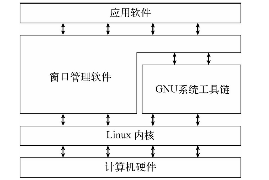

# Linux 

[TOC]


## 基础篇：

## 常识：

U 是用来描述服务器外部尺寸的单位。1 U = 4.445 cm

## 第一章 Linux 入门

##### 1.1 Linux 概述

① Linux 是一款操作系统、免费、开源、安全、高效、稳定，处理高并发非常强悍，现在很多企业级项目都部署在 Linux/Unix 服务器运行

② Linux 创始人: 林纳斯 $\cdot$ 托瓦兹(Linus Torvalds)

③ Linux 吉祥物 企鹅

历史：

- unix 1969年，美国贝尔实验室，ken Thompsan(肯 汤普森),Dennis Ritchie(丹尼斯 里奇) B 语言开发
- 1972 年期间 C 语言诞生
- 1973 年，UNIX 用 C 语言改写
- 1990 年，AT&T 意识到 UNIX 的商业价值，不再开源免费。
- 1991 年，linux 系统正式发布

Linus Benedict Torvalds 研发了 Linux 内核

GNU 组织和 linus 共同开发了 GNU/Linux 系统.

linux 内核：内核网址：www.kernel.org

##### 1.2  GNU 组织

- GNU 计划，是由 Richard  Staillman 公开发起。目标:创建一套完全自由的操作系统。
- GNU 是 “GNU ‘s Not Unix”

> 自由：可以不受限制地自由使用、复制、研究、修改和分发但必须公开源代码。可以买卖
>
> Linux 在本质上指的是 Linux 内核，并不是指发行版的Linux 系统（Centos、Kail…）。发行厂商不过只是在 kernel 的外围添加 shell 及其应用层相关的软件。

##### 1.3  unix 系统

Unix: 贝尔实验室 肯.汤普森(Ken Thompson Unix 之父) 和丹尼斯.理奇(Dennis Ritchie)

1985 GNU: 理查德.斯图曼 Richard stallman 自由软件

##### 1.4 linux 系统划分

inux 系统可以划分为四部分:

- Linux 内核 kernel （www.kernel.org）
- GNU 工具
- 图形化桌面环境
- 应用软件

具体详见 Linux 系统的组成



总结：Linux 内核是系统的核心，控制着内存、程序和硬件之间的交互。GNU工具是 Linux 系统中的一个重要部分。


##### 1.5 进入命令行

CLI （Command line interface,CLI）文本命令行界面

方式一：`Applications（应用） -> System tools （工具）- Terminal （终端） `

方式二：`Windows 键 ->  Terminal（终端）`

方式三：`右击 -> Terminal`

方式四：`Ctrl + Alt + T` Ubuntun 

## 第二章  安装 VMare 和 CentOS 

##### 2.1 安装VM 

略

xfs

Tips: 注意 BIOS 开启虚拟化支持

##### 2.2 Cent OS 安装

Tips: ext4 存储可以到达 1EB

xfs 存储可以到达 8EB （并且性能和可扩展性比 ext4 更强）

swap 分区，必须swap 文件系统（对其有优化）


网络连接的三种方式：

① 桥连接，拥有一个独立的 IP (在主机的 所在的 IP 段内)，可以和其它的系统(主机)进行通信，但是可能会造成 IP 不够用，IP 冲突的问题。 （和当前主机并列关系，可能造成 ip 冲突）

② NAT： 网络地址转换方式：就是拥有一套独立的子 IP 组段，linux 可以访问外网，不会造成 ip 冲突。（和当前主机属于包含关系，不可以和其他系统通信）。 Network Address transion

③ 主机模式： linux 为独立主机，系统拥有一个独立的 IP 。不可以访问外网。

详见[20 网络]

##### 2.3 Cent  OS 终端的使用

① 打开终端：鼠标右击 >> 打开终端

##### 2.4 open-vmt-ools 安装

open-vm-tools 实现 vmware的客户机和主机的文件共享。

> hgfs: host guest file system（主机-客户机 文件系统）

安装命令：

```
yum install open-vm-tools
```

##### 2.5  共享文件

第一步 首先要设置共享文件：虚拟机》设置》选项》共享文件：


第二步：在客户机中列举出共享目录：`vmare-hgfsclient`


具体步骤略：详见vmware 官方（https://kb.vmware.com/s/article/74650?lang=zh_CN）或者使用有道云共享文件中

的方法

① 创建包含一下内容的文件 /etc/systemd/system/mnt-hgfs.mount

```
[Unit]
Description=VMware mount for hgfs
DefaultDependencies=no
Before=umount.target
ConditionVirtualization=vmware
After=sys-fs-fuse-connections.mount

[Mount]
What=vmhgfs-fuse
Where=/mnt/hgfs
Type=fuse
Options=default_permissions,allow_other

[Install]
WantedBy=multi-user.target
```

② 创建包含一下内容的文件：/etc/modules-load.d/open-vm-tools.conf：

```
fuse
```

如果该文件已存在，请将该行添加到该文件中。

③ 使用一下命令启动系统服务

```
sudo sytemctl enable mnt-hgfs.mount
```

这可确保重新引导后会挂载 hgfs 目录。

④ 确保已加载 “fuse” 模块

```
sudo modprobe -v fuse
```

⑤ 共享文件夹应显示在目录 /mnt/hgfs 中。否则，使用以下命令启动服务：

```
sudo systemctl start mnt-hgfs.mount
```

或重新引导。

Tips: 

sudo命令 用来以其他身份来执行命令，预设的身份为root。在`/etc/sudoers`中设置了可执行sudo指令的用户。若其未经授权的用户企图使用sudo，则会发出警告的邮件给管理员。用户使用sudo时，必须先输入密码，之后有5分钟的有效期限，超过期限则必须重新输入密码。

配置 yum 源：https://developer.aliyun.com/mirror/centos?spm=a2c6h.13651102.0.0.3e221b11FE3nbj

- CTRL+ALT+ 功能键（F1~6）可以快速进入控制台界面

  exit 退出

- 更改终端界面：编辑>>首选项

##### 2.6 虚拟机使用技巧

1. 控制权的切换——Ctrl+Alt
2. 清屏——Ctrl+L
3. 结束任务——Ctrl+Alt+Insert
4. 虚拟机 BIOS 设置：开机按 F2
5. 删除虚拟机：虚拟机 >> 管理 >> 从磁盘中删除
6. 虚拟机快照管理。当系统损坏时，就回复到当施的状态。

##### 2.7 Linux 的终端

linux 终端可以分为：

- tty 控制台终端

- pts 虚拟终端

##### pts 虚拟终端

- 图形化界面进入的终端。

- 通过 ssh 相关工具连接上后，显示出来终端

**快捷键：**

- 新建一个 pts 虚拟终端：ctrl + shift + T 
- 快速切换:Alt +1,2…
- 放大：Ctrl + shift + +,
- 缩小：Ctrl + -

##### 2.8 为什么需要远程 linux ？

① Linux 服务器是开发小组共享的

② Linux 服务器是在机房的

使用到远程登录的工具 Xshell、Xftp…

##### 2\.9  Xshell 工具远程连接访问 Linux 工具的前提：

系统启用了 SSHD 服务，该服务使用的是 22 号端口

> Xshell 登录到 Linux，使用控制台
>
> Xftp 上传和下载文件

## 第三章 linux 目录结构

##### 3.1 基本介绍

**级层式，树状目录结构**

Linux 的文件系统采用级层式的树状目录结构，在此结构的最上层 root 根目录"/" 的基础目录,然后在此目录下在创建其他的目录。

linux 系统中，一切皆文件。

常见的目录名均基于**文件系统层级标准**（filesystem hierarchy standard，FHS）：

```
/ 为根目录。所有文件和目录由此开始，只有 root 用户对此目录有写权限。
	/bin /usr/bin /usr/local/bin bin 是 Binary 的缩写，这个目录存放着最经常使用的命令（用户级 GNU 工具） 
	/sbin /usr/sbin、/usr/local/sbin系统管理员使用的系统管理工具
	/lib 库目录：系统和应用程序公用的库 /usr/lib
	/lib64 				/usr/lib64
	/usr 用户所有的应用程序和所需的数据
	/boot 启动 Linux 时使用的一些核心文件，包括一些连接文件，以及镜像文件。
	/dev 设备目录，Linux 在这里创建设备节点。类似于 Windows 的设备管理器，把所有的硬件用文件的形式存储
	/etc 统配置文件目录，包含所有应用程序的配置文件，也包含启动，关闭某个特定程序的脚本
	/home 每个普通用户的主目录,在 Linux 中每个用户都有自己的主目录，默认该目录名是以用户账户昵称命名的
	/swap 虚拟扩展内存
	/opt 额外安装软件的目录。默认为空
	/usr/local 另一个额外安装软件的目录。一般是通过编译源码的方式安装目录
	/media 识别可移动媒体设备 U盘、光驱。
	/mnt 挂载目录 (通常用来挂载存储设备可以看作和 /media 等同)
	/run 运行目录（当前系统运行以来的所有实时信息。重启之后，全部清空）
	/srv 系统服务相关的内容
	/sys 系统硬件相关的内容
	/proc 内存（进程）映射目录
	/tmp 临时目录: 用来存放一些临时的文件
	/var 习惯将经常修改的文件的放在这个目录下（通常存放日志）
	/root 系统管理员，也成为超级权限者的用户主目录
```


> Linux 使用正斜线 `/` 划分目录，反斜线用来标识转义字符。和 winodws 相反。
>
> 在 Linux PC 上安装的第一块硬盘称为**根驱动器**。
>
> 挂载点 （mount point）: 虚拟目录中用于分配额外存储设备的目录（挂载其他存储设备）。虚拟目录会让文件和目录出现在这些挂载点目录中，然而实际上它们却存储在另外一个驱动器中
>
> 通常系统文件会存储在根驱动器中，而用户文件则存储在另一驱动器。 

##### 3.2 总结：

① Linux 各个目录下存放的内容是规划好，不可以乱放文件

② Linux 是以文件的方式管理我们的设备。因此 Linux 系统中一切皆文件


## 第四章 Vi/Vim 编辑器

##### 4.1 vi/vim 是什么

vi：unix系统中通用文本编辑器

vim：从vi 发展出来功能更加强大的文本编辑器。

Tips: vim 编辑器之神 emacs 神之编辑器

##### 4.2  测试

复制文件：`cp srcFiles destFiles`

`windows+空格`切换输入法

4.3 使用略

详见具体笔记。、

## 第五章 网络配置和系统管理操作

配置：略

##### 1\. 网络配置 IP 地址

1\. 查看网络 ip 地址：

- windows: `ipconfig`
- linux: `ifconfig` 或 `ip addr show`

Tips: linux 中的 ip 是 ens33 中的那个

2\. 测试主机之间网络连通性

`ping ip地址或域名`

3\. 修改 IP 地址

配置文件地址：`/etc/sysconfig/network-scripts/ifcfg-ens33`

有值的按照下面的值修改，没有该项的要增加

```
TYPE="Ethernet" #网络类型（通常是Ethemet）
PROXY_METHOD="none"
BROWSER_ONLY="no"
BOOTPROTO="static" #IP 的配置方法[none|static|bootp|dhcp]（引导
时不使用协议|静态分配IP|BOOTP 协议|DHCP 协议）
DEFROUTE="yes"
IPV4_FAILURE_FATAL="no"
IPV6INIT="yes"
IPV6_AUTOCONF="yes"
IPV6_DEFROUTE="yes"
IPV6_FAILURE_FATAL="no"
IPV6_ADDR_GEN_MODE="stable-privacy"
NAME="ens33"
UUID="e83804c1-3257-4584-81bb-660665ac22f6" #随机id
DEVICE="ens33" #接口名（设备,网卡）
ONBOOT="yes" #系统启动的时候网络接口是否有效（yes/no）
#IP 地址
IPADDR=192.168.10.100
#网关
GATEWAY=192.168.10.2
#域名解析器
DNS1=192.168.10.2
```

4\. 重启网络

`service  network restart`

5\. 修改 IP 可能会遇到的问题

略

##### 2\. 配置主机名称

1\. 修改主机名称

方法一：

① 查看当前主机名称：`hostname`

② 修改主机名称：vim /etc/hostname

③ 重启设备：`reboot`

方法二：

① 查看主机名有关的信息（以及一些系统信息）：`hostnamectl`

② 更改主机名称信息：`hostnamectl set-hosthostname 名称 `

方法三：

命令：`hostname 主机名`

##### 3\. 修改 hosts 映射文件

后续在 hadoop 阶段，虚拟机会比较多，配置时通常会采用主机名的方式配置，比较简单方便。不用刻意记ip 地址

命令：`vim /etc/hosts`

增加内容

```
192.168.10.100 hadoop100
192.168.10.101 hadoop101
192.168.10.102 hadoop102
192.168.10.103 hadoop103
192.168.10.104 hadoop104
192.168.10.105 hadoop105
192.168.10.106 hadoop106
192.168.10.107 hadoop107
192.168.10.108 hadoop108
```


## 第六章 常用命令

##### 6.1 关机&重启命令

shutdown:

语法格式：`shutdown [选项] [时间] [警告信息]`

选项：

```linux
-k 并不真正关机而只是发出警告信息给所有用户

-r 关机后立即重新启动

-h 关机后不重新启动

-f 快速关机重启动时跳过fsck

-n 快速关机不经过init 程序

-c 取消一个已经运行的shutdown
```

- `shutdown -h now`： 立即关机
- `shutdown -h 1`: 1 分钟后关机
- `shutdown -r now`： 立即重启
- halt  效果等价于立即关机
- reboot 重启系统
- sync 把内存中的数据同步到磁盘。（一般都使先进行此步操作之后，再关机）

注意：

当关机或者重启时，都应先执行 `sync` 指令，把内存中的数据写入硬盘。

2\. 用户登录和注销

## 

##### 6.2 用户登录和注销

① `su -userName` 切换用户

② logout 注销用户 （在图形运行级别无效）

Tips:

 登录时尽量使用普通用户登录，因为 root 用户权限太大（为避免失误操作）。当需要有用到较大的权限操作时，在使用 `su - 用户名` 切换成系统管理员身份。

##### 6.3 远程登录

在 windows 命令行中输入以下命令：`ssh 用户名@主机名`

## 第六章 用户管理

##### 6\.0 前言

用户是通过 UID 来识别，用户的 UID 是全局唯一的。用户可以分为三类：

- root 用户: 拥有最高权限，可以操作系统任何文件和命令
- 虚拟用户：也称为伪用户或假用户，不具备登录系统的能力，但却是系统运行不可缺少的用户。（系统自身拥有，而非后来添加）
- 普通真实用户：能登录系统，但只能操作其根目录的内容，权限受到限制。（root 用户添加的用户）

命令：

- `whoami` 查看当前用户
- `[root@xj~]#`即 [用户@主机名 当前目录名称]

##### 6.1 基本介绍

- /home/ 目录下有各个普通用户对应的家目录，当用户登录时会自动进入到自己的加目录
- linux 时一个多用户多任务的操作系统，任何一个想要使用系统资源的用户，都必须首先向系统管理员申请一个账户，然后用这个账户进入系统
-  Linux 用户至少要属于一个组

##### 6.2 添加用户

1\. 基本语法：

```shell
useradd [选项] 用户名
adduser [选项] 用户名
```

2\. 执行命令后在系统中的操作:

- 在 /etc/passwd 文件中添加了一行记录
- 在 `/home/` 目录下创建用户同名的主(家)目录，并且 /etc/skel 目录中的文件复制到该目录

使用该命令后，新建的用户暂时无法登录，需要为该用户设置登录口令才能登录（通过 `passwd` 指令）。用户的 UID 和 GID 是 `useradd` 自动选取的，它是将 /etc/passwd 文件中的 UID 加 1，/etc/group 中的 GID 加 1

3\. useradd 或 adduser 选项

| 选项             | 描述                                                         | 例子                      | 例子描述                           |
| ---------------- | ------------------------------------------------------------ | ------------------------- | ---------------------------------- |
| -g [initial_grp] | 指定用户的组。如果指定 -g 参数，useradd 命令会自动创建与用户账号同名的组作为该用户的组，称为私有组。 |                           |                                    |
| -G [grp…]        | 用于添加附属组;                                              |                           |                                    |
| -D               | useradd 命令所使用的默认值                                   |                           |                                    |
| -d [directory]   | 指定用户的主目录，如果此目录不存在，在同时使用 -m 选项来创建主目录 | `useradd -d /home/dog xq` | 将 xq 用户的主目录指定为 /home/dog |
| -m               | 使用目录不存在，则自动创建                                   |                           |                                    |
| -u UID           | 指定用户的 UID，如果同时有 -o 选项，则可以重复使用其他用户的 UID。ID 值不能为负值，不得小于 99，0~99 保留给系统账户使用。 |                           |                                    |

私有组的目的：让新用户和其他用户隔离，确保安全性的措施。一个用户可以属于多个组，添加必须使用 -G 来指定

Tips: `cd` change directory 切换目录

##### 6.3 用户口令管理 passwd

基本语法：`passwd [选项] 用户名`

选项

| 选项 | 说明                             |
| ---- | -------------------------------- |
| -l   | 锁定用户口令，禁止使用该用户账户 |
| -u   | 口令解锁                         |
| -d   | 关闭使用者的密码确认功能         |
| -f   | 强制执行指定的操作               |

root 用户为用户设定密码时，不需要原密码。而普通用户修改自己的密码，则需要原密码

注意：

① 在工作中必须使用复杂密码

② 使用 passwd 指定密码，界面不可见密码

##### 6.4 修改用户账号

基本语法：`usermod 选项 用户名`

选项：

| 选项            | 意义                                             |
| --------------- | ------------------------------------------------ |
| -d [directory]  | 修改用户登录时的目录                             |
| -e [days]       | 修改用户的有效期限，days 表示天数                |
| -g [group]      | 修改用户所属的组                                 |
| -l [login_name] | 变更用户登录时的名称为 login_name                |
| -p [passwd]     | 修改用户密码                                     |
| -s [shell]      | 指定用户登录的 shell，如果不指定则为默认的 shell |

注意：

- 不要使用 usermod 命令修改密码，否则在 `/etc/shadow` 中的密码是明码，因该使用 passwd 修改密码
- 修改时，需确认该用户在电脑上没有执行任何程序，否则报错

##### 6.5 删除用户

- `userdel 用户名`  删除指定用户，但保留家目录
- `userdel -r 用户名` 删除用户单不保留家目录

Tips: 删除用户时，我们一般不会将家目录删除

##### 6.6 查询用户信息

语法：`id 用户名`

```linux
# uid：用户 id, gid：用户所在z=组的 id, 组:组名
uid=0(root) gid=0(root) 组=0(root)
```

当用户不存在，返回 `无此用户`。

##### 6\.7 切换用户

语法：`su - 用户名`

当操作 Linux 时，如果当前用户的权限不够，可以通过 `su 用户名` 指令，来切换到高权限用户。（常切换到 root）

Tips:

① 从权限高的用户切换到权限低的用户，不需要输入密码，反之需要

② 当需要返回到原来用户时，使用 exit

##### 6.8 用户组管理常用命令

用户组是具有相同特征的用户的集合体。用户和用户组的关系是多对多的，一个用户可以属于多个用户组，同样一个用户组也可以包含多个用户。

1\. 用户组添加 groupadd

基本语法：`group 选项 用户组名`

选项：

| 选项   | 描述                                                         |
| ------ | ------------------------------------------------------------ |
| -g GID | 除非用 -o 参数，否则 GID 必须是唯一且数值不可为负，预设值以 /etc/login.defs 为准 |
| -o GID | 运行 GID 不唯一                                              |
| -r     | 创建一个系统组, 且 GID 范围：SYS_GID_MIN~SYS_GID_MAX         |
| -f     | 如果指定的组已经存在，该选项会导致命令简单地以成功状态退出。当与-g一起使用时，如果指定的GID已经存在，则会选择另一个(唯一的)GID(即-g) |

2\. 用户组修改命令 groupmod

基本语法：`groupmod 选项 组名`

| 选项   | 意义             |                                                   |
| ------ | ---------------- | ------------------------------------------------- |
| -g GID | 用户指定新的 GID | `groupmod -g 555 police` #wangyq 组 ID 修改为 555 |
| -o GID | 重复使用 GID     |                                                   |
| -n     | 为群组改名       |                                                   |

3\. 用户删除指令 groupdel

基本语法：`groupdel 组名`

注意：如果该用户组包含某些用户，则必须先删除这些用户才能删除该用户组

系统可以对有共性的多个用户进行统一管理

- 添加组 `groupadd 组名`
- 删除组 `groupdel 组名`

##### 6.8 添加用户时指定组和家目录

`useradd -d 家目录 -g 用户组 用户名`

##### 6.9 修改用户的组：

- `usermod -g 用户组 用户名` 修改用户所在组
- `usermod -d 目录名 用户名` 改变该用户登录的初始目录

#####  6.10 etc 目录下的文件

① /etc/passwd 文件 

记录用户的各种信息

- 所有系统用户名账户列表以及每个用户的基本配置信息

- 每行的含义：`用户名:口令:用户标识号:组标识号:注释性描述:主目录:指定用户使用的 shell程序`（登录 Shell`）

  例如：`rsrmxj:x:1001:1004::/home/rsrmxj:/bin/bash` 当用户登录会自动启用 `bash/shell`

② /etc/shadow 文件

- 口令的配置文件

- 每行的含义：`登录名:加密口令:最后一次修改时间:最小时间间隔:最大时间间隔:警告时间:不活动时间:失效时间:标志`，例如：`rsrmxj:!!:18729:0:99999:7:::`

  加密口令为 `!!` 说明还没有为该用户创建密码，表示用户密码可不用。

③ /etc/group 文件

- 组的配置文件, 记录 linux 包含的组的信息

- 每行含义：`组名:口令:组标识号:组内用户列表`

  Tips: 似乎组内用户列表不可见

## 第七章 实用指令

centOS 7 以前使用 init 指令，7 及之后使用 Systemctl 指令：

##### 7.1 指定默认运行级别：

1\. init 指令

语法: `init 运行级别`

- 0 关机
- 1 单用户(找回丢失密码)
- 2 多用户状态没有网络服务
- 3 多用户状态有网络服务
- 4 系统未使用保留给用户
- 5 图形界面
- 6 重启系统

常用的运行级别是 3 和 5,要修改默认的运行级别，可以修改文件 /etc/initab 的 id:5:initdefault: 中的数字。

举例：`init 0` 关机

2\. systemctl

运行级别说明

- Runlevel 0 : 关闭系统（关机）
- Runlevel 1 : 救援？维护模式
- Runlevel 3 : 多用户，无图形系统
- Runlevel 4 : 多用户，无图形系统
- Runlevel 5 : 多用户，图形化系统
- Runlevel 6 : 关闭并重启机器

```shell
语法格式：systemctl isolate runlevel运行级别.target

#  启动运行等级5，即图形模式
systemctl set-default runlevel5.target
# 等价于
systemctl set-default graphical.target
# 举例：启用多用户,无图形系统模式：
systemctl isolate runlevel3.target
# 常用用户级别：
multi-user.target 运行级别3(多用户状态有网络)
graphical.target 运行级别5(图形界面)
```

设置默认模式。要通过 systemctl 命令进行设置：

- `sytemctl get-default` 查看默认的模式
- `systemctl set-default 模式` 详情查看 etc\inittab

详见 systemctl.md

##### 7.2 重置 root 密码

进入单用户模式 （略）


##### 7.3 帮助指令

当我们对某个指令不熟悉时，可以使用 linux 的帮助指令，来了解这个指令的使用方法。

① man 获取帮助信息

- 语法：`man [命令或配置文件]`

- 功能：获得帮助信息

  举例：`man ls`

- 手册页的内容区域: 节

  | Name          | 命令名称和一段简短的描述 |
  | ------------- | ------------------------ |
  | Synopsis      | 命令的语法               |
  | Configuration | 命令配置的信息           |
  | Description   | 命令的一般性描述         |
  | Options       | 命令选项描述             |
  | Exit status   | 命令退出状态描述         |
  | Errors        | 命令的错误信息           |
  | Enviroment    | 命令所使用的环境变量     |
  | Files         | 命令所用到的文件         |
  | Versions      | 版本信息                 |
  | Conforming To | 命名所遵从的标准         |
  | Notes         | 其他有帮助的资料         |
  | Bugs          | 提供提交 bug 的途径      |
  | Example       | 展示命令的用法           |
  | Authors       | 命令开发人员的信息       |
  | Copyright     | 命令源代码的版权情况     |
  | See Also      | 与该命令类型的其他命令   |

  并不是每一个命令的手册页都包含列出的所有节

> 如果不记得命令名怎么办？
>
> 可以使用关键字搜索手册页。语法是：man -k 关键字。例如，要查找与终端相关的命令，可以输入man -k terminal 。

​	内容区域：

| 区域号 | 所涵盖的内容             |
| ------ | ------------------------ |
| 1      | 可执行程序或 shell 命令  |
| 2      | 系统调用                 |
| 3      | 库调用                   |
| 4      | 特殊文件                 |
| 5      | 文件格式与约定           |
| 6      | 游戏                     |
| 7      | 概览、约定及杂项         |
| 8      | 超级用户和系统管理员命令 |
| 9      | 内核例程                 |

使用 `man 数字 命令名称`  查看对应区域。

② help 指令

- 语法：`help 命令`
- 描述：获得 shell 内置命令帮助细信息

##### 7.3 文件目录类

###### **① `pwd`**

（ print name of current/working directory）

- 语法：`pwd`
- 功能描述：显示当前工作目录的绝对路径

###### **② ls** 

list directory contents

- 语法：`ls [选项] [目录或文件]`

- 描述：列出关于文件的信息(默认的当前目录)。如果没有指定的-cftuvSUX,则按**字母顺序排序**；ls 命令可以用不同的颜色来区分不同类型的文件。由环境变量 LS_COLORS 指定

- 常用选项：

  - -a 显示所有的文件和目录，包括隐藏的
  - -l 以长列表格式显示信息
  - -F 可以区分目录和文件；在目录的后面加了正斜线（/）；会在可执行文件后面加个星号
  - R 显示当前下目录下的内容；还显示当前目录下所有子目录的文件

  > 常用隐藏文件来保存配置信息，以 . 起始的文件。

  ```
  drwxr-xr-x  2 root root     6 12月 27 11:40 桌面
  d 文件类型
  rwx 所有者权限
  r-x 所在组权限
  r-x 其他组权限 
  2 文件:硬链接数;目录:子目录数 
  root 文件所有者 
  root 文件所在组 
  6 文件大小(字节)，如果是文件夹则显示 4096
  12月 27 11:40 最后的修改时间 
  桌面 文件名
  > 详看权限
  ```

- 过滤输出：

  ```
  ls -l my_script # 输出 my_script 文件的相关信息
  ```

  使用通配符：

  - `?`代表一个字符

  - `*` 代表零个或多个字符

  - `[字符列表，中间用逗号隔开]` 在特定位置可能出现的多种选择。

    也可以指定字符范围：`[a-i]`

    ！可以将不需要的内容排除在外 `[!i]` 

    其他详见：收藏中的 linux 通配符、元字符和特殊字符

  > 在过滤器中使用星号和问号被称为文件扩展匹配. （file globbing）指的是使用通配符进行模式匹配的过程。通配符正式的名称叫作元字符通配符 （metacharacter wildcards）。除了星号和问号之外，还有更多的元字符通配符可用于文件扩展匹配。

`ls -[选项] [目录或文件]` 查看当前目录的所有内容（list directory contents)

###### ③  cd 

change directory

- 基本语法：`cd destination` 

  这里的 destination （目的地; 终点）可以是相对路径也可以是绝对路径

- 功能描述：切换到指定目录

- 常用的有：

  `cd ~ 或 cd` 回到自己的家目录

  `cd ..` 返回当前目录的上一级目录

###### ④ mkdir

make directory

- 基本语法：`mkdir [参数] 要创建的目录`
- 功能描述: 创建目录
- 常用选项: -p 创建多级目录

###### ⑤ rmdir 

remove directory 

- 语法：`rmdir [参数] 指令要删除的空目录`
- 功能描述: 删除空目录
- 注意：rmdir 只能删除空目录，如果需要删除非空目录，需要使用 `rm -rf 要删除的目录`

###### ⑥ touch

- 语法：`touch 文件名称`

- 功能描述：创建空文件；改变文件的修改时间，不会改变文件的内容

- 选项

  - `-a` 修改文件的访问时间

    查看文件的访问时间 `ls -l --time=atime`

###### ⑦ cp

- 语法：`cp [选项] sourceFile destinationFile`

- 功能描述：复制文件到指定的目录

  当两个参数都是文件名时，cp 命令会将源文件复制成一个新文件，并且以 destination 命名。有新的修改时间，新文件就像全新文件一样

- 常用选项：

  - -r / -R: 递归复制整个目录（文件夹）下的内容

  - -i :交互式操作，覆盖前先行询问用户，如果源文件与目标文件或目标目录中的文件同名，则询问用户是否覆盖目标文件。用户输入”y”，表示将覆盖目标文件；输入”n”，表示取消对源文件的移动。这样可以避免误将文件覆盖。
  - 
    不使用，会默认覆盖

    Tips: 如果 destination 如果是目录，需要尾部加正斜线 / ，表明 destination 是一个目录而非文件。否则如果如果 destination ,`/home/christine/Documents`不存在。在这种情况下会试图创建要给新文件 `Documents` 的文件，连错误信息都不会显示。

- 可以使用特殊路径符号：例如：`. ..`

如果目标目录中有相同文件，会提示是否覆盖。

`\cp [选项] sourceFile DestFile` 强制覆盖不提示

###### ⑧ rm 

 removing

- 语法：`rm [参数] 要删除的文件` 
- 功能描述：移除（删除）文件或目录
- 常用参数：
  - -r 递归删除整个文件夹
  - -f 强制删除不提示
  - -i 提示是否真的要删除；
  - 可以使用通配符

⑨ mv 

语法：

```shell
# 重命名
mv oldNameFile newNameFile 
# 移动文件或文件见
mv /temp/moveFile /targetFolder 
```

mv 只影响文件名，inode 编号和时间戳保持不变

- 常用选项:

  - -i ： 试图覆盖已有文件时，就会得到提示

- Tip：mv 只会改变名称或位置

##### 7.4 查看文件

###### ①  cat  

- 基本语法：`cat [选项] 文件`
- 功能描述：以只读的方式打开，查看文件的内容
- 常用选项：
  - -n 显示行号
- 其他用法：配合管道命令使用，分页浏览：`cat [选项] 文件名 | more`

###### ② more 

- 基本语法：`more 要查看的文件`

- 功能描述：以全屏幕方式按页显示文本文件的内容。more 指令中内置了若干快捷键，详见操作说明。

- 快捷键

| 按键     | 功能说明                             |
| -------- | ------------------------------------ |
| 空格键   | 向下翻一页                           |
| 回车箭   | 向下翻一行                           |
| q        | 表示立即离开 more,不再显示该文件内容 |
| Ctrl + F | 向下滚动一屏                         |
| Ctrl + B | 返回上一屏                           |
| =        | 输出当前的行号                       |
| :f       | 输出文件名和当前行的行号             |

###### ③ less 

- 基本语法：`less fileName`
- 功能描述：**分屏查看文件内容**，与 more 类似，但是比 more 更加强大。显示文件内容时，不用加载整个文件，可以根据显示加载内容，对于显示大型文件有较高的效率。(根据需要加载内容，对于大型文件具有较高的效率。)

| 按键     | 功能说明                                       |
| -------- | ---------------------------------------------- |
| 空格键   | 向下翻一页                                     |
| PageDown | 向下翻动一页                                   |
| PageUp   | 向上翻动一页                                   |
| /字符串  | 向下查找[字符串]的功能: n 向下查找，N 向上查找 |
| ?字符串  | 向上查找[字符串]的功能: n 向上查找，N 向下查找 |
| q        | 离开 less，不在显示该文件的内容                |

###### ④ file 

功能：查看文件类型 

语法：`file 文件名`

```shell
root@xj-virtual-machine:/home/xj# file hello1.md
hello1.md: ASCII text
# 上面的例子中不仅确定了文件是文本文件，还确定了该文本文件的编码
# 如果是一个类型为软连接的文件，file 命令甚至能够告诉你它链接到那个文件上。

脚本文件
#二进制可执行能够确定该程序编译时所面向的平台以及需要何种类型的
库。
root@xj-virtual-machine:/home/xj# file ls_script 
ls_script: a /bash/shell script, ASCII text executable
```

###### ⑤ `>` 和 `>>`

介绍

- `>` 输出重定向：会将原来的文件内容覆盖
- `>>` 追加：不会覆盖原来的文件，而是追加到文件的末尾

语法：

- `ls -l>文件` 将列表的内容写入覆盖写入到指定的文件中。如果文件不存在，则创建该文件
- `ls -l>>文件` 将列表的内容追加到文件的末尾
- `cat 文件1>文件2`  将文件 1 的内容覆盖到文件 2
- `echo "内容">>文件` 将内容追到文件中：

例子：

`ls -l > a.txt` 列表的内容写入文件 a.txt

`ls -l >> b.txt` 列表的内容追加到文件 a.txt 的末尾

###### ⑥ `echo`

功能描述：输出内容到控制带

基本语法：`echo [选项] [输出内容]`

###### ⑦ `head`

功能描述: 显示文件的开头部分内容，默认显示文件的前 10 行内容

基本语法：

- `head fileName` 查看文件的前 10 行内容
- `head -n 5` fileName  查看文件的前 5行内容

###### ⑧ tail 

功能描述：查看文件中尾部的内容。（默认情况下显示文件的后 10 行内容）

基本语法：

- `tail 文件` 查看文件的后 10 行内容
- `tail -n 5 文件` 查看文件的后 5 内容，同样这里的 5 可以任意数
- `tail -f 文件` 实时追踪该文的所有更新，在工作中经常使用

###### ⑨ 链接文件

链接是目录中指向文件真实位置的占位符。在Linux中有两种不同类型的文件链接：

- 符号链接

  就是一个目录指向，指向文件系统中某个地方的另一个文件。

- 硬链接

###### ln 指令

软链接也叫符号链接，类似于 windows 中的快捷方式，主要存放了链接其他文件的路径

基本语法：`ln -s [原文件或目录] 软链接文件名` 在当前目录下创建一个软连接 LinkRoot，连接到原文件。

注意：这里的软连接文件名仅仅是指向原目录，他们的内容并不相同，是两个完全不同的文件。(可以通过 `ls -i 文件` 查看 inode 编号进行查证)

常用其他指令：

- 删除软连接: `rm -rf 软连接名`

注意：

① 当我们使用 pwd 指令查看目录时，看到的仍然是**软链接所在目录**

② 使用 ln 命令，原是文件必须事先存在

**硬链接**

会创建独立的虚拟文件，其中包含了原始文件的信息及位置。但是他们从根本而言同一个文件。引用硬链接文件等同于引用了源文件。要创建硬链接，原始文件也必须事先存在，只不过这次使用 ln 命令时不再需要加入额外的参数了。

> 只能对处于同一存储媒体的文件创建硬链接。要想在不同存储媒体的文件之间创建链接，只能使用符号链接。


基本语法：`ln -s [原文件或目录] [软链接名]` 给原文件重建一个软链接

Tips: 软链接并不是一个目录。

###### ⑩ history

功能描述：查看已经执行过历史命令，也可以执行历史命令

基本语法：

基本语法：

- `history` 查看所有的历史命令
- `history n` 显示最近使用过的 n 个命令
- `!n` 执行编号为 n 的指令

例子：

- `history` 查看已经执行过历史命令
- `history 10` 查看最近使用过的 10 个命令
- `!178` 执行标号为 `178` 的命令

##### 7.5 时间日期类 

###### 1\. date

功能：显示或设置系统时间与日期

常用选项：

- `-s` 根据字符串设置系统时间。
- `-d`    解析字符串并按照指定格式输出，字符串不能是'now'。`date -s 字符串时间`

基本语法:

- `date` 显示当前时间
- `date +%Y` 显示当前年份
- `date +%m` 显示当前月份
- `date +%d` 显示当前是本月的第几天
- `date "+%Y-%m-%d %H:%M:%S"` 显示年月日时分秒。连接符可以更改
- `date -s 字符串时间` 设置时间。例如：`date -s "2020-12-23 11:23:32"`

format 转义序列：（略）

###### 2\. cal 查看日历

基本语法：`cal [选项] `

- `cal` 显示本月日历
- `cal 年份` 显示指定年份的日历

不加选项，显示本月日历

##### 7.6 搜索查找类

###### 1\. find

功能描述：`find` 指令从指定目录向下递归地遍历其各个子目录，将满足条件的文件或者目录显示在终端

基本语法：`find [搜索范围] [选项]`

选项说明：

| 选项            | 功能                                               | 例子                        | 描述                                                         |
| --------------- | -------------------------------------------------- | --------------------------- | ------------------------------------------------------------ |
| -name<查询方式> | 按照指定的文件名查找文件                           | `find /home -name hello.txt | 查找 /home 目录下的 hello.txt 文件</br>`find / -name *.txt` 查询 / 目录下，查询所有 .txt 的文件 |
| -user<用户名>   | 查找属于指定用户名的所有文件                       | `find -opt -user nobody`    | 查找 /opt 目录下，用户名称为 nobody 的文件                   |
| -size<文件大小> | 按照指定的文件大小查找文件(+ 大于，- 小于，n 等于) | `find / -size +20M`         | 查找 linux 系统大于 20M 的文件                               |

###### 2\. locate 指令

功能描述：*可以快速定位文件路径*。locate 指令利用事先建立的系统中所有文件名称及路径的 locate 数据库事先快速定位给定的文件。locate 指令无需遍历整个文件系统，查询速度较快。

基本语法：`locate 文件`

注意：

1. locate 指令是基于数据库进行查询，所以第一次运行前，必须使用 updatedb 指令创建 locate 数据库
2. 为了确保查询结构，管理员必须定期跟新 locate 数据库。 指令：`updatedb`

###### 3\. grep 指令和管道符号 | 

- `grep` 过滤查找，

- 管道符号 `|`，表示将前一个指令的处理结果传递给后面的指令处理

基本语法：`grep [选项] 查找内容 源文件`

常用选型：

| 选项 | 功能             | 举例：                                                       |
| ---- | ---------------- | ------------------------------------------------------------ |
| -n   | 显示匹配行及行号 | `cat hello.txt | grep -n yes` 在 hello.txt 文件中，查找 yes 所在行，并且显示行号,区分大小写 |
| -i   | 忽略字母大小写   | `cat hello.txt | grep -ni yes` 在 hello.txt 文件中，查找 yes 所在行，并且显示行号,不区分大小写 |

##### 7.7 压缩和解压类

###### 1\. gzip/gunzip 指令

gzip 用于压缩文件，gunzip 用于解压文件

基本语法：

| 基本用法             | 功能描述               |
| -------------------- | ---------------------- |
| `gzip fileName`      | 将文件压缩为 *.gz 文件 |
| `gunzip fileName.gz` | 解压缩文件命令         |

当我们使用 gzip 对文件进行压缩后，不会保留原来的文件

###### 2\. zip/unzip 

zip 用于压缩文件，unzip 用于解压

| 基本用法                            | 功能描述       | 常用选项                           |
| ----------------------------------- | -------------- | ---------------------------------- |
| `zip [选项] ***.zip 将要压缩的内容` | 压缩文件和目录 | -r 递归压缩                        |
| `unzip [选项] ***.zip`              | 解压缩文件     | -d <目录> 指定解压后文件存放的目录 |

zip 常用选项：

- -r: 递归压缩，即将某个目录下的所有内容压缩；举例：`zip -r mypackage.zip /home/`

unzip 常用选项：

- -d: 指定押后文件的存放目录 ; 举例： `unzip -d /opt/tmp mypackage.zip`

###### 3\. tar 指令

打包指令，打包后的文件后缀名为 `*.tar.gz`

基本用法：`tar [选项] ***.tar.gz` 打包的内容

**选项：**

| 选项 | 功能                        |
| ---- | --------------------------- |
| -c   | create 产生 *.tar 打包文件  |
| -v   | verbose 显示详细信息        |
| -f   | filename 指定压缩后的文件名 |
| -z   | 代表用 gzip 算法来压缩/解压 |
| -x   | extract 解压 *.tar 文件     |

注意：tar 格式仅仅是将文件打包，而没有压缩

常用：

- 打包：`tar -cvf [目标文件名].tar [原文件名/目录名]`
- 解包：`tar -xvf [原文件名].tar`
- 打包并压缩： tar -zcvf [目标文件名].tar.gz [原文件名/目录名] 举例：`tar -zcvf myhome.tar.gz /home/` 将 home 文件夹压缩为 myhome.tar.gz 
- 在当前目录下解压并解包： `tar -zxvf tar.gz文件`
- 解压到指定文件夹并解包：`tar -zxvf tar.gz文件 -C 指定解压的目录` 指定解压到的目录要存在，否则会报错。
- 压缩多个文件：`tar -zcvf a.tar.gz a1.txt a2.txt` # 这里将 a1.txt 和 a2.txt 压缩为 a.tar.gz

例如：解压到指定的目录 /opt/：

`tar -zxvf *。tar.gz -C /opt/`

## 第八章 管理和权限管理

##### 8.1 Linux 组基本介绍

在 linux 中每个用户必须属于一个组，不能独立于组外。每个文件有所有者，所在组、其他组的概念。

##### 8.2 文件/目录 所有者

一般文件的创建者为，为该文件的的所有者。文件的所在组默认为创建用户的所在组。

① 查看文件所有者或所在组的指令：`ls -al 或 ll` 

  > 指令：`ls -ahl`
  >
  > 尚硅谷教程中的 h 是文件的尺寸显示，以 kB、M、G 为单位 

② 更改文件的所有者

指令件名

③ 修改文件的所有者和所在组：`chown 用户名:组名 文件名`

##### 8.3 修改文件的所在组

基本指令：`chgrp 组名 文件名`

其他组：除了文件所有者和所在组的用户外，系统的其他用户都是文件的其它组。

选项 -R 如果是目录，则其下所有子文件或目录递归生效

##### 8.4 权限基本介绍

`ls -l`查看

`-rw-r--r--.  1 tom  root    0 8月  22 17:43 apple.txt`

`文件类型+权限 数字 用户名 组 文件大小 最后一次修改日期 文件名`

例如：

````
drwxr-xr-x  2 root root     6 12月 27 11:40 桌面
d 文件类型
rwx 所有者权限
r-x 所在组权限
r-x 其他组权限 
2 文件:硬链接数;目录:子目录数 
root 文件所有者 
root 文件所在组 
6 文件大小(字节)，如果是文件夹则显示 4096
12月 27 11:40 最后的修改时间 
桌面 文件名
````

0~9 位说明

- 第 0 位确定文件类型 (d,-,l,c,b)
- 第 1-3 位确定该文件所有者拥有该文件的权限
- 第 4-6 位确定该文件所在组拥有该文件的权限 
- 第 7-9 位确定该文件其他组拥有该文件的权限

文件类型：

- `l` 软链接
- `-` 普通文件
- `d` 目录（文件夹）
- `c` 字符设备（键盘、鼠标）
- `b` 块文件（硬盘）

数字：

如果是文件，表示硬链接的数，如果是目录则表示该目录的子目录数

Tips: 如果文件大小为 4096 则表示为文件夹

##### 8.4 权限详解

- r read 代表可读：可以读取、查看
- w write 代表可写：可以修改，但是不代表可以删除文件，删除一个文件的前提条件是对该文件所在的目录有写权限，才能删除文件。
- x execute 代表可执行：可以被执行。文件夹如果没有 x 权限则进不去
- 可以用数字表示权限：r=4,w=2,x=1 因此 rwx=4+2+1=7

作用到文件

- r (read)可读取、查看
- w(write) 可写，可修改，但不可以删除该文件。删除一个文件的前提是对该文件所在的目录有写权限。
- x(excute) 可执行

作用到目录

- r 可以读取，ls 可以查看目录
- w 可写，可以修改，目录内创建/删除/重命名目录
- x 代表可执行，可以进入该目录

可用数字表示：r=4,w=2,x=1

##### 8.6  修改权限 chmod

chmod 指令可以修改文件或目录的权限

1\. 第一种方式：+,-,= 变更权限

u: 所有者， g：所在组， o: 其他人 a:所有人（u,g,o 的总和）

① `chmod u=rwx, g=rx, o=rx 文件/目录名`

② `chmod o+w 文件/目录名`  其他组增加写的权限

③ `chmod o-x 文件/目录名`  所有人除去执行权限

例子：

- 给 abc 文件所有者读、写、执行权限，给所在组读、执行权限，其他组读、执行权限

  `chmod u=rwx,g=rx,o=rx`

- 给 abc 文件的所有者去除执行的全兴，增加组写的权限

  `chmod u-x,g+w abc`

2\. 第二种方式 通过数字变更权限

规则：`r=4,w-2,x=1 rwx=4+2+1=7`

例子:

```shell
chmod u=rwx,g=rx,o= x 目录/文件名
# 等价于：
chmod 751 目录/文件名
```

## 第九章  系统管理

##### 9.1 Linux 中的进程和服务

计算机中，一个正在执行的程序或命令，称为 “进程” (progress)。

启动后一直存在，常驻内存的进程，一般称作 “服务” (service)。

##### 9.2 service 服务管理（CentOS6 版本了解）

基本语法：`service 服务名 start|stop|restart|status`

查看服务的方法：`/etc/init.d/服务名`

实例：

`service network status` 查看网络服务状态

##### 9.3 chkconfig 设置后台服务器的自启配置

基本语法：

- `chkconfig` 查看所有服务自启配置
- `chkconfig 服务名 off/on` 关闭/开启指定服务的自动启动；
- `chkconfig 服务名 --list`查看服务开机启动状态

Tips：守护进程 daemon

##### 9.4 systemctl (Centos 7版本，重点掌握)

基本语法：`systemctl start|stop|restart|status 服务名`

实例：查看防火墙状态: `systemctl status firewalld`

- 查看服务方法：`/usr/lib/systemd/system

- `sytemctl get-default` 查看默认的模式
- `systemctl set-default 模式` 详情查看 etc\inittab


##### 9.5 设置服务器自启配置

- `systemctl list-unit-files` 查看服务开机自启状态
- `systemctl disable|enable 服务名` 关闭/开启服务的自动启动

使用network 和 NetworkManager 都可以联网；虽然保留了 network (CentOS 6),但是推荐使用 NetworkManager 联网（CentOS 7 版本的更好一点）。

## 第十章 RPM 和 YUM

##### 1. RPM

1\. 介绍

用于互联网下载包的**打包**及**安装工具**。扩展名为 *.rpm。

RPM是 RedHat Package Mananger （RedHat 软件包管理工具) 的缩写。

② 简单命令

`rpm -qa | grep firefox` 查询适用于当前系统的 firerfox 安装包

Tips:选项 q 询问，a 所有套件

③ rpm 包的基本格式

例如：`irefox-68.10.0-1.el7.centos.x86_64` 

- 软件名：firefox
- 版本号: 68.10.0-1
- 适用于 centos7.* 的 64 位系统：el7.centos.x86_64` 

④ rpm 其他查询命令

- `rpm -qa` 查询安装的所有的 rpm 包
- `rpm -qa| more` 分页显示

Shell

****

普通用户的提示符为 ”$“,而 root 用户的提示符”#“

## 第九章 crond 任务调度

crondtab 机制：定时调度我们的脚本或代码 

例如：定时调用某个脚本或代码，完成某个任务，例如备份 mysql 数据库

① 如果只是简单的任务，可以不用写脚本，直接在 crontab 中加入任务即可

② 对于比较复杂的任务，需要编写脚本（Shell 编程）

1\. 概述

任务调度：是指系统在某个时间执行特定命令或程序

任务调度分类：1. 系统工作：有些重要的工作必须周而复始的执行。

# 扩展

## 一. 虚拟机使用技巧

1. 增加虚拟机的可用物理内存——双击虚拟机>>**编辑虚拟机设置**中可以增加物理内存。
2. 硬件设备添加——**虚拟机设置**中单击添加
3. 控制权的切换——Ctrl+Alt
4. 清屏——Ctrl+L
5. 结束任务——Ctrl+Alt+Insert
6. 虚拟机 BIOS 设置：开机按 F2
7. 删除虚拟机：虚拟机 >> 管理 >> 从磁盘中删除
8. 虚拟机快照管理。当系统损坏时，就回复到当施的状态。

#### linux 基本命令

##### linux 终端

tty 控制台终端，pts 虚拟终端

在 tty 界面返回 图形化界面：init 5 >> 然后按 Ctrl +D 

 在 pts 虚拟终端进入 tty 控制台：init 2

##### pts 虚拟终端

- 图形化界面进入的终端。

- pts 伪终端：通过 ssh 相关工具连接上后，显示出来终端

**快捷键：**

- 新建一个 pts 虚拟终端：ctrl + shift + T 

- 快速切换:Alt +1,2…

- 放大：Ctrl + shift + +,

- 缩小：Ctrl + -

##### Shell 提示符

`[root@xj~]#`即 [用户@主机名 当前目录名称]

普通用户的提示符为 ”$“,而 root 用户的提示符”#“。

**切换用户**：`su - 用户名`

查看当前用户：`whoami`

#### Bash Shell 基本语法

linux 命令输入规律：`命令 [选项]([参数]) [选项的值]([参数的值])`

常见选项(参数):`-h 或--help`  ； 特点：`-字母 或 --单词`

注：空格作为分隔符

#### 基本命令：

| 命令名称 | 作用                     | 语法                                                         | 参数                                                         |
| -------- | ------------------------ | ------------------------------------------------------------ | ------------------------------------------------------------ |
| ls       | 查看当前目录下有哪些文件 | `ls 目录`，如果不加目录查看当前目录<br />                    | - i 显示详细信息 快捷键#ll<br />-a 显示隐藏文件<br />-d 查看目录(不查看里面的内容)<br />-h 增强可读性 |
| pwd      | 查看当前目录             | pwd 没有参数                                                 |                                                              |
| cd       | 切换目录                 | `cd 目录名`<br />`cd 或 cd ~` 回到主目录<br />`cd  -` 切换到上一次切换时  目录<br />.. 上级目录<br />. 当前目录 |                                                              |
| shutdown | 关机，重启，定时关机     | `shutdown [选项]`                                            | `-r` => 重新激动计算机<br />-h => 关机<br />-h time => 定时关机<br />`-c`取消之前的定时时关机，或ctrl+c |
| init 0~6 | 切换系统运行级别         | 0 关机；6 重新启动；5 图形 GUI 模式，<br />查看当前运行级别 runlevel |                                                              |

##### 创建实验快照

- 配置静态 IP 地址，关闭 iptable (防火墙)，关闭 selinux
- 设置来电后自动开机

**进入单用户模式：**

注：韩顺平老师教的单用户和默认模式并不适用于 Centos 7/8。具体操作祥看有道云笔记中的文档

设置默认模式。要通过 systemctl 命令进行设置：

- `sytemctl get-default` 查看默认的模式
- `systemctl set-default 模式` 详情查看 etc\inittab

mount -o remount,rw /

1. *#*touch/.autorelabel