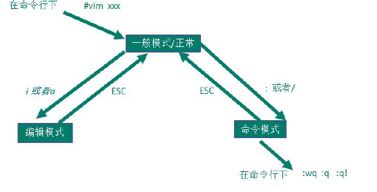
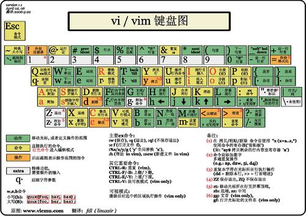

# vi 和 vim 编辑器的使用

##### 1\. vi 和 vim 的基本介绍

- vi 就是 linux 系统内自带的 **文本编辑器**。就类似于 windows 中的记事本
- vim 是 vi 的增强版本，具有编辑程序的能力，代码高亮。

##### 2\. vi 和 vim 的三种模式

**正常模式**

正常模式下，可以使用快捷键。进行 删除字符、删除整行、复制、粘贴等操作

vim 打开文档，就直接进入了正常模式。

**编辑模式/插入模式**

可以输入内容。

在正常模式下按下 i,I,o,O,a,A,r,R 等任何一个字母之后就会进入编辑模式，一般来说按 i 就可以了。

按下 ESC 进入正常模式。

**命令行模式**

正常模式按下 ：或 / 进入该模式，退出按 Esc 进入正常模式。

可以使用相关命令，来完相应的操作。例如：替换、显示行号、存盘、替换、离开 Vim 等操作

##### 3\. vim 编辑使用

使用命令: `vim 文件名称` 如果这个文件没有存在，则新建

几种退出，在命令行模式下：

- 输入 wq,然后回车，
  - w：write 写入
  - q：quit 退出
- 输入 `x`。因为 x=wq
- `Shift+Z+Z`
- **q 正常退出**
  前提：打开的文本文件，在内容上没有被修改过
- 不保存退出（强制退出）`q!`

##### 4\.常用快捷键：

在命令行模式下

- `yy` 复制当前行
- `nyy` 复制从鼠标所在行后 n 行（包括鼠标所在行）
- `p` 粘贴;(需要在上一行末尾粘贴)
- `dd` 删除当前行
- `ndd` 删除当前及后共 n 行。
- `u` 撤销
- `G` 光标移动到尾行（注意并不是到尾行的末尾）
- `gg` 光标移动到首行
- `set nu` 显示行数
- `set nonu` 取消行数显示
- 查询关键词：`\关键字` 然后回车

跳转到指定的行：

 1. 显示行数：`set nu`
 2. 正常模式：输入要跳转到的行数
 3. Shift + G

vi 和 vim 常用

