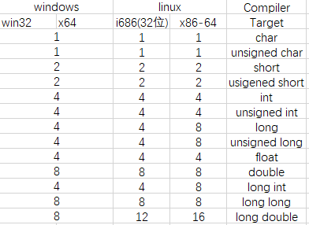

# C 语言核心技术

> 可以做的职位：C 语言开发工程师（服务器）、嵌入式软件开发 (C)、Liunx\C C++ 开发工程师

应用场景 &rarr; C 语言的某个知识点 &rarr; 剖析原理 &rarr; 分析实现步骤(图解) &rarr;代码实现的步骤讲解

 讲解思路：

> 1. 提出一个实际需求(引起 思考)
> 2. 传统方法解决
> 3. 分析传统方法的缺点
> 4. 引出我们要讲解的知识(基本原理和快速入门)
> 5. 注意事项和细节(考试、做项目、使用陷阱)
> 6. 实用案例

# 第一章 C 语言概述

##### 1\.  什么是程序：

程序为了让计算机执行某些操作或为解决某个问题而编写的一系列**有序指令的集合**（目的）。

##### 2\. C 语言的特点：

- 高效
- 代码级别跨平台,即 C 语言代码在不同平台编译后，都可以运行
- 允许访问物理地址，可以对硬件进行操作
- C 语言传递参数的方式：**值传递**(pass by value,传递的是值)、**传递指针**(a pointer by value,传递的是地址) 
- C 语言没有对象，但是不同的变量类型可以用**结构体(struct)**组合在一起。
- 预编译处理(preprocessor), 生成代码质量高，程序执行效率高。 

> 系统软件：操作系统、数据库、杀毒软件、防火墙、驱动、服务器程序
>
> Microsoft Visual C++ 2010 Express
>
> 如果运行在 visual C++ 6.0 程序中报错就将兼容性改为: Windows XP (Service Pack 3)

- getchar();让(控制台)窗口停留，等待输入
- printf 函数在 stdio.h 中，需要引入该文件才能使用

C 程序运行机制(过程)简述:

1. **编写**源程序
2. 编译将 .c 程序翻译成目标文件 (.obj) [cl.exe]
3. 链接：将目标文件 .obj + 运行需要的库文件生成可执行文件（可执行文件的文件名是项目名称）。$ 目标文件+库文件=可执行文件 $ [link.exe]
4. 运行：执行 .exe 文件，得到运行结果

> 库文件：由系统提供
>
> cl.exe 和 link.exe 程序在安装目录可见(VC>>bin)。

编译：

>如果编译没有错误，则没有任何提示，但在 Debug 目录下会出现一个 obj 文件，该文件称为 目标文件。

链接：

> 如果程序没有错误，则没有任何提示，但在 Debug 目录下会出现一个 项目名.exe 文件

扩展：

> 为什么需要链接库文件呢？
>
> 因为我们编写的 C 程序中使用到 C 程序库的内容，比如 <stdio.h><stdlib.h> 中的函数 printf(),sytem() 等等。

C 语言严格区分大小写

main 函数是所有函数的入口；

##### 2.**转义字符**：

- `\t`：制表位实现对齐的功能

- `\n` ：换行

- `\\` ：斜杠

- `\"`：双引号

- `\'`：单引号

- `\r`: 回车

  例如：`printf("张无忌赵敏周\r芷若小昭");`\\输入结果为：芷若小昭敏周

  即芷若小昭替换张无忌赵

注意：如果上一个程序运行的控制台不关闭，那么再次编译时会报错。

##### 3. C 语言开发常见问题和解决方法

1. fatel error LNK1104:无法打开文件：`？\\??.exe` 

   ```java
   1>------ 已启动生成: 项目: myproject01, 配置: Debug Win32 ------
   1>  hello.c
   1>  LINK : 没有找到 F:\C code\myproject01\Debug\myproject01.exe 或上一个增量链接没有生成它；正在执行完全链接
   1>LINK : fatal error LNK1104: 无法打开文件“F:\C code\myproject01\Debug\myproject01.exe”
   ========== 生成: 成功 0 个，失败 1 个，最新 0 个，跳过 0 个 ==========
   ```

   修改源文件后，需改关闭控制台，才能正确运行

2. 缺少分号

   ```java
   1>------ 已启动生成: 项目: myproject01, 配置: Debug Win32 ------
   1>  hello.c
   1>f:\c code\myproject01\myproject01\hello.c(12): error C2146: 语法错误: 缺少“;”(在标识符“getchar”的前面)
   ========== 生成: 成功 0 个，失败 1 个，最新 0 个，跳过 0 个 ==========
   ```

   解决方法：编译失败，注意错误出现的行数，再到源代码中改错

3. 语法错误：程序违反了语法规则例如：忘写分号，大括号、引号、或拼写错了单词。

   要学会看懂编译器报的错误信息。

**注释：** 

> 1. 定义：注解说明解释程序的文字。
>
> 2. 作用：提高了代码的可读性。
>
> 3. 分类：
>
>    - 单行注释：格式：`//注释文字`
>    - 多行(块)注释：格式：`/*注释文字*/`
>
> 4. 注意：多行注释不能嵌套
>
>    如果选中多行
>
>    - 顶到头，进行注释那就多行注释(多个单行注释)
>
>    - 没有定到头，进行注释那就是块注释。

快捷键常识：

1. `Tab` 键选中的代码整体向右移动，`Shift + Tab ` 整体向左移动。

2. `Ctrl + Alt + F` 格式代码
3. `Ctrl + /` 注释代码
4. `Ctrl + \`取消注释

##### C 语言标准库

> C 标准库是一组 C 内置函数、常量和头文件，比如<stdio.h>,<stdlib.h>,<math.h>等等。

- `System("pause");` 表示暂停

##### 4. 变量

定义：内存中数据存储空间的表示。

变量的赋值：

- 在声明变量时赋值。
- 在声明变量后赋值
  - 获取输入赋值
  - 手动赋值(在程序内赋值)

printf 函数：

1. 整数 %d 例如：`printf("%d"num);`,以下以此类推
2. 小数(实数) %f,如果想保留小数点的后几位。`printf("%.2f",num);//保留小数点的后两位`
3. 字符 %c
4. 字符串 %s
5. 在输出多个数据时，格式化的形式和数据要一一对应。

> 变量是程序的基本组成单位。

变量的数据类型：

- 基本类型：
  - 数值类型
    - 整型：
      - 短整型 short 
      - 整型 int
      - 长整型 long
    - 浮点型(实型)：
      - 单精度 float
      - 双精度 double
  - 字符类型 char
- 构造类型：
  - 数组
  - 结构体 struct
  - 共用体 union
  - 枚举类型 enum
- 指针类型：
- 空类型 void：

注意：

1. 在 C 中，没有字符串类型，使用字符串数组表示 字符串
2. 在不同系统中，部分数据类型字节长度不一样。int 2字节 或 4 字节。

|          类型           |  存储大小   |                    值范围                     |
| :---------------------: | :---------: | :-------------------------------------------: |
|  char<br />signed char  |   1 字节    |                   -128~127                    |
|      unsigned char      |   1 字节    |                     0~255                     |
|   int<br />signed int   | 2 或 4 字节 | -32768~32767或<br />-21,4784,3648~21,47843647 |
|      unsigned int       | 2 或 4 字节 |         0~65535或<br />0~42,9496,7295         |
| short<br />signed short |   2 字节    |                 -32768~32767                  |
|     unsigned short      |   2 字节    |                    0~65535                    |
| long <br />signed long  |   4 字节    |           -21,4784,3648~21,47843647           |
|      unsigned long      |   4 字节    |                0~42,9496,7295                 |

注意：

1. 在Java 中 long 为 8 字节，而在 C 中只有 4 字节。
2. 各种类型的存储大小与操作系统、系统位数和编译器有关
3. 在实际工作中，C 程序通常运行在 linux/unix 操作系统下 (考试使用 windows)。
4. C 语言中的整型类型分为有符号和无符号两种，默认为有符号 sigened
5. C 语言整型常用 int,除非不足以表示大数，才使用 long long

> 查看在本系统中数据类型的字节数。
>
> `sizeof(数据类型)`



> 1. 保留浮点型小数点后的位数：例如：`printf("%.2f",sum)`
>
> |   字符    |                              %c                              |
> | :-------: | :----------------------------------------------------------: |
> |  字符串   |                              %s                              |
> |   小数    |                              %f                              |
> |    int    | %d 有符号十进制<br />%u 无符号十进制<br />%o 八进制<br />%x 十六进制<br />注：如果想要显示各进制数的前缀，分别使用`%#o,%#x或%#X` |
> |   long    | %ld 有符号十进制<br />%lx 十六进制<br />%lo 八进制<br />%lu  |
> | long long |                        %lld<br />%llu                        |
> |   指针    |                              %p                              |
> |           |                                                              |

例如：`%d`,指明了在一行中打印整数的位置。%d 称为转换说明，它制定了 `printf()` 应使用什么格式来显示一个值。

- `%nd` 指明数据宽度，默认右对齐（n 为数字）,前面添加 - 号，例如：`%-nd`则左对齐

主要的区别是，对于 float 类型和 double 类型，printf() 都使用 %f、%e、%E、%g和%G转换说明。而 scanf() 只把它们用于 float 类型，对于 double 类型时要使用l修饰符。

**其它整数类型**

- short int
- long int
- long long int 或 long longcw
- unsigned short int
- unsigned short

注：

- short、short int、signed short、signed short int 都表示同一种类型，那么 unsigned short、unsigned short int 也是同一种类型
- 同理可推断：long、long int、signed long、signed long int 也都表示同一张类型、unsigned long、unsigned long int 也是同一种类型
- long long、long long int、signed long long、signed long long int 也都表示同一中类型、unsigned  long long、unsigned long long int 也是同一种类型

> 可以在 long 类型值的后面添加 l 或 L（推荐使用 L 因为 I 和 1 很像，），i 或 L 也可用于 8 进制数或16 进制数例如`020L`和 `0x10L`，
>
> 类似在支持 long long 类型的系统中可以使用 ll 或 LL 后缀来表示 long long 类型的值。
>
> 另外,u 或 U 后缀表示 unsigned long long ,如:`5ull,10ULL,9LLU`
>
> short 可以使用 `h` 作为前缀、`%hd` 以十进制显示 short 类型的数、`%ho` 以八进制显示 short 的数。


**浮点型**(近似值)

| 类型          | 存储大小 | 值范围            | 精度      |
| ------------- | -------- | ----------------- | --------- |
| float 单精度  | 4 字节   | 1.2E-38~3.4E+38   | 6 位小数  |
| double 双精度 | 8 字节   | 2.3E-308~1.7E+308 | 15 位小数 |

说明：

1. A E N(A&times; 10^N^）
2. 浮点数在机器中存放形式的简单说明，**浮点数=符号位+整数位+指数位+尾数位**。
3. 单精度浮点数，有效位只有 7 位，双精度浮点数有效位为 16 位，但 C 规定小数后最多保留 6 位，其余部分四舍五入
4. 位数部分可能随时，造成精度损失。

> 浮点型使用细节：
>
> 1. 浮点型常量默认为 double 类型，声明 float 型常量时，须后加 “f” 或 “F”
>
> 2. 浮点型常量的两种表示形式：
>
>    - 十进制数字形式：
>
>    - 科学计数法形式：
>
> 3. 通常情况下，应该使用 double 型，因为它比 float 更精确
>
> 4. printf("d1=%f",d1); 在输出时，默认保留小数点后 6 位。

**字符类型 Char**

- 字符可以存储字母和数字（1 个字节，因此表示的范围必须在 0~255 之间）

- 多个字符称为字符串，在 C 语言中，使用 char 数组表示字符串。数组不是基本数据类型而是构造类型。

`\b` 退格

**布尔类型：Boolean**

1. C89 没有定义布尔类型，C 语言在判断真假时，0 为假，非 0 为真。

2. 可以使用宏定义来完成。

   ```c
   #define BOOL int
   #define TURE 1
   #define False 0
   
   int main(void){
       
       Bool isOk= TRUE;//等价于 Bool isOk = 1;
   }
   ```

   > C99 提供了 \_BOOL 型，_BOOL 型变量只能赋值 0 或 1，非 0 的值都会被存储为 1。
   >
   > C99 还提供了一个头文件 <stdbool.h> ，定义了 bool 代表 _Bool,只要导入该头文件，就能方便的操作布尔类型了。

**基本数据类型转换：**

1. 自动类型转换：在赋值或运算时，精度小的数据类型自动转换为精度大的数据类型。

   数据类型按精度(容量)大小排序为：

   short >> int >> unsigned int >> long >> unsigned long >> float >> double >> long double 

2. 转换细节：若两种类型的字节数不同，则自动把字节数小的数据类型转换为字节数大的数据类型，若两种类型的字节数相同，如果一种为有符号，另一种为无符号，则转换成无符号类型

   赋值运算时，赋值号两边的数据类型不同时，赋值号右边的数据类型会转换为赋值号左边的数据累心给，如果右边变量的数据类型长度比左边长时，将丢失一部分数据，这样将损失进度，对视的部分按四舍五入向前舍入。

**指针入门:**

```c
int num = 1;
int *ptr = &num;
//int * 表示类型为指针类型
//ptr 指向了一个 int 类型的地址
printf("\nnum的地址=%d,num 地址=%p",num,&num);
//指针变量本身也有地址
printf("\nptr的地址=%p,ptr的值为%p",&ptr，ptr);
//我们发现 ptr 存储的值与 num的地址值相同
printf("\nptr 指向的值为%d",ptr);
//取出指针 ptr 指向的值 
```

> 1. 指针变量的地址值 &ptr
> 2. 指针变量，存放的地址 ptr
> 3. 获取指针指向的值 *ptr

> 疑问：C 语言能否直接给指针指向的地址赋值？为什么？
>
> `int a,*p=&a;*p = 7` 
>
> 可以，但 `int *p = 1;` 不行 ,因为可以直接给指针指向的数据赋值，但是这里的 p 还没有指向，所以不能赋值，这个指针的名字叫做悬浮指针。

注意：指针的类型和该指针指向的变量类型一致。‘

指针使用说明：

1. 基本类型，都有对应的指针类型，形式为`数据类型 *`。例如：int——int \*,float ——float\*
2. 此外还有指向数组、结构体、共用体的指针

**值传递和地址传递**

值传递(pass by value)：将变量指向的存储内容，在传递或赋值时，拷贝一份给接受变量。（即传递的是变量指向的存储内容)

地址传递 == 传递指针 (a pointer passed by value):如果是指针，就将指针变量存储的地址，传递给接受变量，如果是数组，就将数组的首地址传递给接受变量。

1.  默认传递值的类型：基本数据类型、结构体、共用体
2. 默认传递地址的类型：指针、数组。

**常量**

- 常量是固定值，在程序执行期间不能改变，这些固定的值叫做 **字面量**。
- 常量可以是任何的基本数据类型，或字符串字面值，枚举常量。
- 常量在定义后不能进行修改。

整型常量：

- 十六进制 前缀 0x 或 0X

- 八进制 前缀 0

- 整型常量可以带后缀，U 和 L 的组合。U (无符号整数)，L（长整数）

  注：不带前缀默认表示十进制。

举例：

```c
85 //十进制
0123 //八进制
0x4b //十六进制
30u //无符号整数
30l //长整数
30ul //无符号长整数
```

**浮点常量**：

浮点常量由整数部分，小数点，小数部分和指数部分组成。可以使用小数形式或指数形式来表示浮点常量。

举例：

```c
3.14159 //double
314159E-5 //科学计数法(指数形式)
3.1f //float
```

**字符常量**(和之前的一样，没什么要记的)

**字符串常量**：可以使用空格作为分隔符，把一个很长的字符串分行。

例如：

```c
char str[100] = "hello \ 
    world";//等价于 hello      world 空格的个数等于第二行前面的空格加上第一行 \ 前面的空格
```

常量的定义：

定义常量的方式：

1. 使用 #define 预处理器

   ```c
   #define 常量名 常量值
   ```

2. 使用 const 关键字声明指定类型的常量

   ```c
   const 数据类型 常量名 = 常量值
   ```

const 和 #define 的区别？

1. const 定义常量时，带数据类型，define 不带数据类型

2. 

3. const 是在编译运行的时候起作用，而 define 是在编译的预处理阶段起作用

4. define 只是简单的替换，没有类型检查。简单的字符串替换会导致**边界效应**。

   ```c
   #include <stdio.h>
   #define A 1
   #define B A+3
   #define C A/B*3
   int main(void){
       //分析
       //define 只是简单的替换，也就是说 并不会把 A+3 看作为一个整体
       //C 其实是 A/A+3*3=1+9=10
       printf("c=%d",C)
   }
   //如果将 define A+3 替换为 define (A+3)
   //C 其实是 A/(A+3)*3=1/(1+3)*3=1/4*3=? 由于 1/4=0，那么0*3=0，两个整数相除结果为整数，小数部分省略
   ```

5. const 常量是可以调试的，define 是不能进行调试的，主要是预编译阶段就已经换掉了，调试的时候就没它了。

6. const 不能重新定义，不能定义两个一样的，而 define 通过 undef 取消某个符号的定义，再重新定义

   ```c
   #define PI 3.14
   #define PI //取消 PI 的定义
   #define PI 3.145
   ```

7. define 可以配合 #ifdef、#ifndef、#endif 来使用，让代码更加灵活凌辱我们可以通过 #define 来启动和关闭 调试之。

```c
#define DEBUG
int main(void){
    
    #ifdef DEBUG//如果定义过 DEBUG
    	printf("ok,调试信息\n");
    #endif//结束 if
    #ifndef DEBUG //如果没有定义过 DEBUG
    	printf("hello,另外的信息");
	#enddif
}
```

##### 5. 运算符

定义：于是乃父是一种特殊的符号，用以表述数据的运算、赋值、比较等

注意：

1. 除法：如果参与运算的两个数都是整数，则运算结果也为整数。不能整除时，只取结果的整数部分，小数部分全部舍去。

2. ```c
   j = ++i;//等价于 i = i + 1;j = i;
   j = i--;//等价于 j = i;i = i -1;
   ```


详见 Java 运算符

赋值运算符补充：

| 运算符 | 描述               | 实例                               |
| ------ | ------------------ | ---------------------------------- |
| <<=    | 左移赋值运算符     | `c<<=2 等价于c=c<<2`剩下的以此类推 |
| \>\>=  | 右移赋值运算符     |                                    |
| &=     | 按位与赋值运算符   |                                    |
| ^=     | 按位异或赋值运算符 |                                    |
| \|=    | 按位或赋值运算符   |                                    |

**标识符命名规范：**

补充(相对于 Java 而言)：

1. 程序不得出现仅靠大小区分的相似表示符。例如：`int x,X;`
2. 所有宏定义、枚举常数、常量(只读变量)全用大写祖母，单词之间可以用下划线作为分隔符
3. 定义变量时别忘了初始化。定义变量时编译器不一定清空了这块内存，如果不清空，它的值可能时无效的数据，运行程序可能会异常退出。

C **语言中的关键字**：

特点：所有字母都为小写

| auto   | break  | case     | char   |  const   | continue |
| ------ | ------ | -------- | ------ | :------: | -------- |
| double | else   | enum     | extern |  float   | for      |
| int    | long   | register | return |  short   | signed   |
| struct | switch | typedef  | union  | unsigned | void     |

C99 新增了 5 个关键字

| inline | restrict | bool | Complex | _Imaginary |      |      |      |
| ------ | -------- | ---- | ------- | ---------- | ---- | ---- | ---- |
|        |          |      |         |            |      |      |      |

C11 新增了 7 个关键字

| _Alignas | _Allgnof | _Atomic | _Static_assert | _Noreturn | _Thread_Local | _Generic |      |
| -------- | -------- | ------- | -------------- | --------- | ------------- | -------- | ---- |
|          |          |         |                |           |               |          |      |

##### 6. 键盘输入语句

scanf 函数

- 定义：格式化输入函数，从标准输入设备读取输入信息。
- 格式：`scanf("格式化字符串"，地址表)\`
- 格式字符串的一般形式：`%[*][输入数据宽度][长度][类型]`

注：scanf 函数(不安全)已过时，请用 scanf_s函数来代替。

scanf_s 函数

1. scanf_s 函数与scanf 函数功能相同，主要针对 sanf() 不检查边界，可能会造成内存泄漏
2. scanf_s 用于去去字符串时必须提供一个数字，以表明最多读取多少位字符，以防溢出。例如：`scanf_s("%s",str,n);//最多读取n个字符 `
3. 如果使用 sanf_s 函数读取一个字符：`scanf_s("%c",str,1);`

