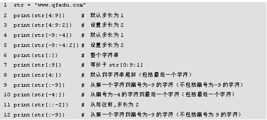

# Python

## Python 基础

### 第一章 编程基础

##### 1. 基本语法

1\. 注释

- 单行注释，以 `#` 开始
- 多行注释，开始和结尾的引号可以单引号也可以是双引号

```python
#单行注释

'''
多行注释
'''
```

2\. 标识符

- 区分大小写
- 由数字、字母、下划线组成，且只能以字母（及下划线）开头
- 下划线对 Python 解释器有特殊意义，*避免使用下划线开头的标识符*

关键字：

```python
import keyword
keyword.kwlist # 输出当前Python 版本的所有关键字
# 输出结果为--version 3.9.0
['False', 'None', 'True', '__peg_parser__', 'and', 'as', 'assert', 'async', 'await', 'break', 'class', 'continue', 'def', 'del', 'elif', 'else', 'except', 'finally', 'for', 'from', 'global', 'if', 'import', 'in', 'is', 'lambda', 'nonlocal', 'not', 'or', 'pass', 'raise', 'return', 'try', 'while', 'with', 'yield']
```

3\. 语句换行

Python 中一条语句占用一行（一条语句末尾不必使用 `;` 结尾作为分隔符），有时一条语句太长就需要分行显示。

```python
print("我很长，在源码中\
需要分为多行")

# 输出为
我很长，在源码中需要分为多行
```

在上面的print() 语句中，可以在末尾添加 `\` 来实现换行，但在列表 []、字典 {} 中分行，可以不使用

4\. 缩进

```python
age = 3
if age == 3:
    print("输出第一条")
    print("输出第二条")
else:
    print("为 false 输出")
# 输出结果为
输出第一条
输出第二条
```

Python 中使用缩进来表示代码块

##### 2. 变量与数据类型

Python 是弱类型语言，在声明变量时不必明确变量类型（一般省略）。

格式：`变量名 = 值`

1\. Python 的数据类型

- 数字类型 Number
    - 整型 int
    - 浮点型 float
    - 复数型 complex
    - 布尔型 bool
- 字符串 String
- 列表类型 List
- 元组类型 Tuple
- 字典类型 Dictionary
- 集合类型 Set

1\. 整数

> 八进制前缀 0o 或 0O
>
> 二进制前缀 0o 或 0O
>
> 十六进制 0x 或 0X

2\. 浮点数

```python
f1 = 0.314 # 准格式 0.314
f2 = 31.4e-2 # 科学计数法格式，等价于 0.314
f3 = 31.E2 # 科学计数法格式，等价于 3140
```

在科学计数法格式中，E 或 e 代表数字 10，其后面的数字代表指数，例如：`31.4E2` = $31.4\times 10^2$

3-\. 复数型

复数型用于表示数学中的复数，经常在科学计算中使用：

```python
a = 3 + 1j;
print(a.real);# 打印实数部分
print(a.imag);# 打印虚数部分

# 输出额结果
3.0
1.0
```

注意：当虚数部为 1j 或 -1j 时, 在数学中可以省略 1，在 Python 中 1 不可以省略。

2\. 布尔型

① Python 中的布尔型取值首字母大写。`True Flase`

② Python  中的每一个变量对象都有一个布尔值 ，从而可以进行条件测试

```python
# 下面对象的布尔值都为 False
None
False 
0 # 整型 0
0.0 # 浮点型 0
0.0+0.0j # 复数 0
"" # 空字符串
[] # 空列表
() # 空元组
{} # 空字典
```

3\. 字符串

Python 中的字符串可以使用单引号或双引号括住字面值

4\. 检测数据类型

Python 中，数据类型是由存储的数据决定的

type 函数：

```python
# 检测变量对应的数据类型
a = 10
print(type(10))
b = 1.0
print(type(b))
c = 1.0 + 1j
print(type(c))
# 输出结果为：
<class 'int'>
<class 'float'>
<class 'complex'>
```

isinstance 函数：

```python
# 判断数据是否属于某一个类型
a = 10
print(isinstance(a, int))
print(isinstance(a, float))
# 输出结果为
True
False
```

5\. 数据类型转换

将一种数据类型转换为另一种数据类型，转换时，需要将目标类型名作为函数名。举例：

| 函数                   | 描述                                    |
| ---------------------- | --------------------------------------- |
| int(x)                 | 将 x 转换为一个整数；只能识别十进制的   |
| int(x, base=16)        | 将 base 进制的字符串转换为一个整数      |
| float(x)               | 将 x 转换为一个浮点数                   |
| complex(real)          | 创建一个复数                            |
| complex(real, imag=16) | 创建一个复数，real 可以同 imag 指定进制 |
| complex(num1,num2…)    | 创建一个复数表                          |

```python
num = 898934
print(float(num))
num1 = "0xaffde"
print(int(num1, base=16))

float1 = 1234
print(float(float1))
float2 = "123123"
print(float(float2))

complex1 = 123
print(complex(complex1))
d = 0xaaf
print(complex(d, imag=16))

com = complex(1.3, 3.5)
print(com)

# 输出为
898934.0
720862
1234.0
123123.0
(123+0j)
(2735+16j)
(1.3+3.5j)
```

##### 3. 运算符

1\. 算术运算符

相比 Java  新增

| 运算符 | 说明 | 实例 | 结果 | 数学中的写法 |
| ------ | ---- | ---- | ---- | ------------ |
| **     | 幂   | 5**2 | 25   | $5^2$        |
| //     | 取整 | 5//2 | 2    | $5\div 2$    |

`-5//2=-3` 取整的那个数，是相除之后向下取整。

```python
print(10/2)
print(5/2)
print(5.0/2)
print(5/2.0)
print(10//2)
print(5//2)
print(5.0//2)
print(5//2.0)
print(5//-2)
# 输出为
5.0
2.5
2.5
2.5
5
2
2.0
2.0
-3
```

2\. 赋值运算符 **=、//=

- 如果需要为多个变量赋不同的值，可以简写为如下形式：`a,b,c,d=13,3.14,1+2j,True`

3\. 逻辑运算符

| 运算符 | 说明 | 示例    | 结果                                        |
| ------ | ---- | ------- | ------------------------------------------- |
| and    | 与   | a and b | 如果 a 的布尔值 True， 返回 b，否则返回 a   |
| or     | 或   | a or b  | 如果 a 的布尔值为 True，返回 a，否则返回 b  |
| not    | 非   | not a   | a 为 Flase 返回 True；a 为 True，返回 False |

> Python 逻辑运算符返回的结果也不一定是布尔值；a，b 为表达式

```python
print(0 and 4)
print(False and 4)
print(1 and 4)
print(1 or 4)
print(True or 4)
print(0 or 4)
print((4 <= 5) and (4 >= 3))
print((4 >= 5) or (4 <= 3))
print(not 1)

# 输出结果为
0
False
4
1
True
4
True
False
False
```

4\. 位运算符

- 位运算符是指对二进制位从低位到高位对齐后进行运算

左移 空位补 0

5\. 成员运算符

用于判断指定序列中是否包含某个值

| 运算符 | 说明                                                    |
| ------ | ------------------------------------------------------- |
| in     | 如果在指定序列中找到指定的值，返回 True，否则返回 Flase |
| not in | 如果在指定序列中找到指定的值，返回 False，否则返回 True |

```python
A = [1, 2, 3, 4]
print(1 in A)
print(0 in A)
print(1 not in A)
print(0 not in A)

# 输出为 
True
False
False
True
```

6\. 身份运算符

判断两个标识符是否引用同一个对象

| 运算符 | 说明                                                     |
| ------ | -------------------------------------------------------- |
| is     | 如果连个表示符引用同一个对象，则返回 True,否则返回 False |
| is not | 如果连个表示符引用同一个对象，则返回 False,否则返回 True |

```python
a = b = 10
print(a is b)
print(a is not b)
b = 20
print(a is b)
print(a is not b)
# 输出结果为
True
False
False
True
```

7\. 运算符的优先级


### 第二章  流程控制语句

##### 1\. 循环语句

(1) while 循环：

```python
while 条件表达式:
	循环体
```

(2) for 循环

for 循环语句可以循环遍历任何序列中的元素，如列表、元组、字符串等，其语法格式如下：

```python
for 元素 in 序列:
	循环体
```

> 遍历数字序列，可以使用 range() 函数
>
> range 函数用法：
>
> - range(stop)
> - range(start,stop[,step])
>
> 注意：参数必须为整数值或实现了`__index__` 的方法。如果省略参数 step 那么默认为 1。如果省略 start 参数，默认为 0。如果 step 为 0，则会触发 ValueError
>
> - step 为正： r[i]=start+i*step,i&geq;0,r[i]<stop
> - step 为负： r[i]=start+i*step,i&geq;0,r[i]>stop
>
> 详见官方文档

##### 2\. else 语句

else 语句除了可以与 if 语句搭配使用外，还可以与 while 语句、for 语句搭配使用，当条件不满足时执行else语句块，它只在循环结束后执行。

while 语句或 for 语句中有 break 语句时，程序将会跳过 while 语句或 for 语句后的 else 语句，例如：

```python
for n in range(1,4)
	print("第%d次循环"%n)
    if n == 2
    	break
else:
    print("循环结束")
print("程序结束")
```

### 第三章 字符串

##### 1\. 表示形式：

单引号、双引号，三对双引号和单引号（多行字符串，还可以用来表示注释）括住表示。

注意: Python 中的字符串，一旦定义，就不能被修改。

##### 2\. 转义字符

- \ddd 1~3 位八进制所代表的字符。这里的 d 应该是个数字
- \xhh 1~2 位十六进制所代表的字符

注意：上面的两种有范围限制，都是用 ASCII 码表示一个字符，因此取值范围只有 0~255

禁用字符串中反斜杠的转义功能。可以在字符串前加一个 r.

```python
print(r'\n表示回车')
# 输出
\n表示回车
```

##### 3\. 字符串的输出

（1）输出 print() 函数

```python
print("xiaoqian")
# 普通输出
xiaoqian
```

字符串格式化是指按照指定的规则连接、替换字符串并返回新的符合要求的字符串，例如示例中 age 的内容18以整数形式替换在要显示的字符串中。格式：`format_string%string_convert`

其中，format_string 为格式标记字符串，包括固定的内容与待替换的内容，待替换的内容用格式化符号标明，string_to_convert 为需要格式化的数据。如果需要格式化的数据是多个，则需要使用小括号括起来并用逗号分隔

```python
age = 18
print("小明的年龄为%d"%age)
# 格式化输出
小明的年龄为 18
```


（)

辅助格式化符号：


示例:

```python
a, b = 65, 3.1416926
print("%#10x"%a)
print("%-#10X"%a)
print("%+d"%a)
print("%5.3f"%b)
print("%*.3f"%(5,b))
print("%5.*f"%(3,b))
# 输出
      0x41
0X41      
+65
3.142
3.142
3.142
第2行输出字符串宽度为10，并且以0x形式显示65对应的十六进制数，注意默认是右对齐的。第3行输出字符串宽度为10，并且以0X形式显示65对应的十六进制数，注意“-”代表左对齐。第4行输出字符串中正值时前加“+”。第5行输出字符串宽度为5，显示的小数点精度为3。第6行通过*设置显示宽度为5。第7行通过*设置小数点精度为3
```

##### 4\. 字符串的输入

`input([prompt])` 表示从标准输入读取一行文本，默认的标准设备是键盘，其中，prompt 表示*提示字符串*，该函数将输入的数据作为字符串返回。

##### 5\. 字符串的索引与切片 

运算符: `[]`

（1）索引


- 字符串 str 正向编号从 0 开始，代表第一个字符，依次往后；
- 字符串 str 负向编号从-1开始，代表最后一个字符，依次往前

因为编号可正可负，所以字符串中的某个字符可以有两种方法索引，例如索引 str 中字符 'q'。具体示例如下：

```pyhon
str[4] str[-9] 都可以索引到字符 'q'
```

 (2）切片

- 切片定义：字符串分片是指从字符串中截取部分字符并组成新的字符串，并不会对原字符串做任何改动

- 语法格式：`[start:end:step]` 

  该语句表示从起始编号处开始，以指定步长进行截取，到结束编号的前一位结束

Tips:start 默认为 0， end 默认为末尾（包括最后一个字符），step 默认为 1



下面这些符号可以参与字符串的运算：


> 上面这些，是序列的通用操作

##### 6. 字符串的常用函数

| 函数名称   | 说明                                                         |
| ---------- | ------------------------------------------------------------ |
| upper()    | 将字符串中所有小写字母转换为大写                             |
| lower()    | 将字符串中所有小写字母转换为大写                             |
| isuppper() | 字符串至少包含了一个字母，并且所有这些字母都是大写           |
| islower()  | 字符串至少包含了一个字母，并且所有这些字母都是小写，返回 `True` ，否则返回 `False` |
| isalpha()  | 如果字符串中的所有字符都是字母，并且至少有一个字符，返回 `True` ，否则返回 `False` 。 |
| isahum()   | 字符串至少有一个字符，并且所有字符都是字母或数字             |
| isdigit()  | 字符串是否只包含数字                                         |
| isspace()  | 字符串是否只包含空白                                         |
| istitle()  | 字符串是否标题化的(标题：所有单词的首字母大写)               |

> 例子看官方文档
>
> 文档下载地址：https://docs.python.org/3.10/ （左上角）

##### 7\. 检测前缀和后缀

检测字符串是否以某个字符串开头或结尾：

- startswith(prefix,beg=0,end=len)
- endswith(suffix,beg=0,end=len)

如果指定了 beg 和 end 则在指定范围内检查。

*合并与分割字符串*

- join(seq) 以指定字符串作为分隔符，将 seq 中的所有元素（字符串表示）合并为一个新的字符串
- split(str="",num=string.count(str))：以 str 作为分隔符，如果 num 有指定值，则仅分割 num 次

```python
seq1 = "千锋教育"
print("|".join(seq1))
seq2 = ["千锋教育","扣丁课堂"，"好程序特训营"]
print("-".join(seq2))
# 输出
千|锋|教|育
千锋教育-扣丁课堂-好程序特训营
```

*对齐方式*

- strip([chars]): 删除字符串头尾指定的 chars 字符，默认删除空白字符
- lstrip([chars])：删除字符串头指定的 chars 字符，默认删除空白字符
- rstrip([chars])：删除字符串尾指定的 chars 字符，默认删除空白字符

*检测子串*

- find(str, beg=0, end=led(string)) :检测 str 是否包含在检测字符串中。如果指定范围 beg 和 end，则检查是否包含在指定范围内。如果包含，则返回开始的下标值，否则返回 -1。
- index(str,beg=0,end=len[string]) :用法与 find() 函数类似，两者的区别是：如果str不在字符串中，那么index()函数会报一个异常。

*替换子串*

- replace(old,new[,max]): 将字符串中 old 替换成 new 并返回新生成的字符串。如果指定第三个参数 max，则表示替换不超过 max 次。
- count(str,beg=0,end=len(string): 统计子字符串出现的次数, 如果 beg 和 end 指定，则是指定范围内子字符串出现的次数。

*首字母大写*：

- capitalize(): 字符串中第一个单词的首字母大写

*标题化*：

- title()：字符串中所有单词的首字母大写

### 第四章 列表与元组

##### 1\. 列表的概念

(1) 列表的创建

列表是由一组任意类型的值组合而成的序列，组成列表的值称为元素，每个元素之间用逗号隔开。

用 `[]` 来表示列表


- 创建空列表：`list5 = []`
- 通过 list() 函数创建：`list1 = list()`

(2) 列表的切片和索引 

略（序列的操作都是相同的）具体详见官方文档(通用序列操作)。

（3）列表的遍历

while 循环

```python
list=['干锋教育”，’扣学堂”，’好程序员特训营’]
length，i=len（list），0
while i < length：
     print（list[i]）
	i+=1
```

for 循环

```python
list=['干锋教育”，’扣学堂”，’好程序员特训营’]
for value in list:
	print(value)
```

##### 2\. 列表的常用操作

- 修改元素：`list[index] = value` 索引需要修改的元素并对其赋新值即可
- 添加元素：
  - append(obj): 列表末尾添加元素 obj
  - extend(seq): 在列表末尾添加添加另一个序列 seq 的多个元素
  - insert(index,obj): 将元素 obj 插入到列表的 index 位置
- 删除元素：
  - pop(index): 提取在 index 位置上的项，并将其从 *s* 中移除
  - remove(obj)：删除列表中第一次出现的 obj 元素
  - clean()：删除列表中的所有元素
- 查找元素位置
  - index(obj,strat=0,end=-1): 从列表中查找出某个元素第一次出现的位置
- 元素排序
  - sort([*，key=none,reverse=False]) 函数
  - reverse() 元素的反转
- 计算元素个数：count()

##### 3\. 列表推导

已有一个包含 10 个整数的列表list，创建一个新列表newList，该列表中每个元素为list列表中每个元素的平方:

原来的写法：

```python
list = range(1,11)
newlist = []
for num in list:
    newlist.append(num**2)
print(list)
```

使用列表推导

```python
list = range(1,11)
newlist = [num ** 2 for num in list] # 这一行干了上面三行的活
print(list)
```

语法格式：

```python
exp1 for value in list [if exp2]

等价于

list = []
for vlue in list:
	[if exp2]
	list.append(exp1)
```

##### 4\. 元组

**元组中的元素不能改变**。

1\. 创建

- 空元组：`tuple = ()`
- 创建元组：tuple = (value,value,……,value)` 使用 () 将多个元素包括起来，元素值之间用` ，` 隔开
- 只包含一个元素的元组（特殊）：`tuple=(value,)`

```python
tuple1 = (1,)
tuple2 = (1)
print(1,)
print(1)
# 输出
(1,) # 元组
1 # 整数
```

> 元组的速度比列表快。
>
> 遍历和索引（略）和其他序列一样

元组与列表的转换

- list(seq): 可以将元组转换为列表
- tuple(seq)：将列表转换为元组

### 第五章  字典与集合

1\. 字典的概念

字典是由元素构成的，其中每个元素都是一个键值对。

元素之间用逗号隔开，整体用大括号括起来。每个元素是一个键值对，键与值之间用冒号隔开，例如：`student={'name':'小千','id':20190101,'score':98.0}`

> 键是不可变数据类型，而值可以是任意数据类型。

字典的创建：

```python
dict1 = ()
student={'name':'小千','id':20190101,'score':98.0}
d = dict('name':'小千','id':20190101,'score':98.0)
```

常用操作：

- lend(dict): 获取元素的个数

- `字典名[key]`:通过键来访问元素值

- 有时不确定字典中是否存在某个键而又想访问该键对应的值，则可以通过 get() 函数实现:

  ```python
  dict={'qfedu'：'千锋教育”，’codingke’：'扣丁学堂}
  name1=dict.get（'goodProgramner'）#不存在该键时，返回None，而不是报错print（namel）
  name2=dict.get（'qfedu'）#存在该键时，返回对应的值print（name2）
  # 输出
  None
  千锋教育
  ```

  
